# TicketBox — Technical Design

> **Lưu ý:** Tài liệu này chứa các sơ đồ Mermaid. Để hiển thị đúng trong VS Code, hãy cài extension **Markdown Preview Mermaid Support** từ Marketplace.

---

## 1. Kiến Trúc Tổng Thể

### Phong Cách Kiến Trúc: Modular Monolith

TicketBox áp dụng kiến trúc **Modular Monolith** cho backend — tức là hệ thống chạy trên một tiến trình (process) duy nhất nhưng được tổ chức thành các module nghiệp vụ tách biệt (Auth, Concert, Booking, Payment, Notification, Ticket, Guest).

**Lý do không dùng Microservices:**

| Tiêu chí | Microservices | Modular Monolith (TicketBox) |
|---|---|---|
| Team size | 20+ engineers | 4 sinh viên |
| Độ phức tạp vận hành | Cao (service mesh, distributed tracing) | Thấp (1 server, 1 deploy) |
| Network latency | Cao (gọi HTTP giữa các service) | Gần bằng 0 (in-process call) |
| Khả năng scale | Từng service độc lập | Scale toàn bộ horizontally |
| Phù hợp | Hệ thống đã ổn định, rõ bounded context | Giai đoạn phát triển, còn thay đổi nhanh |

**Lý do không dùng Monolith thuần:**
Codebase được chia module theo nghiệp vụ (mỗi module có Controller, Service, DTO riêng), giúp dễ dàng tách ra Microservice sau này nếu cần scale từng phần.

### Các Thành Phần Chính

```
┌─────────────────────────────────────────────────────────────────┐
│                     TICKETBOX SYSTEM                            │
│                                                                 │
│  ┌─────────────────┐    ┌───────────────────────────────────┐   │
│  │  Next.js Web     │    │        NestJS Backend API         │   │
│  │  (Vercel)        │    │           (Render)                │   │
│  │                 │    │                                   │   │
│  │ • SSR/ISR pages │    │ Modules: Auth, Concert, Booking,  │   │
│  │ • SWR polling   │    │ Payment, Ticket, Notification,    │   │
│  │ • Admin panel   │    │ Guest, Admin                      │   │
│  └────────┬────────┘    └──────────┬────────────────────────┘   │
│           │                        │                             │
│           │      REST API (JSON)   │                             │
│           └────────────────────────┘                             │
│                                                                 │
│  ┌─────────────────┐    ┌──────────────┐   ┌─────────────────┐  │
│  │  Flutter Mobile  │    │  PostgreSQL  │   │     Redis       │  │
│  │  (Soát vé)       │    │  (Render)    │   │  (Upstash/      │  │
│  │                 │    │              │   │   Render)       │  │
│  │ • Offline-first │    │ 7 entities   │   │ • Cache vé      │  │
│  │ • SQLite local  │    │ ACID trans   │   │ • Rate limit    │  │
│  │ • QR scanner    │    │ Soft delete  │   │ • BullMQ        │  │
│  └─────────────────┘    └──────────────┘   └─────────────────┘  │
└─────────────────────────────────────────────────────────────────┘
```

### Hạ Tầng Triển Khai Thực Tế

| Thành phần | Nền tảng | Ghi chú |
|---|---|---|
| **Frontend Web** | Vercel | Auto-deploy từ Git, Edge Network toàn cầu |
| **Backend API** | Render | Containerized NestJS, port 8080 |
| **PostgreSQL** | Supabase | Tự động backup, SSL |
| **Redis** | Redis Cloud | Connection pool với ioredis |
| **Flutter App** | APK build | Chạy trên Android thiết bị staff |

---

## 2. C4 Diagram

### Level 1 — System Context

Sơ đồ này trả lời câu hỏi: **TicketBox tồn tại trong bức tranh nào?**

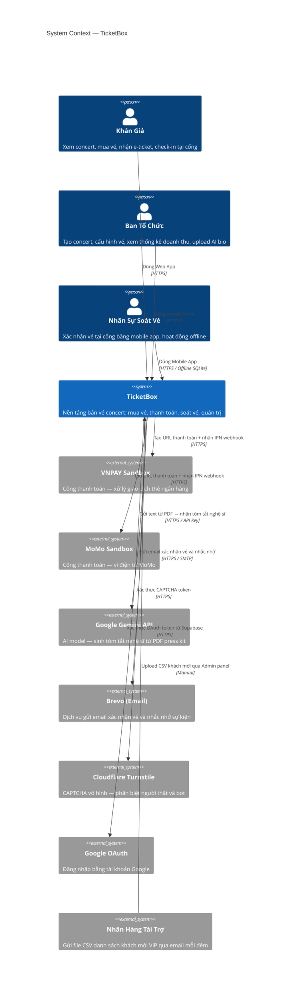

---

### Level 2 — Container

Sơ đồ này trả lời: **TicketBox gồm những container nào, chúng dùng công nghệ gì và giao tiếp ra sao?**

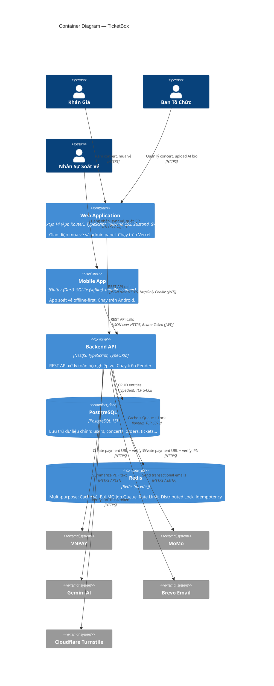

---

## 3. High-Level Architecture Diagram

Sơ đồ này trả lời: **Dữ liệu chạy như thế nào qua các thành phần, đặc biệt tại các điểm tích hợp?**

```mermaid
flowchart TB
    subgraph CLIENT["Client Layer"]
        FE["Next.js Web App\n(Vercel)"]
        MOB["Flutter Mobile\n(Android)"]
    end

    subgraph BACKEND["Backend Layer — NestJS (Render)"]
        direction TB
        subgraph GUARDS["Guard Chain (mọi request đều qua)"]
            G1["JwtAuthGuard\n(Global)"]
            G2["RolesGuard\n(Global)"]
            G3["ThrottlerGuard\n(Redis-backed)"]
            G4["CaptchaGuard\n(Cloudflare Turnstile)"]
            G5["IdempotencyGuard\n(Redis SET NX)"]
        end

        subgraph MODULES["Business Modules"]
            AUTH["AuthModule\n/auth/*"]
            CONCERT["ConcertModule\n/concerts/*"]
            BOOKING["BookingModule\n/booking/*"]
            PAYMENT["PaymentModule\n/payment/*"]
            TICKET["TicketModule\n/ticket/*"]
            NOTIF["NotificationModule"]
            GUEST["GuestModule\n/guest/*"]
        end

        subgraph WORKERS["Background Workers (BullMQ)"]
            W1["OrderProcessor\nticketbox.order"]
            W2["AiBioProcessor\nticketbox.concert.ai-bio"]
            W3["SyncCheckinProcessor\nticketbox.sync-checkins"]
            W4["NotificationProcessor\nnotification-queue"]
        end

        subgraph CRONS["Scheduled Jobs (@nestjs/schedule)"]
            C1["handleExpiredOrders\nMỗi 5 phút"]
            C2["handleEventReminders\nMỗi 30 phút"]
            C3["updateConcertStatuses\nMỗi ngày"]
        end
    end

    subgraph DATA["Data Layer"]
        PG[("PostgreSQL\n7 entities")]
        REDIS[("Redis\nCache + Queue")]
    end

    subgraph EXTERNAL["External Services"]
        VNPAY["VNPAY\n(Circuit Breaker)"]
        MOMO["MoMo\n(Circuit Breaker)"]
        GEMINI["Google Gemini AI\n(+ Groq fallback)"]
        BREVO["Brevo\n(Email)"]
        CF["Cloudflare\nTurnstile"]
    end

    FE -- "REST API (JSON)\nHttpOnly Cookie JWT" --> GUARDS
    MOB -- "REST API (JSON)\nBearer Token JWT" --> GUARDS
    GUARDS --> MODULES

    BOOKING -- "Lua Script atomic\nDECRBY vé" --> REDIS
    BOOKING -- "Add job" --> REDIS
    W1 -- "Tạo Order (PENDING)" --> PG
    W2 -- "Summarize PDF" --> GEMINI
    W2 -- "Update aiBio" --> PG
    W3 -- "Update CHECKED_IN" --> PG
    W4 -- "Gửi email xác nhận vé" --> BREVO
    
    CONCERT -- "Read/Write" --> PG
    CONCERT -- "SET NX warm-up\nGET availability" --> REDIS
    AUTH -- "JWT HttpOnly Cookie" --> FE
    
    PAYMENT -- "Create URL\n(opossum Circuit Breaker)" --> VNPAY
    PAYMENT -- "Create URL\n(opossum Circuit Breaker)" --> MOMO
    VNPAY -- "IPN Webhook GET /vnpay-ipn\nHMAC-SHA512 verified" --> PAYMENT
    MOMO -- "IPN Webhook POST /momo-ipn\nHMAC-SHA256 verified" --> PAYMENT
    PAYMENT -- "Pessimistic Lock\nTạo Ticket + QR code" --> PG
    PAYMENT -- "Add job → email vé" --> NOTIF

    C1 -- "Distributed Lock\n(Redis SET NX)" --> REDIS
    C1 -- "Cancel PENDING\n> 15 phút" --> PG
    C1 -- "Rollback vé" --> REDIS
    C2 -- "Distributed Lock" --> REDIS
    C2 -- "Add reminder job" --> NOTIF
    C3 -- "Update status" --> PG

    CF -- "Verify token" --> BACKEND
    MODULES --> PG
    MODULES --> REDIS
```

---

## 4. Thiết Kế Cơ Sở Dữ Liệu

### 4.1 Lựa Chọn Công Nghệ Database

#### PostgreSQL — RDBMS chính (Transactional Data)

**Lý do chọn:**
- **ACID compliance:** Đảm bảo tính toàn vẹn tuyệt đối cho dữ liệu tài chính (Order, Ticket). Không thể dùng NoSQL với giao dịch mua vé — một vé phải đồng thời được tạo và số lượng bán phải được cập nhật trong cùng một transaction.
- **Pessimistic Locking (`SELECT FOR UPDATE`):** Cần thiết cho Webhook IPN để đảm bảo VNPAY gọi nhiều lần không tạo ticket trùng.
- **Foreign Key constraints:** Đảm bảo integrity giữa Order, Ticket, Concert, User.
- **Soft Delete (`@DeleteDateColumn`):** Dữ liệu tài chính không được xóa cứng.

#### Redis — In-Memory Store (Operational Data)

**Lý do chọn:**
- **Atomic operations:** Lua Script chạy single-threaded, không có race condition — không thể thay bằng PostgreSQL vì latency quá cao.
- **TTL nội trang:** Idempotency key, job result, distributed lock đều có thời gian sống tự nhiên — không cần cron xóa rác.
- **BullMQ:** Chạy trên Redis, tận dụng infrastructure có sẵn, không cần setup RabbitMQ/Kafka.
- **Sub-millisecond latency:** Đọc số vé từ Redis < 1ms vs 5-20ms từ PostgreSQL.

---

### 4.2 Schema PostgreSQL

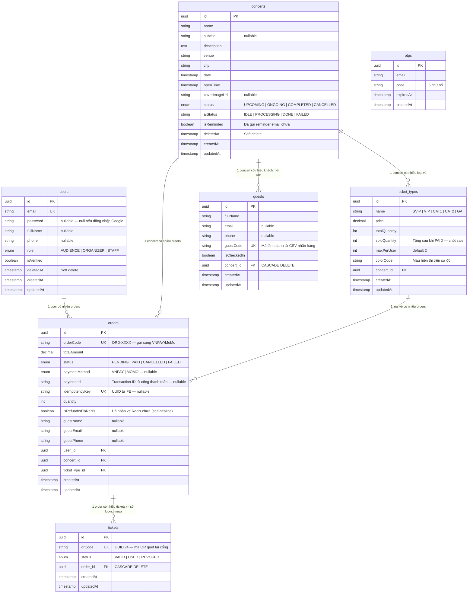

---

### 4.3 Redis Key Patterns

| Key Pattern | Kiểu dữ liệu | TTL | Mục đích |
|---|---|---|---|
| `ticket_type:{id}:available` | String (số nguyên) | Không hết hạn | Số vé còn lại — engine đặt vé |
| `user:{id}:ticket_type:{id}:tickets_held` | String (số nguyên) | Không hết hạn | Số vé user đã giữ — giới hạn per-user |
| `idempotency:{UUID}` | String (`'processing'`) | 3600s (1 giờ) | Chặn double-click |
| `job_result:{idempotencyKey}` | String (orderId hoặc `'FAILED'`) | 3600s (1 giờ) | FE polling kết quả booking |
| `cronjob:lock:handleExpiredOrders` | String (`'locked'`) | 240s (4 phút) | Distributed lock cho cron hủy đơn |
| `cronjob:lock:sendEventReminders` | String (`'locked'`) | 1200s (20 phút) | Distributed lock cho cron nhắc nhở |
| `throttler:{IP/userID}` | Hash | 1000ms | Rate limit counter |
| `bull:{queueName}:*` | List/Hash/Set | BullMQ managed | Job queue internal state |

---

### 4.4 Database Indexes

Hai index đã được đánh trong codebase để tối ưu Cronjob queries:

```typescript
// Trên bảng orders — phục vụ Cronjob quét đơn PENDING hết hạn
@Index(['status', 'createdAt'])
export class Order { ... }

// Trên bảng concerts — phục vụ Cronjob gửi nhắc nhở 24h
@Index(['status', 'isReminded', 'date'])
export class Concert { ... }
```

**Tại sao cần index?** Khi hệ thống tích lũy hàng triệu đơn hàng, query không có index buộc PostgreSQL phải Full Table Scan → CPU database lên 100% mỗi 5 phút → toàn bộ API chậm lại (latency tăng vọt).

---

## 5. Thiết Kế Kiểm Soát Truy Cập (RBAC)

### 5.1 Mô Hình Phân Quyền

TicketBox áp dụng **Role-Based Access Control (RBAC)** với 3 role cứng được lưu trong cột `role` của bảng `users`:

| Role | Mô tả | Đối tượng |
|---|---|---|
| `AUDIENCE` | Khán giả thông thường — mua vé, xem vé đã mua | Default cho mọi user mới đăng ký |
| `ORGANIZER` | Ban tổ chức — toàn quyền quản lý concert | Tài khoản được cấp thủ công |
| `STAFF` | Nhân sự soát vé — chỉ được dùng Mobile App | Tài khoản được cấp thủ công |

### 5.2 Cơ Chế Kỹ Thuật

**Lớp 1: JwtAuthGuard (Global Guard)**

```typescript
// app.module.ts — áp dụng cho TOÀN BỘ endpoint
{ provide: APP_GUARD, useClass: JwtAuthGuard }
```

- Đọc JWT từ **HttpOnly Cookie** (`token`) hoặc **Authorization: Bearer** header
- Verify signature với `JWT_SECRET`
- Gắn `{ id, email, role }` vào `req.user`
- Endpoint muốn public phải dùng decorator `@Public()`

**Lớp 2: RolesGuard (Global Guard)**

```typescript
// app.module.ts — áp dụng cho TOÀN BỘ endpoint
{ provide: APP_GUARD, useClass: RolesGuard }
```

- Đọc metadata `@Roles(UserRole.ORGANIZER)` từ Controller/Handler
- So sánh `req.user.role` với role được yêu cầu
- Nếu role không đủ → HTTP 403 Forbidden

### 5.3 Bảng Phân Quyền API

| Endpoint | AUDIENCE | ORGANIZER | STAFF | Public |
|---|:---:|:---:|:---:|:---:|
| `GET /concerts` | ✅ | ✅ | ✅ | ✅ |
| `GET /concerts/:id` | ✅ | ✅ | ✅ | ✅ |
| `GET /concerts/:id/availability` | ✅ | ✅ | ✅ | ✅ |
| `POST /concerts` | ❌ | ✅ | ❌ | ❌ |
| `PUT /concerts/:id` | ❌ | ✅ | ❌ | ❌ |
| `DELETE /concerts/:id` | ❌ | ✅ | ❌ | ❌ |
| `POST /concerts/:id/upload-bio` | ❌ | ✅ | ❌ | ❌ |
| `POST /booking` | ✅ | ❌ | ❌ | ❌ |
| `GET /booking/status` | ✅ | ✅ | ✅ | ❌ |
| `POST /payment/create-url` | ✅ | ❌ | ❌ | ❌ |
| `GET /payment/vnpay-ipn` | — | — | — | ✅ (VNPAY server) |
| `POST /payment/momo-ipn` | — | — | — | ✅ (MoMo server) |
| `GET /ticket/my-tickets` | ✅ | ❌ | ❌ | ❌ |
| `POST /ticket/batch-sync` | ❌ | ❌ | ✅ | ❌ |
| `GET /ticket/download` | ❌ | ❌ | ✅ | ❌ |
| `GET /guest` | ❌ | ✅ | ✅ | ❌ |
| `POST /guest/import-csv` | ❌ | ✅ | ❌ | ❌ |

### 5.4 Luồng Xác Thực

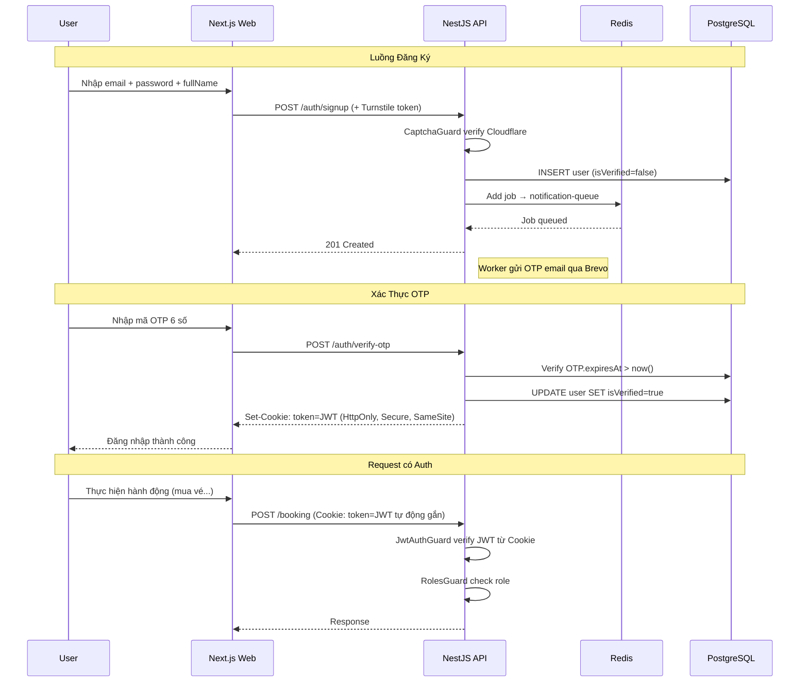

---

## 6. Luồng Nghiệp Vụ Quan Trọng

### 6.1 Luồng Mua Vé (Concurrency Booking)

Đây là luồng phức tạp nhất — giải quyết bài toán 80.000 người cùng mua vé.

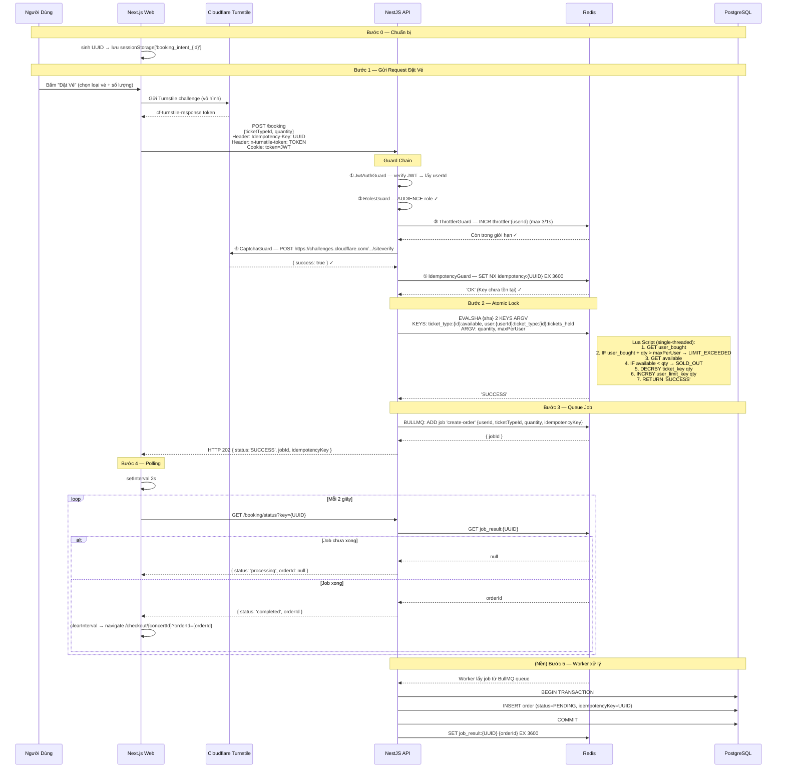

**Xử lý lỗi:**

| Lỗi | HTTP | Hành động FE |
|---|---|---|
| Bot / Rate limit | 429 | Hiện thông báo "Vui lòng thử lại sau" |
| Captcha fail | 403 | Hiện thông báo "Xác thực thất bại" |
| Double-click | 409 | Bỏ qua (request sau trùng key) |
| SOLD_OUT | 400 | Hiện "Hết vé loại này" |
| LIMIT_EXCEEDED | 400 | Hiện "Bạn đã mua tối đa X vé" |
| Worker fail (3 lần) | — | Job result = 'FAILED', nhả vé Redis, FE sinh key mới |

---

### 6.2 Luồng Thanh Toán và Webhook

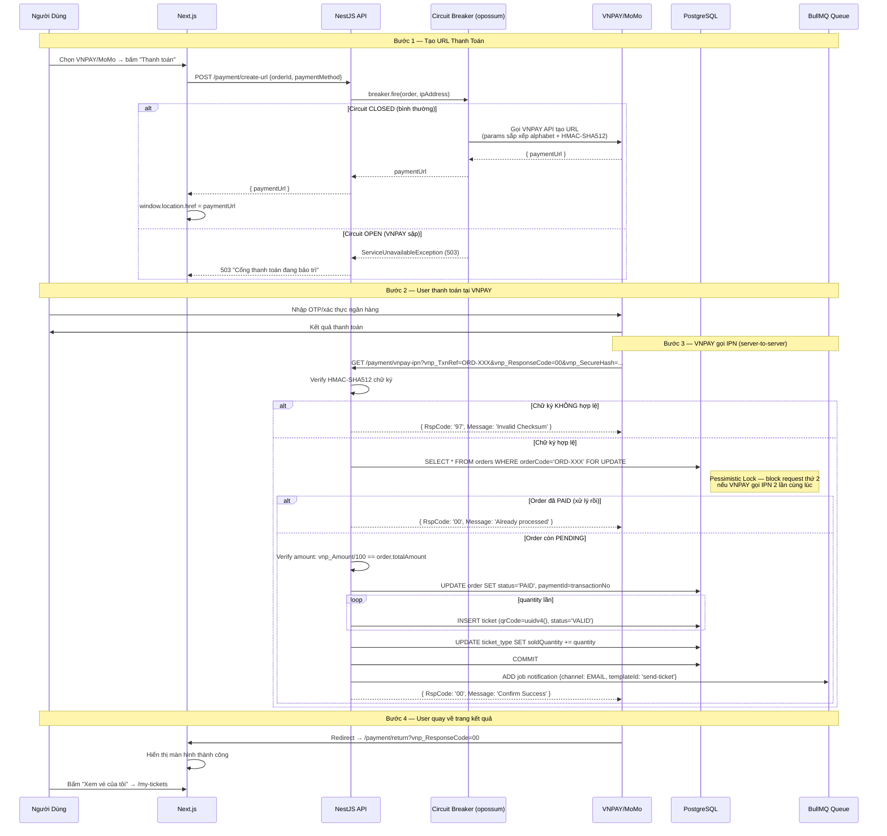

---

### 6.3 Luồng Soát Vé Offline

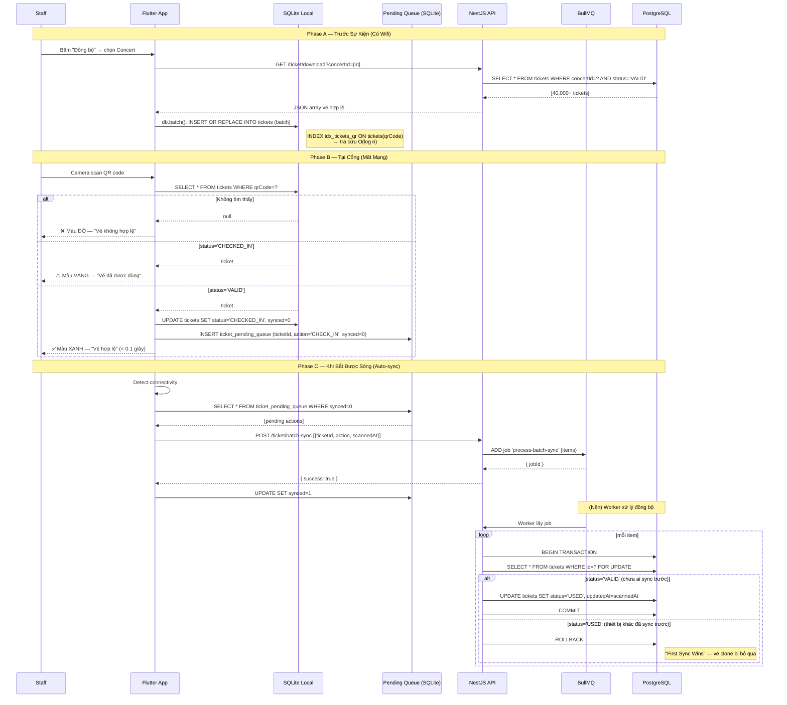

---

### 6.4 Luồng Nhập CSV Khách Mời VIP

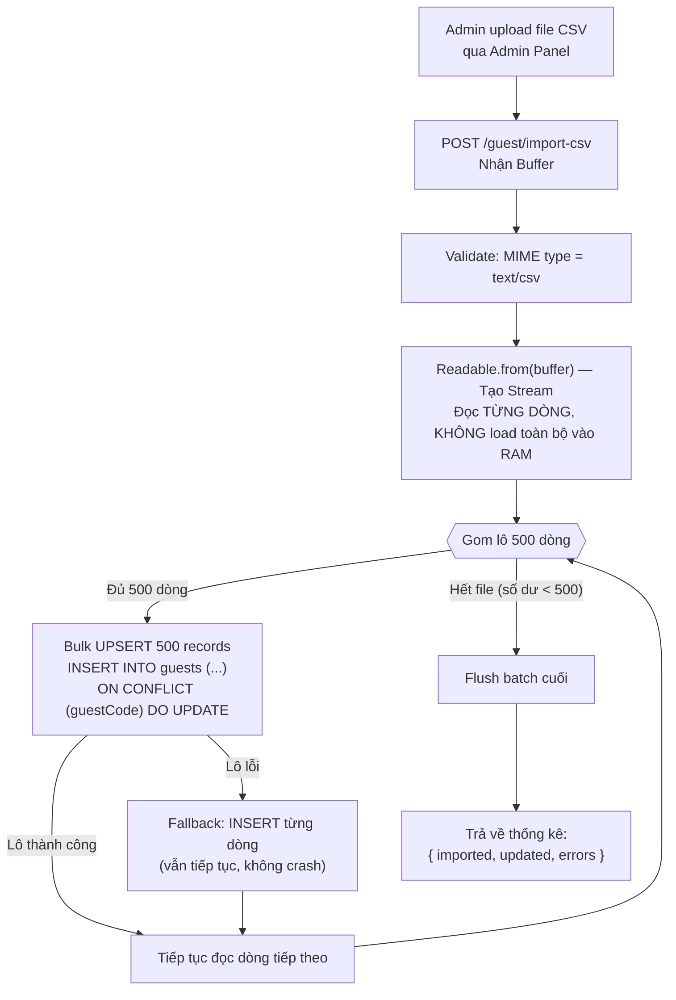

---

## 7. Thiết Kế Các Cơ Chế Bảo Vệ Hệ Thống

### 7.1 Kiểm Soát Tải Đột Biến (Rate Limiting)

**Thuật toán đã chọn: Fixed Window Counter (via `@nestjs/throttler` + Redis)**

Hệ thống đã cài đặt 2 cấp độ rate limiting:

**Cấp độ Global (cho mọi endpoint):**
```typescript
// app.module.ts
ThrottlerModule.forRootAsync({
  useFactory: (config, redisClient) => ({
    throttlers: [{ ttl: 1000, limit: 10 }], // 10 req / 1 giây / IP
    storage: new ThrottlerStorageRedisService(redisClient), // Redis-backed
  })
})
```

**Cấp độ Endpoint-specific (gắt hơn cho API nhạy cảm):**
```typescript
// booking.controller.ts
@Throttle({ default: { limit: 3, ttl: 1000 } }) // 3 req / 1 giây cho /booking

// auth.controller.ts
@Throttle({ default: { limit: 5, ttl: 60000 } }) // 5 req / 1 phút cho /auth/signup & forgot-password
```

**Tại sao dùng Redis storage thay vì in-memory?**
Nếu backend scale lên 3 instance, mỗi instance có counter riêng trong memory → một bot có thể gửi 3 req/giây đến mỗi instance → thực tế gửi được 9 req/giây mà không bị chặn. Redis-backed storage đồng bộ counter giữa tất cả instances.

**Cơ chế bảo vệ chống bot nhiều lớp:**

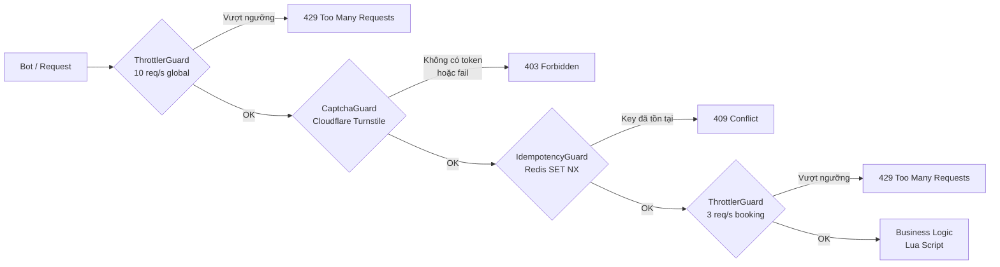

---

### 7.2 Xử Lý Cổng Thanh Toán Không Ổn Định (Circuit Breaker)

**Thư viện sử dụng: `opossum`**

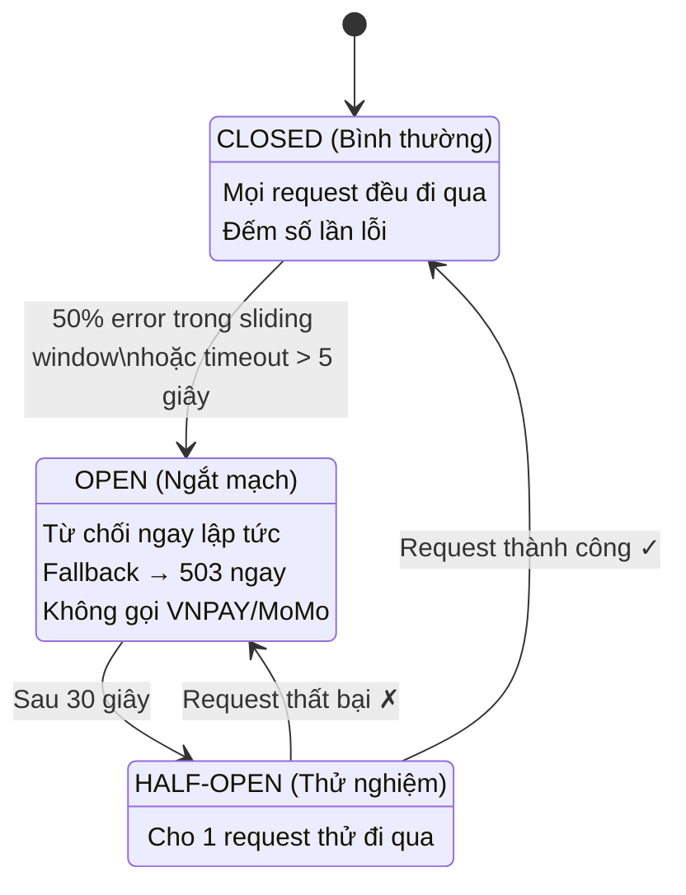

**Cấu hình thực tế (từ codebase `vnpay.strategy.ts` và `momo.strategy.ts`):**

| Tham số | Giá trị | Ý nghĩa |
|---|---|---|
| `timeout` | 5000ms | Quá 5s không phản hồi → tính là lỗi |
| `errorThresholdPercentage` | 50% | 50% request lỗi → chuyển OPEN |
| `resetTimeout` | 30000ms | 30s sau chuyển HALF-OPEN |

**Graceful Degradation:** Khi circuit OPEN, các tính năng không liên quan đến thanh toán (xem concert, số vé còn lại, tìm kiếm...) vẫn hoạt động bình thường — chỉ có luồng tạo URL thanh toán bị từ chối.

---

### 7.3 Chống Trừ Tiền Hai Lần (Idempotency)

TicketBox áp dụng 2 cơ chế bổ sung cho nhau:

**Cơ chế 1: Idempotency Key (Frontend → Backend)**

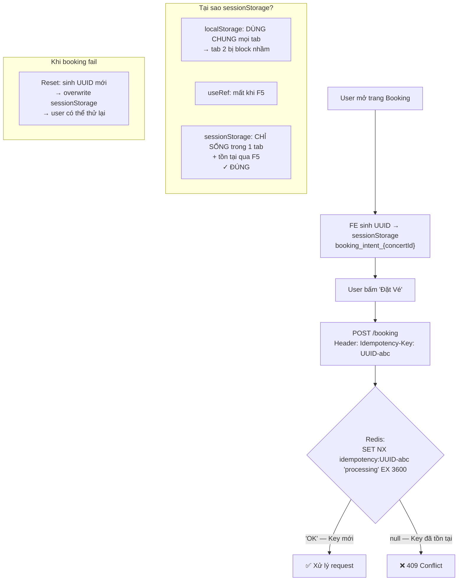

**Cơ chế 2: Pessimistic Lock (VNPAY/MoMo → Backend)**

Áp dụng cho trường hợp VNPAY gọi IPN nhiều lần (retry tự động):

```typescript
// payment.service.ts
const order = await queryRunner.manager.findOne(Order, {
  where: { orderCode },
  lock: { mode: 'pessimistic_write' }, // SELECT ... FOR UPDATE
});

// Nếu order đã PAID → bỏ qua (idempotent)
if (order.status !== OrderStatus.PENDING) {
  await queryRunner.rollbackTransaction();
  return { status: 'IGNORED', message: 'Order already processed' };
}
```

**Cơ chế 3: Amount Verification (chống Payment Bypass)**

```typescript
// payment.service.ts
// Chống hacker sửa vnp_Amount thành 100đ
if (paidAmount !== undefined && Number(paidAmount) !== Number(order.totalAmount)) {
  return { status: 'IGNORED', message: 'Invalid payment amount' };
}
```

---

### 7.4 Caching (Multi-Layer Cache Strategy)

TicketBox áp dụng **4 tầng cache xếp chồng** để hệ thống chịu được hàng chục nghìn người truy cập đồng thời:

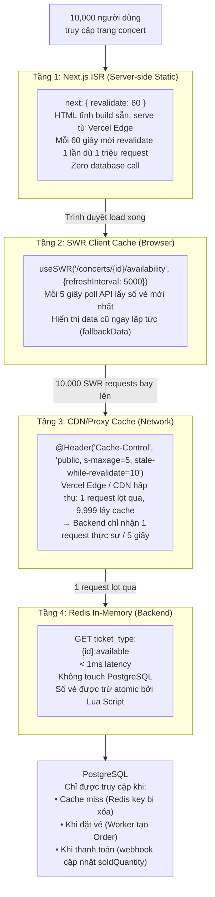

**TTL Strategy:**

| Dữ liệu | TTL | Lý do |
|---|---|---|
| Trang danh sách concert (ISR) | 60 giây | Ít thay đổi, cần SEO tốt |
| Số vé còn lại (CDN) | 5 giây (`s-maxage=5`) | Thay đổi liên tục khi mở bán |
| Số vé còn lại (Redis) | Không hết hạn | Được trừ trực tiếp bởi Lua Script, luôn chính xác |
| Idempotency key (Redis) | 3600 giây | Đủ dài để phòng retry trong 1 giờ |
| Job result (Redis) | 3600 giây | FE poll trong vài giây, không cần giữ lâu |

**Cache Invalidation khi vé thay đổi:**

- **Khi đặt vé (Booking):** Lua Script `DECRBY ticket_type:{id}:available qty` → Redis tự động cập nhật
- **Khi hủy đơn (Cron/Failure):** `rollbackBooking()` gọi `INCRBY` trả vé về Redis
- **Khi server restart:** `onApplicationBootstrap()` dùng `SET NX` để chỉ seed nếu key chưa tồn tại, bảo toàn giá trị đang live

---

## 8. Các Quyết Định Kỹ Thuật Quan Trọng (ADR)

### ADR-001: Redis Lua Script vs Pessimistic DB Lock (Chống Oversell)

**Context:** Cần đảm bảo khi 80.000 người cùng mua vé, không bao giờ bán lố.

**Options:**

| | Redis Lua Script | PostgreSQL SELECT FOR UPDATE |
|---|---|---|
| **Latency** | < 1ms | 5-20ms |
| **Throughput** | ~100k ops/sec | ~5k TPS |
| **Atomic** | Có — single-threaded | Có — MVCC |
| **Risk** | Vé Redis có thể lệch DB nếu crash | Không có risk này |
| **Complexity** | Cần compensating transaction | Simpler |

**Decision:** Redis Lua Script cho việc giữ chỗ (booking). PostgreSQL dùng cho việc ghi chính thức sau khi thanh toán.

**Lý do:** Với 80.000 concurrent users, PostgreSQL sẽ là bottleneck. Redis single-threaded đảm bảo atomicity mà không cần lock — throughput cao hơn 20x. Compensating Transaction (nhả vé khi Worker fail) được xử lý bằng `isRefundedToRedis` flag và Self-Healing Cronjob.

---

### ADR-002: JWT trong HttpOnly Cookie vs Bearer Token Header

**Context:** Cần cơ chế xác thực an toàn cho Web App và Mobile App.

**Options:**

| | HttpOnly Cookie | Bearer Token (Authorization Header) |
|---|---|---|
| **XSS Protection** | ✅ JS không đọc được | ❌ localStorage bị XSS steal |
| **CSRF Risk** | ⚠️ Cần SameSite | ✅ Không có risk |
| **Mobile App** | ❌ Khó quản lý cookie | ✅ Lưu trong secure storage |
| **Cross-domain** | ⚠️ Cần SameSite=None+Secure | ✅ Không vấn đề |

**Decision:** **HttpOnly Cookie cho Web App**, **Bearer Token cho Mobile App**.

**Lý do:** Web App dùng Cookie với `SameSite=Lax` (dev) / `SameSite=None; Secure` (production) — chống XSS hoàn toàn. Mobile App Flutter dùng `flutter_secure_storage` lưu token → gửi qua Authorization header.

---

### ADR-003: BullMQ (trên Redis) vs RabbitMQ vs Kafka

**Context:** Cần Message Queue cho Background Jobs (Order processing, Email, Sync checkin, AI Bio).

**Options:**

| | BullMQ (Redis) | RabbitMQ | Kafka |
|---|---|---|---|
| **Setup** | Dùng Redis có sẵn | Cần thêm 1 service | Cần thêm cluster phức tạp |
| **Throughput** | Tốt (Redis) | Tốt | Rất cao (overkill) |
| **Retry/Backoff** | Built-in | Plugin | Custom |
| **Dashboard** | Bull Board | RabbitMQ Admin | Kafka UI |
| **Phù hợp** | Small-medium scale | Medium scale | High scale (>1M msg/s) |

**Decision:** BullMQ.

**Lý do:** Redis đã được dùng cho Cache và Rate Limiting → không cần thêm infrastructure. BullMQ có built-in retry với exponential backoff, job scheduling, priority queue — đủ mọi tính năng cần thiết. Kafka là overkill cho một concert platform với vài nghìn đơn hàng mỗi giờ.

---

### ADR-004: Modular Monolith vs Microservices

**Context:** Lựa chọn architectural style cho backend.

**Decision:** Modular Monolith (đã trình bày tại mục 1).

**Consequences:**
- ✅ Deploy đơn giản (1 container)
- ✅ Không có network latency giữa các module
- ✅ Dễ debug và phát triển với team nhỏ
- ⚠️ Nếu sau này scale, cần refactor từng module thành microservice riêng (nhưng vì code đã được tổ chức theo module nên việc tách ra không quá khó)

---

### ADR-005: Google Gemini vs OpenAI vs Groq cho AI Bio

**Context:** Cần AI model để tóm tắt PDF press kit thành đoạn giới thiệu nghệ sĩ.

**Decision:** Google Gemini (primary), Groq (fallback) — cả hai đều được implement trong codebase.

**Lý do:** 
- Gemini có free tier phù hợp cho prototype
- AI Provider được thiết kế theo **Strategy Pattern** — dễ switch provider mà không sửa Worker code

```typescript
// ai-provider.interface.ts
export interface AiProviderService {
  summarize(text: string): Promise<string | null>;
}

// Providers: gemini.provider.ts, groq.provider.ts, openai.provider.ts
// Đều implement cùng interface → swap dễ dàng
```

---

### ADR-006: Offline-First với SQLite vs Pure Online

**Context:** Mobile App soát vé cần hoạt động khi mất mạng tại sân vận động.

**Decision:** Offline-First với SQLite (sqflite).

**Lý do:** Sân vận động 40,000 người → mạng di động quá tải hoàn toàn. Nếu dùng pure online, toàn bộ hệ thống soát vé sẽ tê liệt. SQLite local cho phép tra cứu < 0.1 giây không cần Internet.

**Tradeoff — "First Sync Wins":**
Nếu 1 vé được quét ở 2 cổng khác nhau khi offline, cả 2 cổng đều báo xanh. Khi sync lên server, chỉ cổng nào sync trước được tính là hợp lệ. Đây là đánh đổi có chủ ý: tính availability (hoạt động được khi offline) ưu tiên hơn tính consistency tuyệt đối trong trường hợp edge case clone vé.
