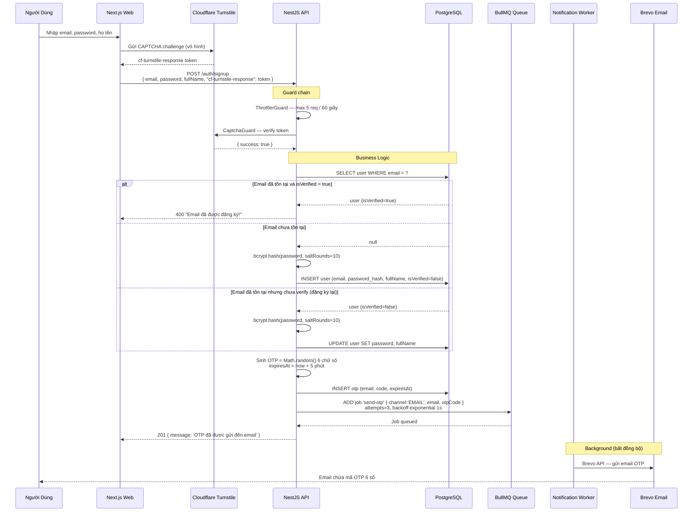
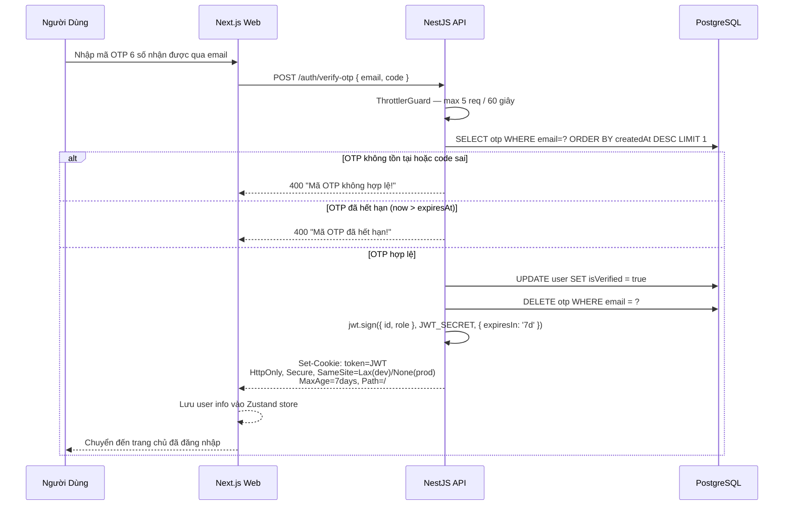
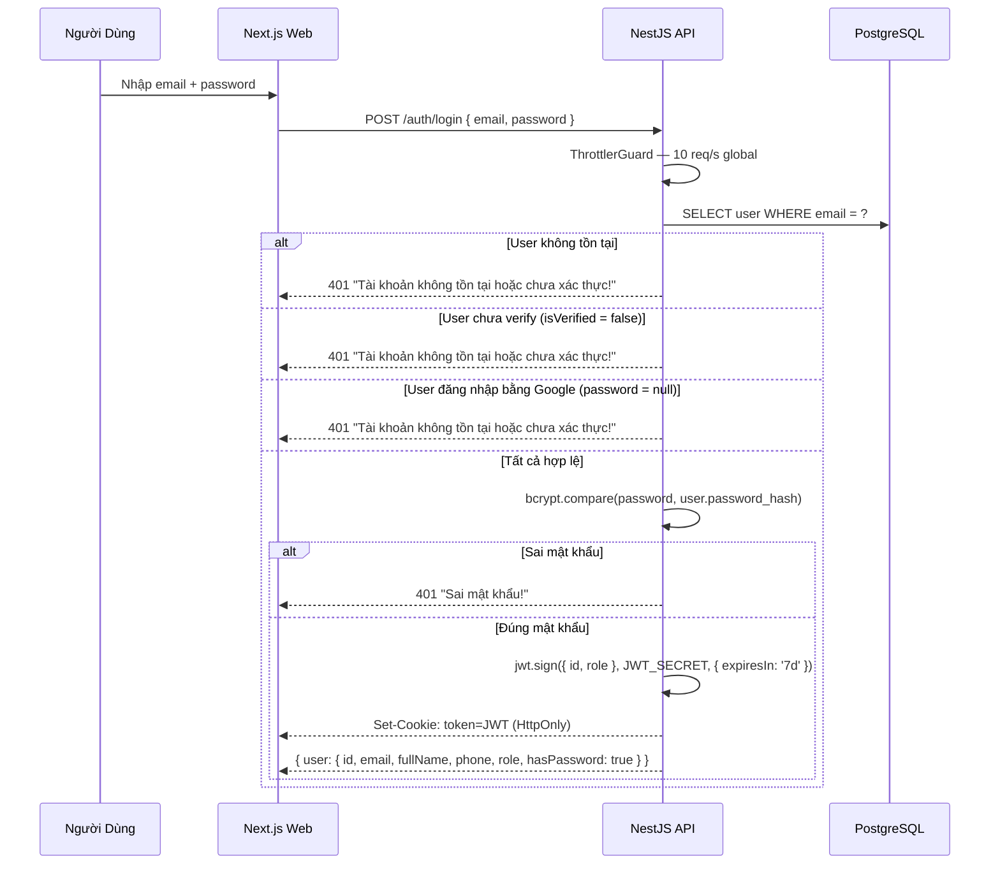
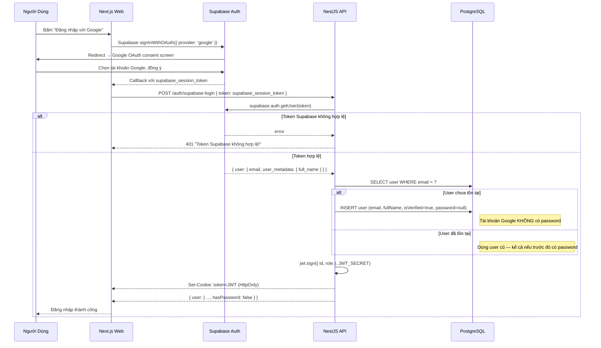
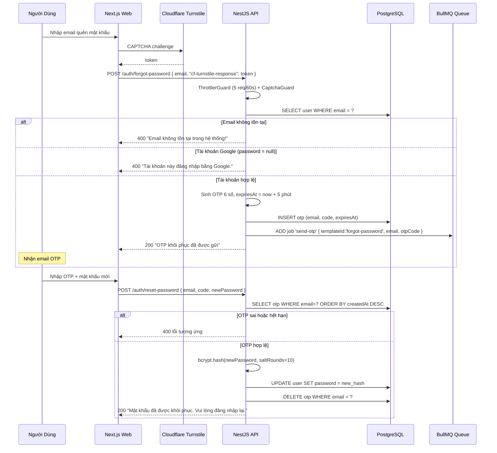
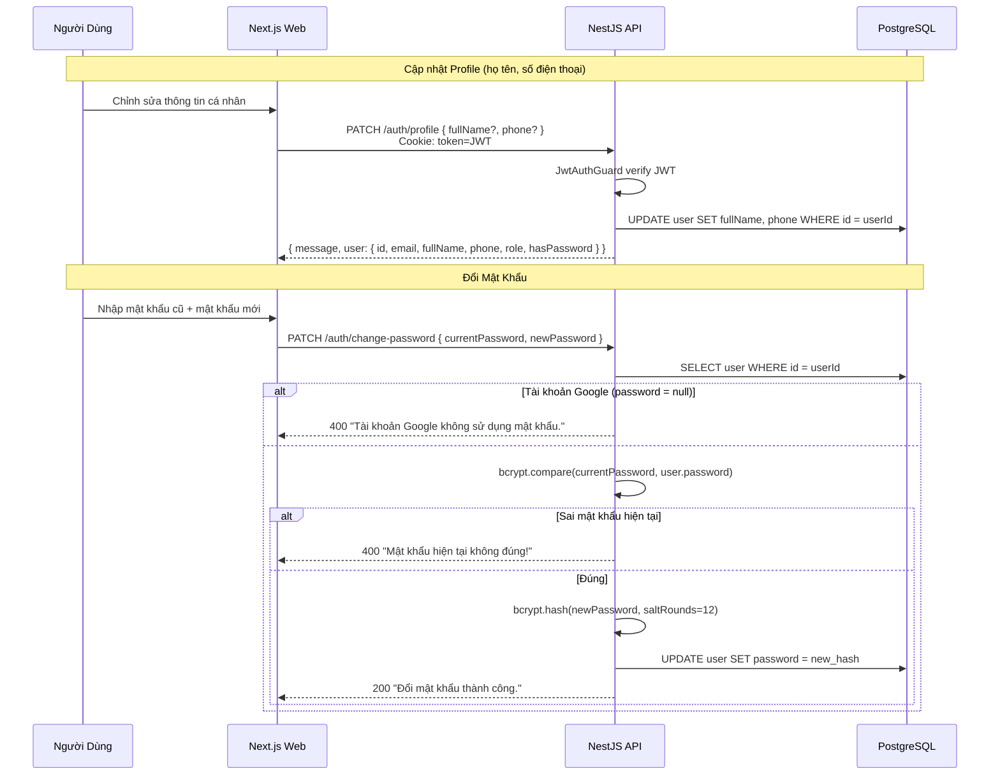

# Đặc Tả: Xác Thực và Phân Quyền (Authentication & Authorization)

## Mô Tả

Module Auth chịu trách nhiệm toàn bộ vòng đời danh tính người dùng trong hệ thống TicketBox: đăng ký, xác thực, phân quyền, quản lý phiên đăng nhập và bảo vệ tài khoản. Hệ thống hỗ trợ đồng thời hai phương thức xác thực:

- **Email + OTP:** Đăng ký tài khoản nội bộ, xác thực qua mã OTP 6 số gửi vào email
- **Google OAuth (qua Supabase):** Đăng nhập nhanh bằng tài khoản Google, không cần đặt mật khẩu

Mọi endpoint trong hệ thống được bảo vệ mặc định bởi `JwtAuthGuard` đăng ký global — endpoint nào muốn public phải khai báo tường minh bằng decorator `@Public()`.

---

## Luồng Chính

### Luồng 1 — Đăng Ký Tài Khoản (Email + OTP)



---

### Luồng 2 — Xác Thực OTP và Nhận JWT



---

### Luồng 3 — Đăng Nhập Thông Thường (Email + Password)



---

### Luồng 4 — Đăng Nhập Google (OAuth qua Supabase)



---

### Luồng 5 — Quên Mật Khẩu



---

### Luồng 6 — Cập Nhật Profile và Đổi Mật Khẩu



---

### Luồng 7 — Đăng Xuất và Xóa Tài Khoản

**Đăng xuất:**
```
POST /auth/logout
→ Server: res.clearCookie('token', { httpOnly, secure, sameSite, path: '/' })
→ Response: 200 { message: 'Đăng xuất thành công' }
→ Cookie bị xóa khỏi browser → mọi request sau đó không còn token → bị block bởi JwtAuthGuard
```

**Xóa tài khoản (Soft Delete):**
```
DELETE /auth/account
→ Ẩn danh hóa: UPDATE user SET fullName=null, phone=null, password=null, 
                                email='deleted_{userId}@deleted.local'
→ Soft delete: UPDATE user SET deletedAt = now()
→ Giữ lại lịch sử Order và Ticket để đối chiếu tài chính
→ Clear cookie → 200 { message: 'Tài khoản đã được xoá.' }
```

---

## Cơ Chế JWT và Quản Lý Phiên

### JWT Payload

```json
{
  "id": "uuid-v4",
  "role": "AUDIENCE | ORGANIZER | STAFF",
  "iat": 1719000000,
  "exp": 1719604800
}
```

### Cơ Chế Lưu Token

| Client | Phương thức | Lý do |
|---|---|---|
| **Web App (Next.js)** | HttpOnly Cookie (`token`) | Không thể đọc bằng JS → chống XSS |
| **Mobile App (Flutter)** | `flutter_secure_storage` → `Authorization: Bearer` | Cookie khó quản lý trên mobile |

**Cấu hình Cookie Web:**

| Thuộc tính | Dev | Production |
|---|---|---|
| `httpOnly` | `true` | `true` |
| `secure` | `false` (HTTP) | `true` (HTTPS) |
| `sameSite` | `'lax'` | `'none'` (cross-domain Vercel↔Render) |
| `maxAge` | 7 ngày | 7 ngày |
| `path` | `/` | `/` |

### JWT Guard Chain

```
Request đến bất kỳ endpoint
        ↓
JwtAuthGuard (Global)
  ├── Đọc JWT từ Cookie 'token' HOẶC Authorization: Bearer header
  ├── jwt.verify(token, JWT_SECRET)
  ├── Gán req.user = { id, role }
  ├── Nếu endpoint có @Public() → bỏ qua guard, cho đi
  └── Nếu không có token hoặc invalid → 401 Unauthorized
        ↓
RolesGuard (Global)
  ├── Đọc @Roles() metadata từ controller/handler
  ├── Nếu không có @Roles() → cho đi
  ├── So sánh req.user.role với role yêu cầu
  └── Nếu không đủ quyền → 403 Forbidden
```

---

## Phân Quyền RBAC

### Mapping Role → Quyền

| Role | Mô tả | Cách tạo tài khoản |
|---|---|---|
| `AUDIENCE` | Khán giả — mua vé, xem vé của mình | Tự đăng ký (default) |
| `ORGANIZER` | Ban tổ chức — toàn quyền concert, ticket type, AI Bio | Admin cấp thủ công |
| `STAFF` | Nhân sự soát vé — chỉ dùng Mobile App | Admin cấp thủ công |

### Bảng Endpoint → Role

| Endpoint | Method | AUDIENCE | ORGANIZER | STAFF | Public |
|---|---|:---:|:---:|:---:|:---:|
| `/auth/signup` | POST | — | — | — | ✅ |
| `/auth/verify-otp` | POST | — | — | — | ✅ |
| `/auth/login` | POST | — | — | — | ✅ |
| `/auth/supabase-login` | POST | — | — | — | ✅ |
| `/auth/logout` | POST | — | — | — | ✅ |
| `/auth/forgot-password` | POST | — | — | — | ✅ |
| `/auth/reset-password` | POST | — | — | — | ✅ |
| `/auth/profile` | PATCH | ✅ | ✅ | ✅ | ❌ |
| `/auth/change-password` | PATCH | ✅ | ✅ | ✅ | ❌ |
| `/auth/account` | DELETE | ✅ | ✅ | ✅ | ❌ |
| `/concerts` | GET | ✅ | ✅ | ✅ | ✅ |
| `/concerts` | POST | ❌ | ✅ | ❌ | ❌ |
| `/concerts/:id/upload-bio` | POST | ❌ | ✅ | ❌ | ❌ |
| `/booking` | POST | ✅ | ❌ | ❌ | ❌ |
| `/payment/create-url` | POST | ✅ | ❌ | ❌ | ❌ |
| `/payment/vnpay-ipn` | GET | — | — | — | ✅ |
| `/payment/momo-ipn` | POST | — | — | — | ✅ |
| `/ticket/my-tickets` | GET | ✅ | ❌ | ❌ | ❌ |
| `/ticket/download` | GET | ❌ | ❌ | ✅ | ❌ |
| `/ticket/batch-sync` | POST | ❌ | ❌ | ✅ | ❌ |
| `/guest` | GET | ❌ | ✅ | ✅ | ❌ |
| `/guest/import-csv` | POST | ❌ | ✅ | ❌ | ❌ |

---

## Kịch Bản Lỗi

### Đăng Ký / Xác Thực OTP

| Kịch bản | HTTP | Response |
|---|---|---|
| Email đã đăng ký và verified | 400 | `"Email đã được đăng ký!"` |
| OTP nhập sai | 400 | `"Mã OTP không hợp lệ!"` |
| OTP hết hạn (> 5 phút) | 400 | `"Mã OTP đã hết hạn!"` |
| Không có CAPTCHA token | 403 | `"Thiếu mã xác thực Captcha"` |
| CAPTCHA fail (bot) | 403 | `"Xác thực Captcha thất bại"` |
| Spam quá 5 req / 60s | 429 | Too Many Requests |

### Đăng Nhập

| Kịch bản | HTTP | Response |
|---|---|---|
| Email không tồn tại | 401 | `"Tài khoản không tồn tại hoặc chưa xác thực!"` |
| Account chưa verify OTP | 401 | `"Tài khoản không tồn tại hoặc chưa xác thực!"` |
| Sai mật khẩu | 401 | `"Sai mật khẩu!"` |
| Token Supabase không hợp lệ | 401 | `"Token Supabase không hợp lệ!"` |

### Truy Cập Endpoint Có Auth

| Kịch bản | HTTP | Response |
|---|---|---|
| Không có JWT | 401 | Unauthorized |
| JWT hết hạn (> 7 ngày) | 401 | Unauthorized |
| JWT bị giả mạo (sai signature) | 401 | Unauthorized |
| Role không đủ quyền | 403 | Forbidden |

### Quên Mật Khẩu / Đổi Mật Khẩu

| Kịch bản | HTTP | Response |
|---|---|---|
| Gọi forgot-password cho tài khoản Google | 400 | `"Tài khoản này đăng nhập bằng Google."` |
| Gọi change-password cho tài khoản Google | 400 | `"Tài khoản Google không sử dụng mật khẩu."` |
| Mật khẩu hiện tại sai | 400 | `"Mật khẩu hiện tại không đúng!"` |

---

## Ràng Buộc

### Bảo Mật

- **Password hashing:** bcrypt với `saltRounds=10` (signup/forgot) và `saltRounds=12` (change-password — gắt hơn)
- **JWT TTL:** 7 ngày — đủ dài để khán giả không bị đăng xuất giữa chừng khi mua vé
- **HttpOnly Cookie:** JavaScript phía client không thể đọc — chống XSS hoàn toàn
- **SameSite=None; Secure** trên production: bắt buộc vì Frontend (Vercel) và Backend (Render) khác domain
- **OTP TTL:** 5 phút — đủ ngắn để không bị brute-force

### Hiệu Năng

- Rate limiting trên toàn bộ AuthController (`ThrottlerGuard`) với Redis-backed storage — đồng bộ giữa nhiều server instance
- OTP email gửi bất đồng bộ qua BullMQ — POST /auth/signup trả về 201 ngay lập tức, không chờ email gửi xong
- Retry 3 lần với exponential backoff nếu Brevo bị lỗi tạm thời

### Tính Toàn Vẹn Dữ Liệu

- Email được normalize: `email.trim().toLowerCase()` trước mọi thao tác — tránh duplicate do chữ hoa/thường
- Tài khoản Google không có password (`password = null`) — không thể dùng login thường hay forgot-password
- Soft delete: Tài khoản xóa được ẩn danh hóa và đánh dấu `deletedAt`, KHÔNG xóa cứng — giữ lại Order/Ticket lịch sử
- OTP được xóa ngay sau khi verify thành công — không thể dùng lại

---

## Tiêu Chí Chấp Nhận

| # | Hành vi | Kết quả mong đợi |
|---|---|---|
| 1 | Đăng ký email mới → nhận OTP → verify OTP | Tạo tài khoản thành công, nhận JWT Cookie, redirect vào app |
| 2 | Đăng ký lại email đã verify | 400 "Email đã được đăng ký!" |
| 3 | Nhập OTP sai 3 lần | Mỗi lần đều trả 400, OTP vẫn còn giá trị đến hết 5 phút |
| 4 | Nhập OTP sau 5 phút | 400 "Mã OTP đã hết hạn!" |
| 5 | Đăng nhập bằng Google → lần đầu | Tạo user mới, role=AUDIENCE, hasPassword=false |
| 6 | Đăng nhập bằng Google → lần 2 | Dùng lại user cũ, không tạo duplicate |
| 7 | Gọi forgot-password cho tài khoản Google | 400 về lỗi đúng, KHÔNG gửi email |
| 8 | ORGANIZER gọi POST /booking | 403 Forbidden |
| 9 | AUDIENCE gọi POST /concerts | 403 Forbidden |
| 10 | STAFF gọi POST /guest/import-csv | 403 Forbidden |
| 11 | Request không có Cookie JWT | 401 Unauthorized |
| 12 | Bot gửi 10 req/s đến /auth/signup | Request thứ 6+ bị 429 Too Many Requests |
| 13 | Bot không có CAPTCHA token | 403 Forbidden ngay lập tức |
| 14 | Xóa tài khoản → xem lại lịch sử Order | Order vẫn tồn tại trong DB |
| 15 | Đăng xuất → gọi API có auth | 401 Unauthorized (cookie đã bị clear) |
