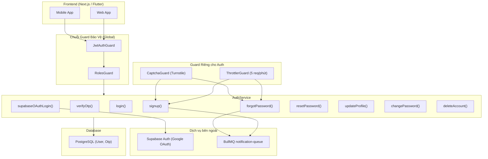
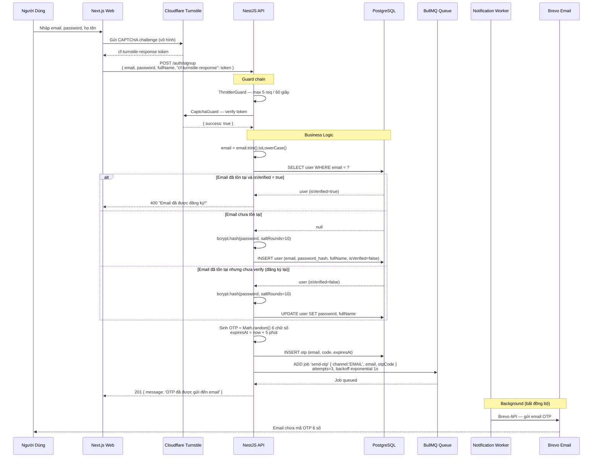
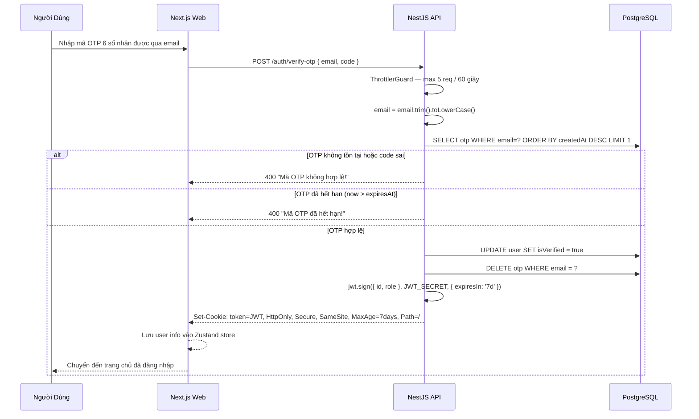
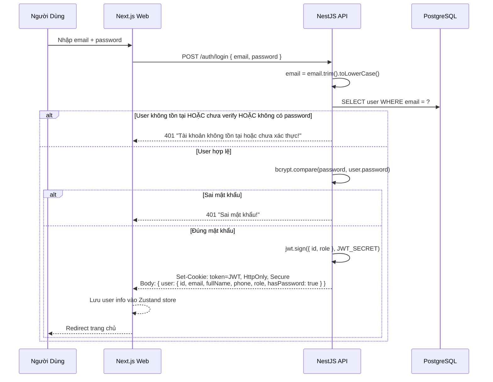
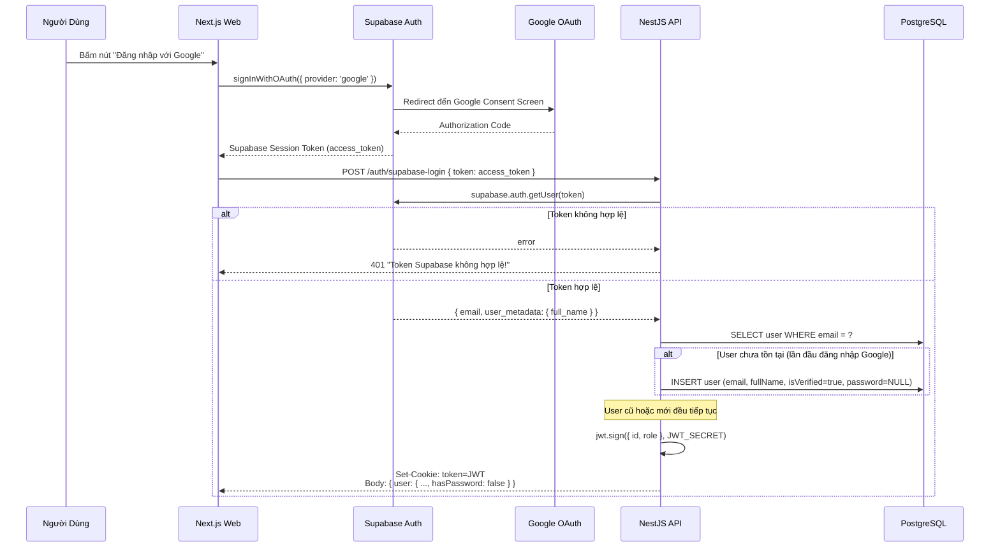
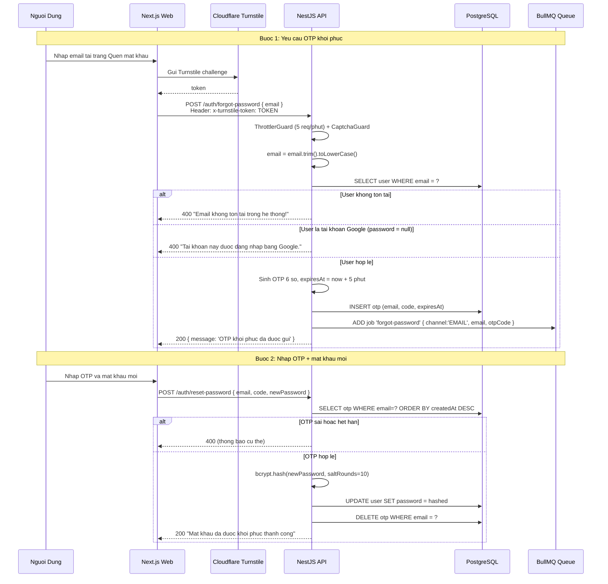
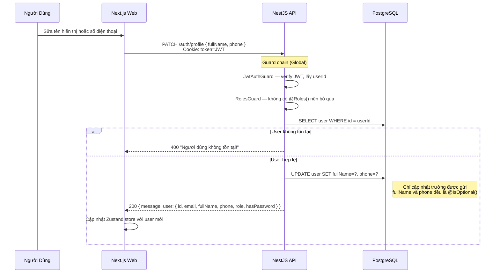
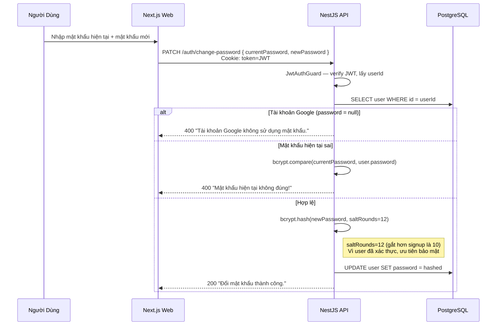
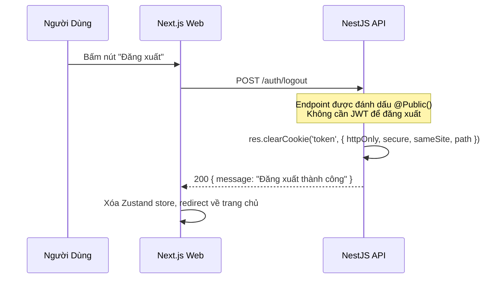
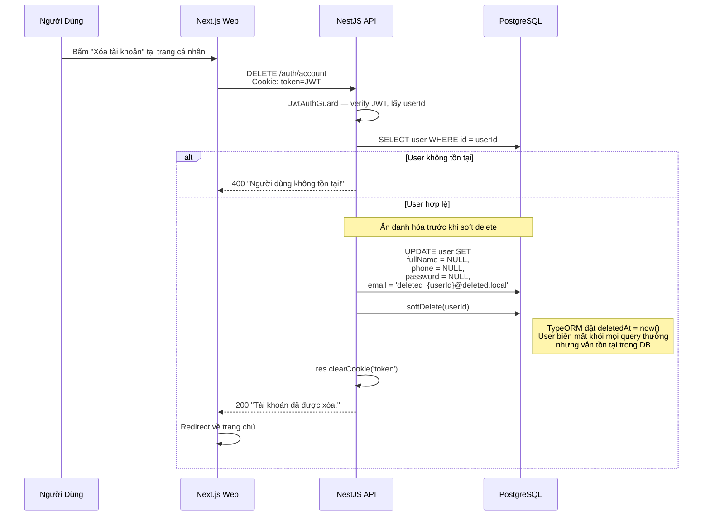

# Đặc Tả: Xác Thực và Phân Quyền (Auth Module)

## 1. Mô Tả

Module Auth chịu trách nhiệm toàn bộ vòng đời danh tính người dùng trong hệ thống TicketBox: đăng ký, xác thực, phân quyền, quản lý phiên đăng nhập và bảo vệ tài khoản. Hệ thống hỗ trợ đồng thời hai phương thức xác thực:

- **Email + OTP:** Đăng ký tài khoản nội bộ, xác thực qua mã OTP 6 số gửi vào email
- **Google OAuth (qua Supabase):** Đăng nhập nhanh bằng tài khoản Google, không cần đặt mật khẩu

Mọi endpoint trong hệ thống được bảo vệ mặc định bởi `JwtAuthGuard` đăng ký global — endpoint nào muốn public phải khai báo tường minh bằng decorator `@Public()`. Hệ thống phân quyền RBAC 3 cấp (AUDIENCE, ORGANIZER, STAFF) được thực thi bởi `RolesGuard` global, kiểm tra metadata `@Roles()` trên mỗi controller/handler.

**Các thành phần tham gia:**

| Thành phần     | File nguồn                          | Chức năng                                                                          |
| -------------- | ----------------------------------- | ---------------------------------------------------------------------------------- |
| AuthController | `auth.controller.ts`                | Định tuyến 10 endpoint, gắn ThrottlerGuard + CaptchaGuard, set/clear JWT Cookie   |
| AuthService    | `auth.service.ts`                   | Xử lý nghiệp vụ: signup, login, OTP, OAuth, profile, password, soft delete        |
| JwtAuthGuard   | `common/guards/jwt.strategy.ts`     | Guard global: đọc JWT từ Cookie hoặc Authorization header, gán `req.user`          |
| RolesGuard     | `common/guards/roles.guard.ts`      | Guard global: kiểm tra `req.user.role` với metadata `@Roles()`, throw 403 nếu sai |
| CaptchaGuard   | `common/guards/captcha.guard.ts`    | Xác thực Cloudflare Turnstile chống bot trên signup và forgot-password             |
| User Entity    | `entities/user.entity.ts`           | Schema: email, password (nullable), role (enum), isVerified, soft delete            |
| Otp Entity     | `entities/otp.entity.ts`            | Schema: email, code (6 số), expiresAt (5 phút), createdAt                          |
| Auth DTOs      | `auth/dto/auth.dto.ts`              | Validation: class-validator cho tất cả request body                                |

**Tổng quan kiến trúc:**



---

## 2. Luồng Chính

### 2.1. Đăng Ký Tài Khoản (Email + OTP)



Điểm đáng chú ý trong luồng đăng ký:

- Email được normalize bằng `trim().toLowerCase()` trước mọi thao tác — tránh duplicate do chữ hoa/thường hoặc khoảng trắng thừa.

- Nếu email đã tồn tại nhưng chưa verify (người dùng đăng ký rồi không nhập OTP), hệ thống cho phép đăng ký lại: cập nhật password và fullName mới, sinh OTP mới. Không tạo user trùng.

- OTP được gửi bất đồng bộ qua BullMQ — API trả về 201 ngay lập tức, không chờ email gửi xong. Nếu Brevo bị lỗi, BullMQ tự retry 3 lần với exponential backoff (1s, 2s, 4s).

---

### 2.2. Xác Thực OTP và Nhận JWT



Sau khi OTP hợp lệ, hệ thống thực hiện 3 thao tác tuần tự: (1) đánh dấu user đã verify, (2) xóa tất cả OTP của email này (không thể dùng lại), (3) ký JWT và trả về qua HttpOnly Cookie. Frontend không bao giờ nhìn thấy JWT token — nó được trình duyệt tự động gửi kèm mọi request.

---

### 2.3. Đăng Nhập Thông Thường (Email + Password)



Lưu ý điều kiện `!user.password` trong kiểm tra: tài khoản Google OAuth không có password (field = null), nên cố đăng nhập bằng email+password sẽ bị từ chối. Đây là thiết kế có chủ đích — buộc user OAuth luôn dùng luồng Google.

---

### 2.4. Đăng Nhập Google OAuth (qua Supabase)



Luồng OAuth hoạt động theo mô hình "Supabase là proxy": Frontend dùng Supabase SDK để mở Google Consent Screen, nhận access_token từ Supabase, rồi gửi token đó lên Backend TicketBox. Backend gọi `supabase.auth.getUser(token)` để verify và lấy thông tin email, fullName. Nếu email chưa tồn tại trong DB, tạo user mới với `isVerified = true` (Google đã xác thực email), `password = null` (không cần mật khẩu).

Field `hasPassword: false` được trả về Frontend để ẩn các tính năng không liên quan (đổi mật khẩu, quên mật khẩu) trên giao diện.

---

### 2.5. Quên Mật Khẩu (Forgot Password → Reset)



Lưu ý thiết kế: luồng forgot-password và signup dùng chung cơ chế OTP 6 số, nhưng template email khác nhau (`forgot-password` thay vì `send-otp`). Cả hai đều có CaptchaGuard + ThrottlerGuard để chống bot spam email hàng loạt.

---

### 2.6. Cập Nhật Hồ Sơ (Profile)



---

### 2.7. Đổi Mật Khẩu



Điểm đáng chú ý: `saltRounds=12` cho change-password trong khi signup dùng `saltRounds=10`. Lý do: khi user đã đăng nhập và chủ động đổi mật khẩu, server có thể dành thêm thời gian CPU để hash mạnh hơn (khoảng 4x chậm hơn) mà không ảnh hưởng trải nghiệm — vì đây là thao tác hiếm khi xảy ra. Với signup, response time quan trọng hơn vì user đang chờ OTP.

---

### 2.8. Đăng Xuất



Endpoint logout được đánh dấu `@Public()` — không yêu cầu JWT hợp lệ. Lý do: nếu JWT đã hết hạn hoặc bị lỗi, user vẫn cần có thể đăng xuất (clear cookie) mà không bị 401.

---

### 2.9. Xóa Tài Khoản (Soft Delete + Ẩn Danh Hóa)



Quy trình xóa tài khoản gồm 2 bước: (1) ẩn danh hóa — xóa trắng thông tin cá nhân (fullName, phone, password) và thay email bằng `deleted_{userId}@deleted.local`, (2) soft delete — TypeORM đặt `deletedAt = now()`. Dữ liệu Order và Ticket lịch sử vẫn tham chiếu được đến user đã xóa (foreign key giữ nguyên) để phục vụ đối chiếu tài chính.

---

## 3. Chi Tiết Kỹ Thuật

### 3.1. JWT Cookie Configuration

| Thuộc tính | Dev                 | Production                                  |
| ---------- | ------------------- | ------------------------------------------- |
| `httpOnly` | `true`              | `true`                                      |
| `secure`   | `false` (HTTP)      | `true` (HTTPS)                              |
| `sameSite` | `'lax'`             | `'none'` (cross-domain Vercel↔Render)       |
| `maxAge`   | 7 ngày              | 7 ngày                                      |
| `path`     | `/`                 | `/`                                         |

`sameSite='none'` trên production là bắt buộc vì Frontend (Vercel, domain `.vercel.app`) và Backend (Render, domain `.onrender.com`) khác origin. Nếu dùng `'lax'`, trình duyệt sẽ không gửi cookie cross-origin, dẫn đến mọi API call đều bị 401.

### 3.2. JWT Guard Chain

```
Request đến bất kỳ endpoint
        |
JwtAuthGuard (Global)
  |-- Đọc JWT từ Cookie 'token' HOẶC Authorization: Bearer header
  |-- jwt.verify(token, JWT_SECRET)
  |-- Gán req.user = { id, role }
  |-- Nếu endpoint có @Public() -> bỏ qua guard, cho đi
  |-- Nếu không có token hoặc invalid -> 401 Unauthorized
        |
RolesGuard (Global)
  |-- Đọc @Roles() metadata từ controller/handler
  |-- Nếu không có @Roles() -> cho đi
  |-- So sánh req.user.role với role yêu cầu
  |-- Nếu không đủ quyền -> 403 Forbidden
```

JwtAuthGuard đọc token theo thứ tự ưu tiên: Cookie `token` trước, Authorization header sau. Lý do: Web Frontend dùng Cookie (HttpOnly, bảo mật hơn), Mobile App dùng Authorization header (Flutter không hỗ trợ cookie tự động như trình duyệt).

### 3.3. Phân Quyền RBAC

**Mapping Role → Quyền:**

| Role       | Mô tả                                          | Cách tạo tài khoản     |
| ---------- | ----------------------------------------------- | ----------------------- |
| `AUDIENCE` | Khán giả — mua vé, xem vé của mình              | Tự đăng ký (default)    |
| `ORGANIZER`| Ban tổ chức — toàn quyền concert, ticket type, AI Bio | Admin cấp thủ công |
| `STAFF`    | Nhân sự soát vé — chỉ dùng Mobile App           | Admin cấp thủ công      |

**Bảng Endpoint → Role:**

| Endpoint | Method | AUDIENCE | ORGANIZER | STAFF | Public |
|---|---|:---:|:---:|:---:|:---:|
| `/auth/signup` | POST | — | — | — | ✅ |
| `/auth/verify-otp` | POST | — | — | — | ✅ |
| `/auth/login` | POST | — | — | — | ✅ |
| `/auth/supabase-login` | POST | — | — | — | ✅ |
| `/auth/logout` | POST | — | — | — | ✅ |
| `/auth/forgot-password` | POST | — | — | — | ✅ |
| `/auth/reset-password` | POST | — | — | — | ✅ |
| `/auth/profile` | PATCH | ✅ | ✅ | ✅ | ❌ |
| `/auth/change-password` | PATCH | ✅ | ✅ | ✅ | ❌ |
| `/auth/account` | DELETE | ✅ | ✅ | ✅ | ❌ |
| `/concerts` | GET | ✅ | ✅ | ✅ | ✅ |
| `/concerts` | POST | ❌ | ✅ | ❌ | ❌ |
| `/concerts/:id/upload-bio` | POST | ❌ | ✅ | ❌ | ❌ |
| `/booking` | POST | ✅ | ❌ | ❌ | ❌ |
| `/payment/create-url` | POST | ✅ | ❌ | ❌ | ❌ |
| `/payment/vnpay-ipn` | GET | — | — | — | ✅ |
| `/payment/momo-ipn` | POST | — | — | — | ✅ |
| `/ticket/my-tickets` | GET | ✅ | ❌ | ❌ | ❌ |
| `/ticket/download` | GET | ❌ | ❌ | ✅ | ❌ |
| `/ticket/batch-sync` | POST | ❌ | ❌ | ✅ | ❌ |
| `/guest` | GET | ❌ | ✅ | ✅ | ❌ |
| `/guest/import-csv` | POST | ❌ | ✅ | ❌ | ❌ |

---

## 4. Kịch Bản Lỗi

### 4.1. Đăng Ký / Xác Thực OTP

| Kịch bản                        | HTTP | Response                                | Hành động phía Frontend                          |
| -------------------------------- | ---- | --------------------------------------- | ------------------------------------------------ |
| Email đã đăng ký và verified     | 400  | `"Email đã được đăng ký!"`              | Hiển thị lỗi, gợi ý đăng nhập                   |
| OTP nhập sai                    | 400  | `"Mã OTP không hợp lệ!"`               | Hiển thị lỗi, cho nhập lại                       |
| OTP hết hạn (> 5 phút)          | 400  | `"Mã OTP đã hết hạn!"`                 | Hiển thị nút "Gửi lại OTP"                      |
| Không có CAPTCHA token           | 403  | `"Thiếu mã xác thực Captcha"`          | Lỗi phía Frontend, cần kiểm tra integration      |
| CAPTCHA fail (bot)               | 403  | `"Xác thực Captcha thất bại"`          | Hiển thị lỗi, yêu cầu thử lại                   |
| Spam quá 5 req / 60s            | 429  | Too Many Requests                       | Hiển thị "Vui lòng thử lại sau"                  |

### 4.2. Đăng Nhập

| Kịch bản                              | HTTP | Response                                            | Hành động phía Frontend                    |
| ------------------------------------- | ---- | --------------------------------------------------- | ------------------------------------------ |
| Email không tồn tại                   | 401  | `"Tài khoản không tồn tại hoặc chưa xác thực!"`    | Hiển thị lỗi, gợi ý đăng ký               |
| Account chưa verify OTP               | 401  | `"Tài khoản không tồn tại hoặc chưa xác thực!"`    | Cùng message — không leak thông tin verify |
| Sai mật khẩu                         | 401  | `"Sai mật khẩu!"`                                   | Hiển thị lỗi, gợi ý quên mật khẩu          |
| Token Supabase không hợp lệ           | 401  | `"Token Supabase không hợp lệ!"`                    | Hiển thị lỗi, yêu cầu thử lại Google      |

### 4.3. Truy Cập Endpoint Có Auth

| Kịch bản                       | HTTP | Response     | Hành động phía Frontend                     |
| ------------------------------ | ---- | ------------ | ------------------------------------------- |
| Không có JWT                   | 401  | Unauthorized | Redirect sang trang đăng nhập               |
| JWT hết hạn (> 7 ngày)        | 401  | Unauthorized | Clear local state, redirect sang đăng nhập  |
| JWT bị giả mạo (sai signature) | 401  | Unauthorized | Clear local state, redirect sang đăng nhập  |
| Role không đủ quyền            | 403  | Forbidden    | Hiển thị "Bạn không có quyền truy cập"      |

### 4.4. Quên Mật Khẩu / Đổi Mật Khẩu

| Kịch bản                                     | HTTP | Response                                                |
| -------------------------------------------- | ---- | ------------------------------------------------------- |
| Gọi forgot-password cho tài khoản Google      | 400  | `"Tài khoản này được đăng nhập bằng Google."`           |
| Gọi change-password cho tài khoản Google      | 400  | `"Tài khoản Google không sử dụng mật khẩu."`           |
| Mật khẩu hiện tại sai khi đổi mật khẩu       | 400  | `"Mật khẩu hiện tại không đúng!"`                       |
| Mật khẩu mới ngắn hơn 6 ký tự               | 400  | `"Mật khẩu mới phải có ít nhất 6 ký tự"` (DTO validate) |

---

## 5. Ràng Buộc

### 5.1. Bảo Mật

- **Password hashing:** bcrypt với `saltRounds=10` (signup, forgot-password) và `saltRounds=12` (change-password). Change-password dùng cost cao hơn vì user đã authenticate, server có thể dành thêm CPU.

- **JWT TTL:** 7 ngày — đủ dài để khán giả không bị đăng xuất giữa chừng khi mua vé, nhưng đủ ngắn để giảm rủi ro nếu token bị lộ.

- **HttpOnly Cookie:** JavaScript phía client không thể đọc JWT — chống XSS hoàn toàn. Cookie được gửi tự động bởi trình duyệt.

- **SameSite=None; Secure** trên production: bắt buộc vì Frontend (Vercel) và Backend (Render) khác domain.

- **OTP TTL:** 5 phút — đủ ngắn để không bị brute-force (10^6 combinations / 5 req per phút = không khả thi).

- **CaptchaGuard** chỉ áp dụng trên 2 endpoint tạo email outbound (signup, forgot-password) — chống bot spam hàng ngàn email qua hệ thống.

### 5.2. Hiệu Năng

- Rate limiting trên toàn bộ AuthController (`ThrottlerGuard`) với Redis-backed storage — đồng bộ giữa nhiều server instance.

- OTP email gửi bất đồng bộ qua BullMQ — POST /auth/signup trả về 201 ngay lập tức, không chờ email gửi xong.

- Retry 3 lần với exponential backoff nếu Brevo bị lỗi tạm thời.

### 5.3. Tính Toàn Vẹn Dữ Liệu

- Email được normalize: `email.trim().toLowerCase()` trước mọi thao tác — tránh duplicate do chữ hoa/thường.

- Tài khoản Google không có password (`password = null`) — không thể dùng login thường hay forgot-password.

- Soft delete: Tài khoản xóa được ẩn danh hóa (email thay bằng `deleted_{id}@deleted.local`, fullName/phone/password set null) và đánh dấu `deletedAt`, KHÔNG xóa cứng — giữ lại Order/Ticket lịch sử.

- OTP được xóa ngay sau khi verify thành công — không thể dùng lại.

- **DTO validation** bằng `class-validator` trên tất cả request body: email phải hợp lệ (`@IsEmail`), password tối thiểu 6 ký tự (`@MinLength(6)`), OTP phải đúng 6 ký tự (`@Length(6,6)`).

---

## 6. Quyết Định Thiết Kế

### 6.1. Tại sao dùng HttpOnly Cookie thay vì localStorage cho JWT?

| Tiêu chí          | localStorage                            | HttpOnly Cookie                          |
| ----------------- | --------------------------------------- | ---------------------------------------- |
| XSS Protection    | Không — JS có thể đọc token            | Có — JS không thể truy cập              |
| CSRF Protection   | Miễn nhiễm (không tự gửi)              | Cần SameSite + CORS                     |
| Cross-tab sharing | Có (tất cả tab dùng chung)             | Có (cookie dùng chung)                  |
| Mobile App        | Không liên quan                         | Cần fallback Authorization header        |
| Độ phức tạp       | Đơn giản                               | Phức tạp hơn (cookie config, CORS)       |

**Quyết định:** HttpOnly Cookie cho Web, Authorization header cho Mobile.

**Lý do:** XSS là rủi ro phổ biến nhất trên web app. Một lỗ hổng XSS duy nhất cho phép attacker đánh cắp toàn bộ JWT từ localStorage. HttpOnly Cookie miễn nhiễm hoàn toàn vì JavaScript không thể đọc. CSRF được xử lý bằng SameSite + CORS origin check. Mobile App (Flutter) không hỗ trợ cookie tự động nên dùng Authorization Bearer header — JwtAuthGuard đã hỗ trợ cả hai cơ chế.

### 6.2. Tại sao dùng OTP qua Email thay vì Magic Link?

| Tiêu chí           | OTP 6 số                              | Magic Link (URL token)                   |
| ------------------ | -------------------------------------- | ---------------------------------------- |
| UX trên Mobile     | Tốt (nhập 6 số, autofill)             | Kém (mở link có thể ra web thay vì app)  |
| Bảo mật            | 10^6 combinations, rate limited        | Token dài, khó brute-force               |
| Chia sẻ email      | An toàn (OTP hết hạn 5 phút)          | Nguy hiểm (link có thể bị forward)       |
| Phụ thuộc backend  | Stateful (lưu OTP trong DB)           | Stateless (verify bằng signature)        |

**Quyết định:** OTP 6 số qua email.

**Lý do:** TicketBox có Mobile App (Flutter). Magic Link mở trên trình duyệt thay vì app, UX kém. OTP 6 số hỗ trợ autofill trên cả iOS và Android. Kết hợp với ThrottlerGuard (5 req/phút) và TTL 5 phút, brute-force không khả thi (cần 200,000 phút = 139 ngày để thử hết 10^6 combinations).

### 6.3. Tại sao dùng Supabase làm proxy cho Google OAuth thay vì tích hợp trực tiếp?

| Tiêu chí           | Tích hợp Google trực tiếp             | Supabase làm proxy                       |
| ------------------ | ------------------------------------- | ---------------------------------------- |
| Cấu hình           | Google Cloud Console (phức tạp)       | Bật toggle trên Supabase Dashboard       |
| Thêm provider mới  | Viết code cho mỗi provider            | Bật toggle (GitHub, Facebook, etc.)      |
| Token management   | Tự quản lý refresh token              | Supabase quản lý                         |
| Phụ thuộc          | Chỉ Google                            | Thêm Supabase                            |

**Quyết định:** Supabase làm proxy.

**Lý do:** Supabase đã được dùng trong hệ thống (Storage cho ảnh concert). Tận dụng Auth module có sẵn giúp thêm các provider mới (GitHub, Facebook) chỉ bằng 1 click trên Dashboard, không cần viết code. Backend chỉ cần 1 endpoint `supabase-login` cho tất cả OAuth provider.

### 6.4. Tại sao ẩn danh hóa trước khi soft delete thay vì chỉ soft delete?

| Tiêu chí          | Chỉ soft delete                        | Ẩn danh hóa + soft delete                |
| ----------------- | -------------------------------------- | ---------------------------------------- |
| GDPR compliance   | Không (PII vẫn còn trong DB)           | Có (PII đã bị xóa)                      |
| Khả năng phục hồi | Có thể restore nguyên vẹn             | Không thể restore thông tin cá nhân      |
| Dữ liệu tài chính | Giữ nguyên (Order vẫn có user_id)     | Giữ nguyên (Order vẫn có user_id)        |
| Email unique       | Email cũ bị chiếm, không đăng ký lại  | Email cũ được giải phóng, có thể tái sử dụng |

**Quyết định:** Ẩn danh hóa trước khi soft delete.

**Lý do:** Theo nguyên tắc GDPR và bảo vệ dữ liệu cá nhân, khi user yêu cầu xóa tài khoản, PII (Personally Identifiable Information) phải được xóa triệt để. Chỉ soft delete thì email, tên, số điện thoại vẫn nằm trong DB. Ẩn danh hóa (thay email bằng `deleted_{id}@deleted.local`, set null các field còn lại) đảm bảo không thể truy vết ngược về cá nhân. Foreign key từ Order vẫn giữ nguyên để đối chiếu tài chính.

---

## 7. Tiêu Chí Chấp Nhận

| #   | Hành vi                                                        | Kết quả mong đợi                                                                                |
| --- | -------------------------------------------------------------- | ------------------------------------------------------------------------------------------------ |
| 1   | Đăng ký email mới → nhận OTP → verify OTP                     | Tạo tài khoản thành công, nhận JWT Cookie, redirect vào app                                     |
| 2   | Đăng ký lại email đã verify                                   | 400 "Email đã được đăng ký!"                                                                    |
| 3   | Đăng ký lại email chưa verify (bỏ dở lần trước)               | Cập nhật password/fullName, sinh OTP mới, không tạo user trùng                                   |
| 4   | Nhập OTP sai 3 lần                                            | Mỗi lần đều trả 400, OTP vẫn còn giá trị đến hết 5 phút                                        |
| 5   | Nhập OTP sau 5 phút                                           | 400 "Mã OTP đã hết hạn!"                                                                        |
| 6   | Đăng nhập bằng Google → lần đầu                               | Tạo user mới, role=AUDIENCE, hasPassword=false, isVerified=true                                  |
| 7   | Đăng nhập bằng Google → lần 2                                 | Dùng lại user cũ, không tạo duplicate                                                            |
| 8   | Gọi forgot-password cho tài khoản Google                      | 400 "Tài khoản này được đăng nhập bằng Google.", KHÔNG gửi email                                |
| 9   | Gọi change-password cho tài khoản Google                      | 400 "Tài khoản Google không sử dụng mật khẩu."                                                  |
| 10  | ORGANIZER gọi POST /booking                                   | 403 Forbidden                                                                                    |
| 11  | AUDIENCE gọi POST /concerts                                   | 403 Forbidden                                                                                    |
| 12  | STAFF gọi POST /guest/import-csv                              | 403 Forbidden                                                                                    |
| 13  | Request không có Cookie JWT                                    | 401 Unauthorized                                                                                 |
| 14  | Bot gửi 10 req/s đến /auth/signup                             | Request thứ 6+ bị 429 Too Many Requests                                                         |
| 15  | Bot không có CAPTCHA token                                    | 403 Forbidden ngay lập tức                                                                       |
| 16  | Xóa tài khoản → kiểm tra DB                                  | fullName=null, phone=null, password=null, email=deleted_{id}@deleted.local, deletedAt có giá trị |
| 17  | Xóa tài khoản → xem lại lịch sử Order                        | Order vẫn tồn tại trong DB, user_id vẫn trỏ đến bản ghi đã soft delete                          |
| 18  | Đăng xuất → gọi API có auth                                   | 401 Unauthorized (cookie đã bị clear)                                                            |
| 19  | Mobile App gửi JWT qua Authorization: Bearer header            | JwtAuthGuard chấp nhận, hoạt động bình thường                                                    |
| 20  | DTO validation: email = "not-an-email"                        | 400 "Email không hợp lệ"                                                                        |
| 21  | DTO validation: password = "123"                              | 400 "Mật khẩu phải có ít nhất 6 ký tự"                                                          |

