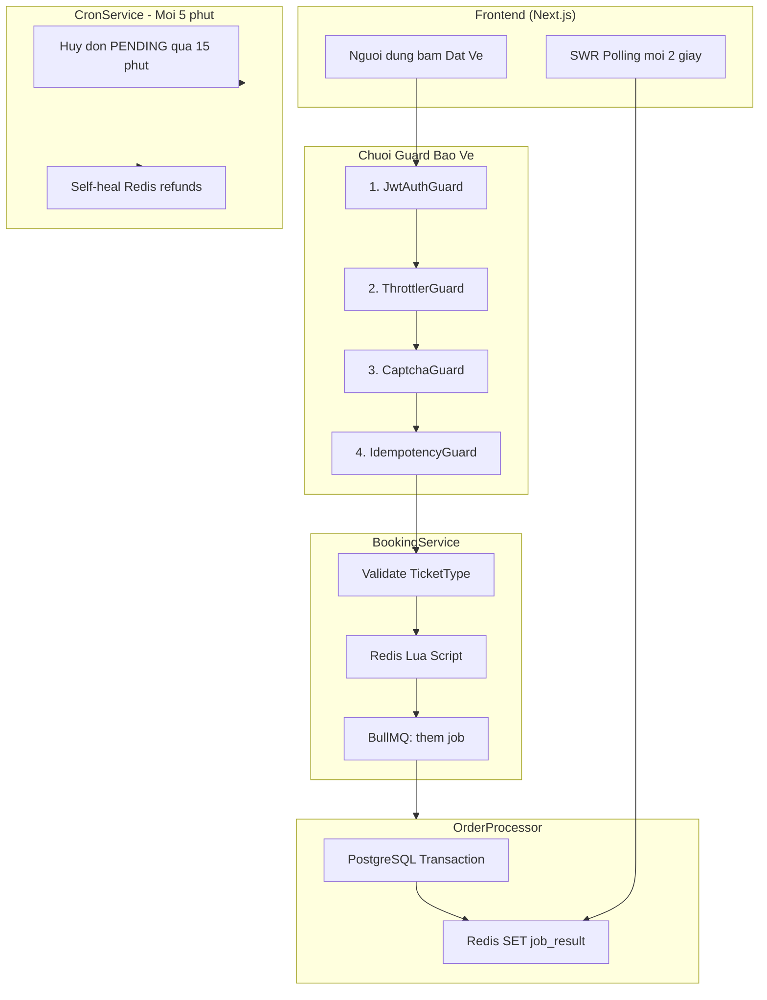
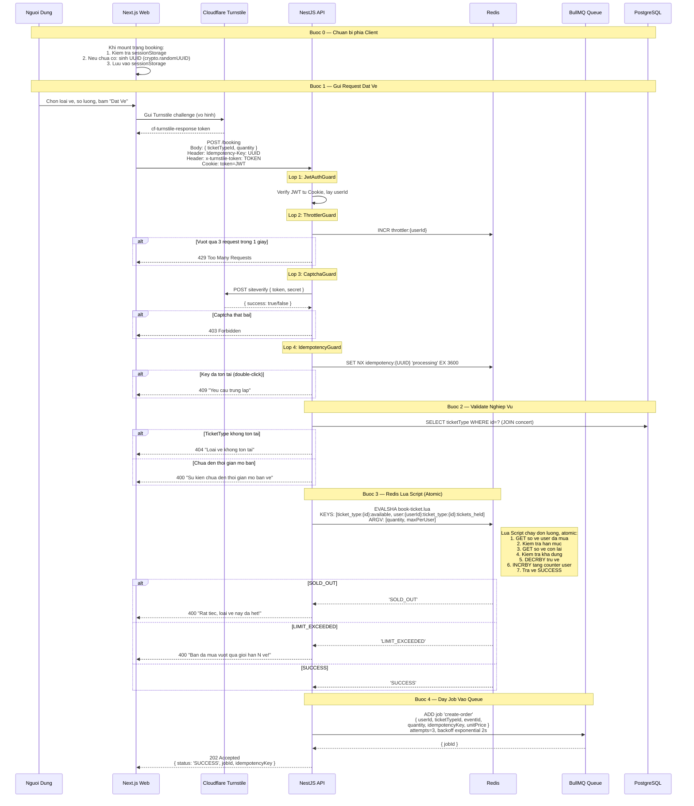
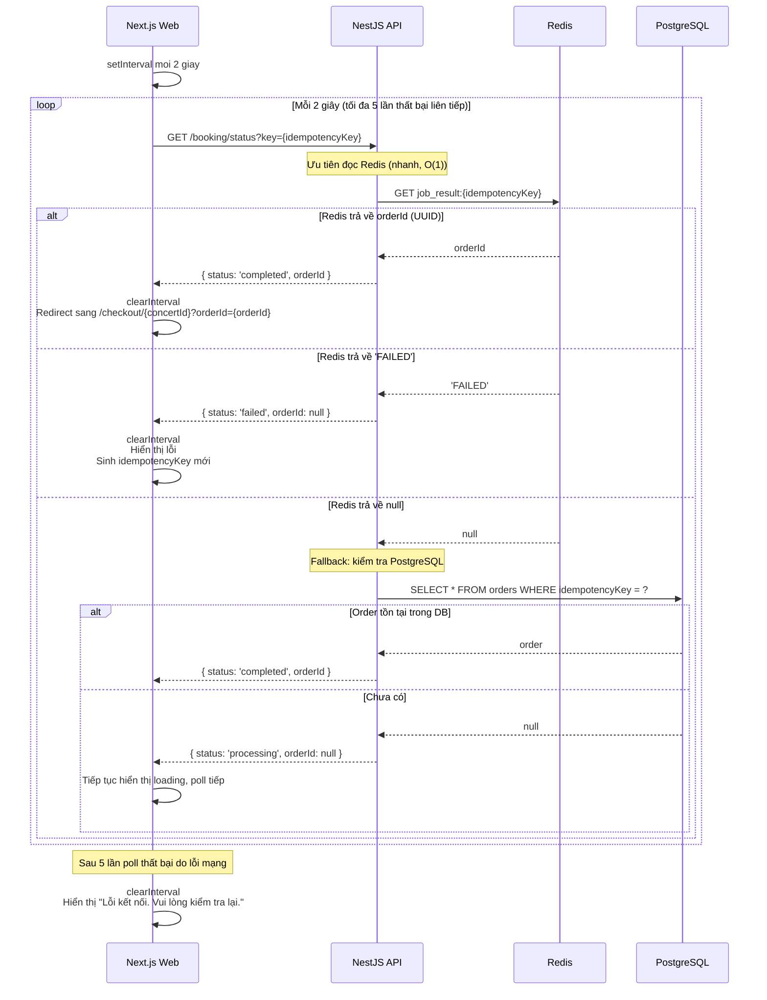
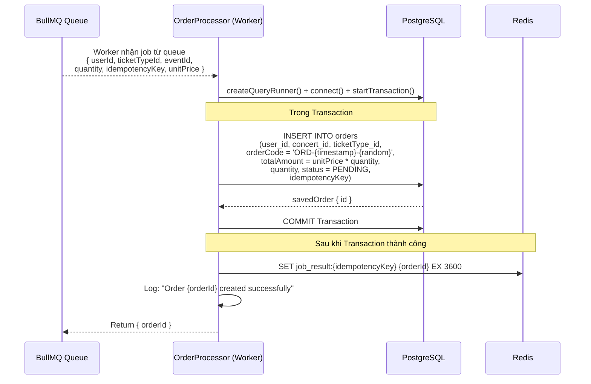
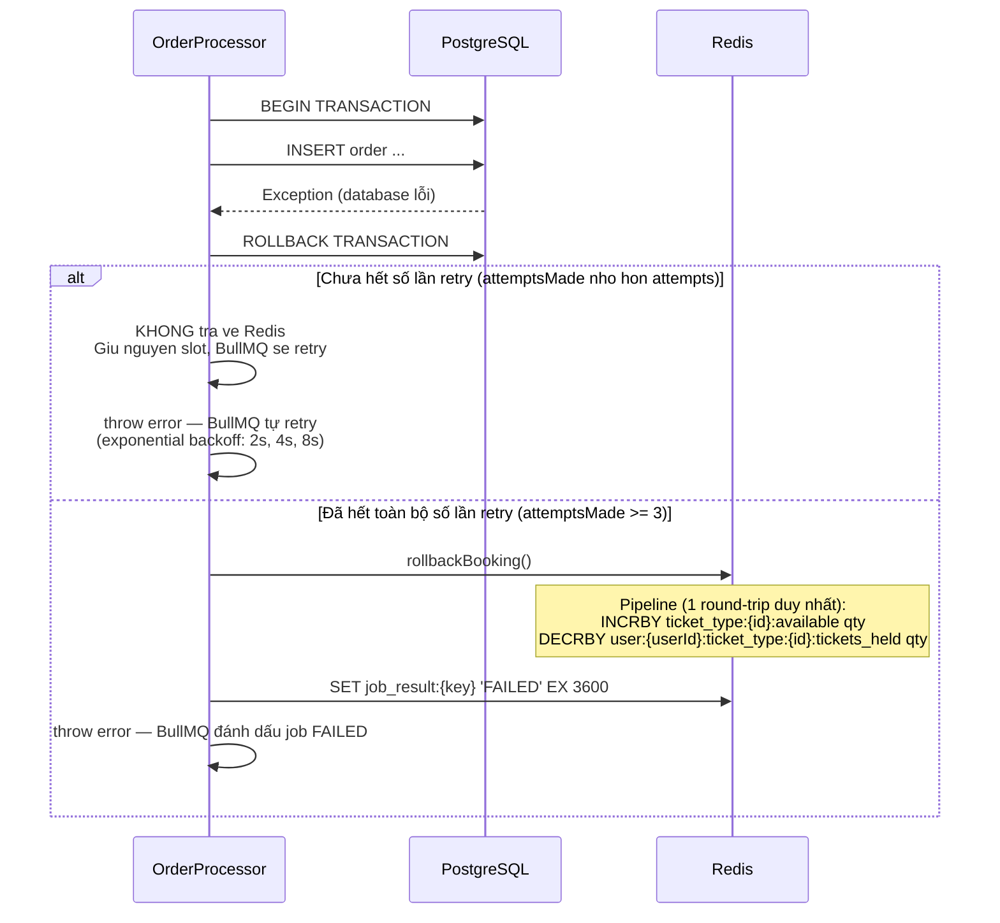
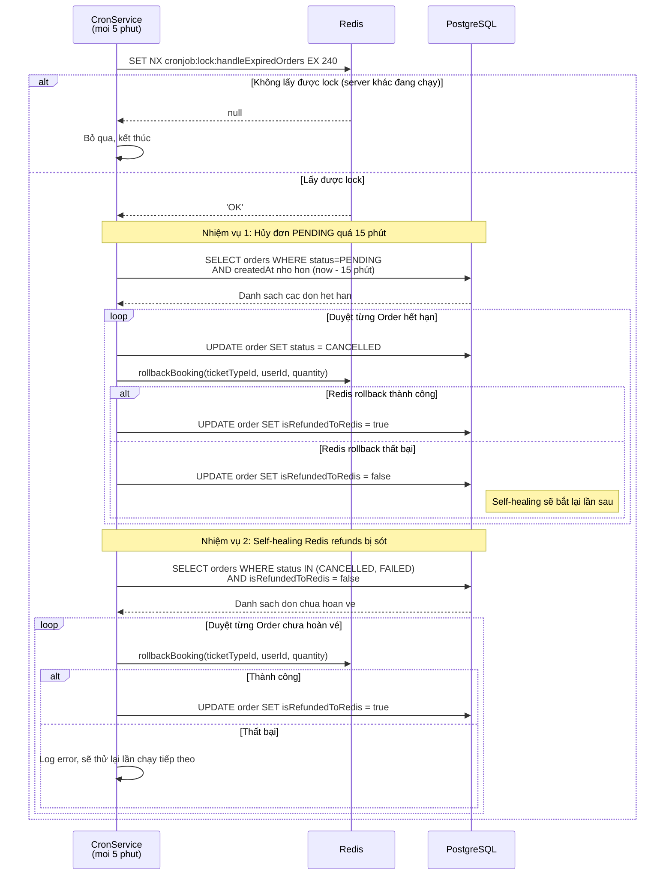

# Đặc Tả: Luồng Đặt Vé Đồng Thời (Concurrency Booking)


> **TicketBox - Hệ thống đặt vé sự kiện trực tuyến**
>
> _Đồ án Thiết kế Phần mềm - Khoa Công nghệ Thông tin - Trường Đại học Khoa học Tự nhiên, ĐHQG-HCM_

---

## Mục Lục

- [1. Mô Tả](#1-mô-tả)
- [2. Luồng Chính](#2-luồng-chính)
  - [2.1. Đặt Vé — 5 Lớp Bảo Vệ](#21-đặt-vé--5-lớp-bảo-vệ)
  - [2.2. Frontend Polling Kết Quả](#22-frontend-polling-kết-quả)
  - [2.3. Worker Tạo Order (Background)](#23-worker-tạo-order-background)
  - [2.4. Compensating Transaction — Hoàn Vé Redis khi Worker Thất Bại](#24-compensating-transaction--hoàn-vé-redis-khi-worker-thất-bại)
  - [2.5. Cronjob Hủy Đơn Treo và Self-Healing](#25-cronjob-hủy-đơn-treo-và-self-healing)
- [3. Kịch Bản Lỗi](#3-kịch-bản-lỗi)
- [4. Ràng Buộc](#4-ràng-buộc)
- [5. Quyết Định Thiết Kế](#5-quyết-định-thiết-kế)
- [6. Tiêu Chí Chấp Nhận](#6-tiêu-chí-chấp-nhận)

---

## 1. Mô Tả

Module Booking xử lý bài toán cốt lõi của TicketBox: **hàng chục nghìn người cùng tranh mua vé tại một thời điểm**. Đây là bài toán đồng thời (concurrency) với yêu cầu tuyệt đối: không bao giờ bán nhiều vé hơn số lượng thực tế (zero overselling), không cho một người mua vượt quá hạn mức cho phép, và không trừ tiền hai lần dù người dùng bấm nhiều lần.

Hệ thống được thiết kế với **kiến trúc tách biệt 2 giai đoạn**:

1. **Giữ vé (Booking):** Xử lý toàn bộ bằng Redis Lua Script (dưới 1ms, atomic) — không tác động database.
2. **Tạo đơn hàng (Order Creation):** Đẩy vào hàng đợi BullMQ, Worker xử lý ngầm, ghi vào PostgreSQL khi sẵn sàng.

Việc tách biệt này đảm bảo backend không bao giờ bị nghẽn dưới tải cao, vì thao tác nặng (ghi database) được tách khỏi thao tác nhanh (trừ vé trên Redis).

**Các thành phần tham gia:**

| Thành phần        | File nguồn                           | Chức năng                                             |
| ----------------- | ------------------------------------ | ----------------------------------------------------- |
| BookingController | `booking.controller.ts`              | Định tuyến API, gắn chuỗi Guard bảo vệ                |
| BookingService    | `booking.service.ts`                 | Xử lý logic đặt vé: validate, gọi Lua Script, đẩy job |
| OrderProcessor    | `order.processor.ts`                 | Background Worker tạo Order trong PostgreSQL          |
| CronService       | `cron.service.ts`                    | Hủy đơn treo, self-healing Redis refunds              |
| RedisService      | `redis/redis.service.ts`             | Load Lua Script, quản lý idempotency, rollback vé     |
| IdempotencyGuard  | `common/guards/idempotency.guard.ts` | Chặn double-click bằng Redis SET NX                   |
| CaptchaGuard      | `common/guards/captcha.guard.ts`     | Xác thực Cloudflare Turnstile chống bot               |
| book-ticket.lua   | `redis/lua/book-ticket.lua`          | Lua Script atomic: kiểm tra hạn mức + trừ vé          |

**Tổng quan kiến trúc:**



---

## 2. Luồng Chính

### 2.1. Đặt Vé — 5 Lớp Bảo Vệ

Đây là luồng xử lý phức tạp nhất trong toàn bộ hệ thống. Mỗi request đặt vé phải vượt qua 5 lớp bảo vệ trước khi được xử lý. Mỗi lớp giải quyết một rủi ro cụ thể.



**Chi tiết 5 lớp bảo vệ:**

| Lớp | Guard / Component | Mối nguy được ngăn chặn                  | Cơ chế                                   | Thời gian xử lý |
| --- | ----------------- | ---------------------------------------- | ---------------------------------------- | --------------- |
| 1   | JwtAuthGuard      | Người dùng chưa đăng nhập, token giả mạo | Verify JWT local bằng secret key         | Duoi 1ms        |
| 2   | ThrottlerGuard    | Bot gửi hàng trăm request mỗi giây       | Redis INCR, giới hạn 3 req/giây/user     | Duoi 1ms        |
| 3   | CaptchaGuard      | Bot tự động giả lập hành vi người dùng   | Cloudflare Turnstile verification        | 50-100ms        |
| 4   | IdempotencyGuard  | Double-click, mạng lag gửi lại request   | Redis SET NX với TTL 1 giờ               | Duoi 1ms        |
| 5   | Redis Lua Script  | Overselling, vượt hạn mức mua vé         | Atomic script trên Redis single-threaded | Duoi 0.1ms      |

Tổng thời gian Guard chain: khoảng 55-105ms — phần lớn là thời gian gọi Cloudflare Turnstile.

**Chi tiết Lua Script `book-ticket.lua`:**

```lua
-- KEYS[1] = ticket_type:{ticketTypeId}:available
-- KEYS[2] = user:{userId}:ticket_type:{ticketTypeId}:tickets_held
-- ARGV[1] = quantity (số vé muốn mua)
-- ARGV[2] = maxPerUser (hạn mức tối đa mỗi user)

-- Bước 1: Kiểm tra hạn mức user
local user_bought = tonumber(redis.call('GET', KEYS[2]) or '0')
if (user_bought + qty) > max_per_user then
    return 'LIMIT_EXCEEDED'
end

-- Bước 2: Kiểm tra số vé còn lại
local available = tonumber(redis.call('GET', KEYS[1]) or '0')
if available < qty then
    return 'SOLD_OUT'
end

-- Bước 3: Trừ vé + tăng counter user (atomic)
redis.call('DECRBY', KEYS[1], qty)
redis.call('INCRBY', KEYS[2], qty)
return 'SUCCESS'
```

Tại sao Lua Script đảm bảo an toàn? Redis là single-threaded — khi Lua Script đang chạy, không có request nào khác có thể chen ngang. 6 lệnh trong script (2 GET, 2 kiểm tra, 1 DECRBY, 1 INCRBY) được thực thi như một khối nguyên tử (indivisible). Không tồn tại khoảng thời gian giữa lúc đọc số vé và lúc trừ vé để request khác xen vào.

---

### 2.2. Frontend Polling Kết Quả

Sau khi nhận 202 Accepted, Frontend chuyển sang trạng thái polling để biết Worker đã tạo Order xong chưa.



**State Machine phía Frontend:**

```
idle --> submitting --> polling --> completed (redirect sang checkout)
                                \-> failed (hiển thị lỗi, sinh key mới)
                   \-> error (lỗi ngay khi gửi request)
```

Luồng đọc kết quả được thiết kế ưu tiên Redis (nhanh, O(1)) rồi mới fallback sang PostgreSQL. Trường hợp Redis key đã hết hạn (TTL 1 giờ) nhưng Order vẫn tồn tại trong DB thì vẫn tìm được.

Khi booking thất bại (SOLD_OUT, LIMIT_EXCEEDED, hoặc Worker FAILED), Frontend sinh UUID mới bằng `crypto.randomUUID()` và ghi đè vào `sessionStorage` để người dùng có thể thử lại mà không bị IdempotencyGuard chặn.

---

### 2.3. Worker Tạo Order (Background)



Các điểm thiết kế quan trọng:

- **Order code:** Format `ORD-{Date.now()}-{random5chars}` tạo mã đơn hàng duy nhất, dùng làm tham chiếu khi gửi sang cổng thanh toán VNPAY/MoMo.

- **Status = PENDING:** Order được tạo ở trạng thái PENDING, chờ thanh toán từ Payment Module. Nếu không thanh toán trong 15 phút, CronService sẽ tự động hủy và hoàn vé.

- **Job result TTL = 3600 giây:** Frontend chỉ poll trong vài giây, nhưng giữ key 1 giờ để phòng trường hợp người dùng tải lại trang và cần kiểm tra lại trạng thái.

- **Transaction Postgres:** Dùng `QueryRunner` để mở transaction thủ công. Nếu INSERT thất bại, transaction được rollback và không có dữ liệu rác trong DB.

---

### 2.4. Compensating Transaction — Hoàn Vé Redis khi Worker Thất Bại

Khi Worker thất bại (database lỗi, connection timeout), vé đã bị trừ trong Redis nhưng Order chưa được tạo trong DB. Cần trả vé lại Redis để không mất vé "ảo".



**Tại sao không trả vé về Redis ngay ở lần retry đầu tiên?**

Đây là một lỗ hổng nghiêm trọng cần phải xử lý đúng. Xét kịch bản nếu trả vé ngay:

1. Worker lần 1 thất bại, trả +1 vé về Redis (slot được giải phóng)
2. Người dùng B ngay lập tức mua slot này (Redis -1 vé, thành công)
3. Worker của người dùng A retry lần 2 — INSERT thành công vào DB
4. **Kết quả:** Cả A và B đều có đơn hàng cho cùng 1 slot — overselling

Giải pháp: **chỉ trả vé về Redis khi đã hết toàn bộ số lần retry** (mặc định 3 lần). Lúc này chắc chắn Job sẽ không bao giờ thành công nữa, nên việc giải phóng slot là an toàn. Slot bị "khóa" thêm 8-12 giây (thời gian retry) là chấp nhận được so với rủi ro overselling.

---

### 2.5. Cronjob Hủy Đơn Treo và Self-Healing

CronService chạy mỗi 5 phút, thực hiện 2 nhiệm vụ: hủy đơn PENDING quá 15 phút và self-healing Redis refunds bị bỏ sót.



**Tại sao cần Self-Healing?**

Xét kịch bản: Cronjob tìm thấy 5 đơn hết hạn. Cập nhật DB thành CANCELLED cho cả 5, nhưng Redis bị lỗi mạng khi rollback đơn thứ 3:

- Don 1, 2: CANCELLED + isRefundedToRedis = true (bình thường)
- Don 3: CANCELLED + isRefundedToRedis = false (Redis chưa hoàn)
- Don 4, 5: CANCELLED + isRefundedToRedis = false (chưa xử lý)

Self-Healing chạy ở lần cronjob tiếp theo, tìm tất cả đơn có `isRefundedToRedis = false` và thử hoàn vé lại. Đây là cơ chế **eventually consistent** — đảm bảo Redis và PostgreSQL cuối cùng sẽ đồng bộ, dù có lỗi giữa chừng.

**Distributed Lock cho Cronjob:**

| Tham số         | Giá trị                            | Lý do                                                                       |
| --------------- | ---------------------------------- | --------------------------------------------------------------------------- |
| Lock key        | `cronjob:lock:handleExpiredOrders` | Định danh duy nhất cho cronjob này                                          |
| Lock TTL        | 240 giây (4 phút)                  | Cron chạy mỗi 5 phút. TTL 4 phút đảm bảo lock tự nhả trước chu kỳ tiếp theo |
| Cơ chế nhả lock | Tự động (TTL expire)               | Không cần gọi DEL — tránh trường hợp server crash mà không nhả được lock    |

Khi chạy nhiều server NestJS (horizontal scaling), Redis SET NX đảm bảo chỉ 1 server duy nhất lấy được lock. Các server còn lại bỏ qua, tránh việc 2 server cùng hủy đơn và rollback Redis 2 lần (double refund).

---

## 3. Kịch Bản Lỗi

### 3.1. Request Đặt Vé

| Kịch bản                                     | HTTP | Response          | Hành động phía Frontend                         |
| -------------------------------------------- | ---- | ----------------- | ----------------------------------------------- |
| Người dùng chưa đăng nhập                    | 401  | Unauthorized      | Redirect sang trang đăng nhập                   |
| Bot gửi hơn 3 request mỗi giây               | 429  | Too Many Requests | Hiển thị "Vui lòng thử lại sau"                 |
| Captcha thất bại (nghi ngờ bot)              | 403  | Forbidden         | Hiển thị lỗi, yêu cầu thử lại captcha           |
| Thiếu header Idempotency-Key                 | 400  | Bad Request       | Lỗi phía Frontend, cần sửa code                 |
| Double-click (key trùng lặp)                 | 409  | Conflict          | Bỏ qua, không làm gì (request trước đang xử lý) |
| TicketType không tồn tại                     | 404  | Not Found         | Hiển thị lỗi                                    |
| Chưa đến thời gian mở bán                    | 400  | Bad Request       | Hiển thị countdown đến openTime                 |
| Hết vé (Lua Script trả SOLD_OUT)             | 400  | Bad Request       | Hiển thị "Hết vé", vô hiệu hóa nút mua          |
| Vượt hạn mức (Lua Script trả LIMIT_EXCEEDED) | 400  | Bad Request       | Hiển thị "Đã đạt tối đa N vé"                   |

### 3.2. Worker Tạo Order

| Kịch bản                                | Xử lý                                             | Hậu quả                                                                             |
| --------------------------------------- | ------------------------------------------------- | ----------------------------------------------------------------------------------- |
| Database connection timeout             | Rollback transaction, BullMQ retry (tối đa 3 lần) | Nếu retry thành công: bình thường. Hết retry: trả vé về Redis, Frontend nhận FAILED |
| Database disk full                      | INSERT thất bại, retry không hiệu quả             | Hết retry: trả vé về Redis, ghi log cảnh báo                                        |
| Redis không khả dụng khi lưu job_result | Order đã tạo trong DB nhưng Frontend không biết   | Frontend poll timeout, fallback GET /booking/status kiểm tra Postgres trực tiếp     |

### 3.3. Cronjob

| Kịch bản                             | Xử lý                                        | Hậu quả                                                  |
| ------------------------------------ | -------------------------------------------- | -------------------------------------------------------- |
| Redis bị lỗi khi rollback vé         | DB ghi CANCELLED + isRefundedToRedis = false | Self-healing bắt lại ở lần chạy tiếp theo                |
| Server crash giữa cronjob            | Lock TTL 4 phút tự động hết hạn              | Lần chạy tiếp theo trên server khác sẽ xử lý bình thường |
| 3 server cùng chạy cronjob đồng thời | Redis SET NX chỉ cho 1 server lấy lock       | 2 server còn lại log thông báo bỏ qua                    |

---

## 4. Ràng Buộc

### 4.1. Đồng Thời (Concurrency)

- **Bắt buộc trừ vé bằng Lua Script trên Redis**, không query database trong lúc giữ vé. Redis đơn luồng (single-threaded) đảm bảo atomicity — không có cửa sổ lỗ hổng (window of vulnerability) giữa lúc đọc và lúc ghi.

- **Lua Script** kiểm tra đồng thời 2 điều kiện (hạn mức user + số vé còn) và thực hiện 2 thao tác (DECRBY vé + INCRBY counter user) trong **một lệnh duy nhất** không thể chia nhỏ (indivisible).

- Thời gian xử lý trung bình của Lua Script: dưới 0.1ms. Throughput lý thuyết: khoảng 100.000 operations mỗi giây — đủ để xử lý 80.000 người truy cập đồng thời.

### 4.2. Idempotency

- UUID được sinh từ `crypto.randomUUID()` phía Frontend và lưu vào `sessionStorage` (không phải `localStorage`). Tại sao sessionStorage? Vì `localStorage` dùng chung giữa tất cả tab — nếu người dùng mở 2 tab, tab thứ 2 sẽ bị chặn nhầm do dùng chung key. `sessionStorage` chỉ sống trong 1 tab, tồn tại qua F5 (reload), phù hợp với ngữ cảnh mua vé.

- Khi booking thất bại, Frontend sinh UUID mới và ghi đè sessionStorage để người dùng có thể thử lại.

- Redis idempotency key có TTL = 3600 giây (1 giờ). Sau 1 giờ, key tự động hết hạn.

### 4.3. Hiệu Năng

- **POST /booking** trả về 202 trong dưới 200ms (Guard chain + Lua Script + BullMQ add job).
- **GET /booking/status** trả về trong dưới 5ms (Redis GET).
- Worker xử lý mỗi order mất 5-20ms (1 INSERT vào PostgreSQL + 1 SET vào Redis).
- Cronjob chạy mỗi 5 phút, mỗi lần xử lý tối đa vài chục đơn. Lock TTL = 4 phút.

### 4.4. Tính Toàn Vẹn Dữ Liệu

- **isRefundedToRedis** flag trên Order entity đảm bảo cơ chế self-healing: mỗi đơn hàng bị hủy đều được theo dõi xem Redis đã được hoàn vé chưa.

- **Đơn hàng PENDING quá 15 phút** bị hủy tự động bởi cronjob — tránh trường hợp người dùng vào cổng thanh toán nhưng không thanh toán, chiếm slot vé vô thời hạn.

- **DTO validation:** `quantity` phải là số nguyên, tối thiểu 1, tối đa 10. `ticketTypeId` phải là string không rỗng. Được validate bởi `class-validator` trước khi vào Controller.

---

## 5. Quyết Định Thiết Kế

### 5.1. Redis Lua Script hay PostgreSQL Pessimistic Lock cho việc giữ vé?

| Tiêu chí        | Redis Lua Script                       | PostgreSQL SELECT FOR UPDATE |
| --------------- | -------------------------------------- | ---------------------------- |
| Latency         | Duoi 1ms                               | 5-20ms                       |
| Throughput      | ~100.000 ops/giây                      | ~5.000 TPS                   |
| Atomicity       | Có (Redis single-threaded)             | Có (MVCC lock)               |
| Rủi ro          | Vé trên Redis có thể lệch DB nếu crash | Không có rủi ro này          |
| Độ phức tạp     | Cần compensating transaction           | Đơn giản hơn                 |
| Phù hợp tải cao | Rất phù hợp                            | Trở thành bottleneck         |

**Quyết định:** Redis Lua Script cho giữ vé, PostgreSQL cho ghi chính thức.

**Lý do:** Với 80.000 người truy cập đồng thời, PostgreSQL sẽ là bottleneck (khoảng 5.000 TPS). Redis single-threaded xử lý khoảng 100.000 ops/giây — gấp 20 lần. Rủi ro lệch dữ liệu giữa Redis và DB được xử lý bằng `isRefundedToRedis` flag và Self-Healing Cronjob, đảm bảo eventually consistent.

### 5.2. BullMQ Queue hay xử lý đồng bộ cho tạo Order?

| Tiêu chí               | Đồng bộ (INSERT ngay trong Controller)     | BullMQ Queue (bất đồng bộ)             |
| ---------------------- | ------------------------------------------ | -------------------------------------- |
| Response time          | 5-20ms (chờ DB ghi xong)                   | Duoi 1ms (trả 202 ngay)                |
| Connection pool        | Chiếm 1 connection mỗi request             | Worker dùng riêng connection           |
| Khả năng chịu tải      | Cạn kiệt pool khi 10.000 request đồng thời | Worker xử lý tuần tự, không quá tải DB |
| Retry khi lỗi          | Phải tự implement                          | BullMQ built-in (exponential backoff)  |
| Phức tạp phía Frontend | Đơn giản (nhận kết quả ngay)               | Cần polling                            |

**Quyết định:** BullMQ Queue.

**Lý do:** Tách biệt "giữ vé" (Redis, duoi 1ms) khỏi "tạo đơn" (DB, 5-20ms). Khi 10.000 người đặt vé trong 1 phút, 10.000 lệnh INSERT đồng thời sẽ gây connection pool exhaustion. BullMQ đảm bảo Worker xử lý tuần tự, không làm quá tải database.

### 5.3. Thời điểm rollback Redis khi Worker thất bại — ngay lập tức hay sau khi hết retry?

| Tiêu chí               | Trả vé ngay lần fail đầu tiên                       | Trả vé sau khi hết toàn bộ retry               |
| ---------------------- | --------------------------------------------------- | ---------------------------------------------- |
| Tốc độ giải phóng slot | Nhanh (ngay lập tức)                                | Chậm hơn (thêm 8-12 giây qua 3 lần retry)      |
| Rủi ro overselling     | Cao (slot có thể bị bán 2 lần nếu retry thành công) | Không có (Job sẽ không bao giờ thành công nữa) |
| Trải nghiệm người dùng | Tốt hơn (slot được giải phóng nhanh)                | Chấp nhận được (slot bị khóa thêm vài giây)    |

**Quyết định:** Chỉ trả vé về Redis khi đã hết toàn bộ số lần retry.

**Lý do:** An toàn tuyệt đối. Slot bị "khóa" thêm 8-12 giây (thời gian retry với exponential backoff 2s, 4s, 8s) là chấp nhận được so với rủi ro overselling. Overselling là lỗi nghiêm trọng không thể sửa sau khi xảy ra (đã thu tiền, đã phát vé).

### 5.4. Polling hay WebSocket cho việc kiểm tra kết quả?

| Tiêu chí                  | Polling (GET mỗi 2 giây)          | WebSocket                       | Server-Sent Events (SSE) |
| ------------------------- | --------------------------------- | ------------------------------- | ------------------------ |
| Độ phức tạp               | Thấp (stateless)                  | Cao (stateful, connection pool) | Trung bình               |
| Tương thích CDN           | Hoàn toàn                         | Không                           | Không                    |
| Scale horizontally        | Dễ (stateless)                    | Khó (cần sticky session)        | Trung bình               |
| Bandwidth                 | Tốn hơn                           | Tiết kiệm                       | Tiết kiệm                |
| Thời gian polling thực tế | 5-10 giây (Worker xong rất nhanh) | Real-time                       | Real-time                |

**Quyết định:** Polling (GET mỗi 2 giây).

**Lý do:** Mỗi phiên booking chỉ poll trong 5-10 giây (cho đến khi Worker xong). Với 80.000 người, chỉ khoảng 1.000-5.000 người ở trạng thái polling cùng lúc (những người khác đang nhập thông tin, đang bị SOLD_OUT, hoặc đang xem concert). Chi phí bandwidth không đáng kể so với độ phức tạp của WebSocket (cần sticky session, khó scale horizontally).

### 5.5. Fixed Window Counter hay Token Bucket cho Rate Limiting?

| Thuật toán                      | Ưu điểm                                                     | Nhược điểm                                      |
| ------------------------------- | ----------------------------------------------------------- | ----------------------------------------------- |
| Fixed Window Counter (hiện tại) | Đơn giản, ít overhead, tích hợp sẵn với `@nestjs/throttler` | Có thể burst ở ranh giới của window             |
| Sliding Window Log              | Chính xác hơn, không burst                                  | Tốn nhiều memory (lưu timestamp mỗi request)    |
| Token Bucket                    | Cho phép burst có kiểm soát                                 | Phức tạp cài đặt, không tích hợp sẵn            |
| Leaky Bucket                    | Xử lý đều đặn, không burst                                  | Người dùng thật có thể bị chặn khi burst hợp lệ |

**Quyết định:** Fixed Window Counter với `@nestjs/throttler` + Redis storage.

**Lý do:** Thư viện có sẵn, tích hợp trực tiếp với NestJS qua decorator `@Throttle()`. Redis-backed đảm bảo đồng bộ giữa nhiều server instance. Burst ở ranh giới window là rủi ro lý thuyết — trong thực tế, CaptchaGuard và IdempotencyGuard đã chặn phần lớn bot trước khi đến ThrottlerGuard.

---

## 6. Tiêu Chí Chấp Nhận

| #   | Hành vi                                                    | Kết quả mong đợi                                                                         |
| --- | ---------------------------------------------------------- | ---------------------------------------------------------------------------------------- |
| 1   | AUDIENCE đặt 2 vé VIP (còn 100 vé, maxPerUser = 4)         | 202 Accepted. Sau 2-5 giây polling, Frontend nhận orderId và redirect sang checkout      |
| 2   | ORGANIZER gọi POST /booking                                | 403 Forbidden                                                                            |
| 3   | Bot gửi 10 request mỗi giây đến POST /booking              | Request thứ 4 trở đi bị 429 Too Many Requests                                            |
| 4   | Người dùng bấm "Đặt vé" 5 lần liên tiếp (double-click)     | Chỉ request đầu tiên được xử lý (202). 4 request sau bị 409 Conflict                     |
| 5   | 1000 người cùng mua vé VIP (còn 100 vé)                    | Chính xác 100 người thành công, 900 người nhận 400 "Hết vé". Tổng số vé trong Redis = 0  |
| 6   | Người dùng đã mua 2 vé VIP (maxPerUser = 2), mua thêm 1 vé | 400 "Bạn đã mua vượt quá giới hạn 2 vé cho loại vé này!"                                 |
| 7   | Chưa đến openTime, bấm đặt vé                              | 400 "Sự kiện chưa đến thời gian mở bán vé"                                               |
| 8   | Worker thất bại 3 lần liên tiếp                            | Redis rollback (vé được trả lại). Frontend nhận status 'failed'. Sinh key mới để thử lại |
| 9   | Đơn PENDING quá 15 phút không thanh toán                   | Cronjob tự động hủy, trả vé về Redis. isRefundedToRedis = true                           |
| 10  | Redis bị lỗi khi cronjob rollback                          | Đơn bị đánh dấu isRefundedToRedis = false. Self-healing bắt lại ở lần chạy tiếp theo     |
| 11  | 3 server NestJS cùng chạy cronjob                          | Chỉ 1 server lấy được Redis lock. 2 server còn lại bỏ qua                                |
| 12  | Frontend poll GET /booking/status, Redis key đã hết hạn    | Fallback sang PostgreSQL, tìm Order theo idempotencyKey                                  |
| 13  | Booking thành công nhưng Frontend mất mạng khi polling     | Khi kết nối lại, Frontend tiếp tục poll. Order vẫn tồn tại trong DB                      |
| 14  | DTO validation: quantity = 0                               | 400 "Số lượng tối thiểu là 1"                                                            |
| 15  | DTO validation: quantity = 100                             | 400 "Số lượng tối đa là 10"                                                              |
| 16  | Lua Script SHA bị mất trên Redis (NOSCRIPT)                | RedisService tự động fallback sang EVAL và re-load script                                |

---

<div align="center">

_Powered by NestJS, Redis Lua Script, BullMQ, Cloudflare Turnstile & PostgreSQL_

**Thiết kế Phần mềm - FIT HCMUS**

</div>
