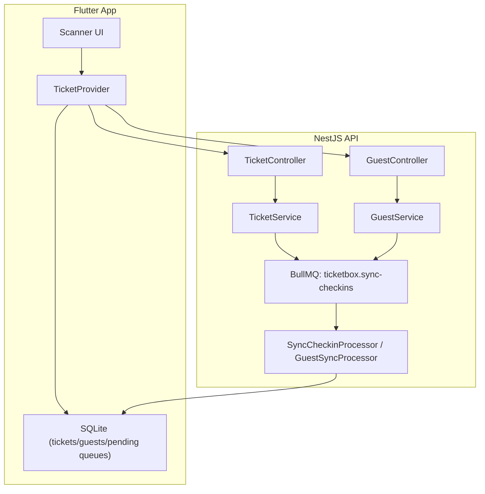
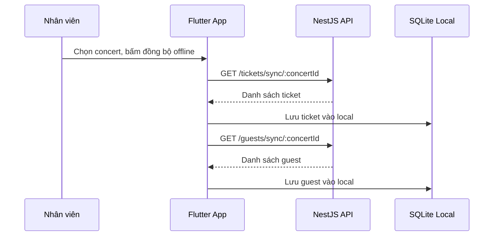
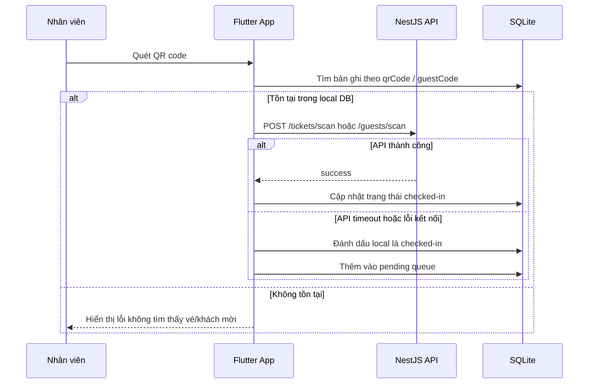
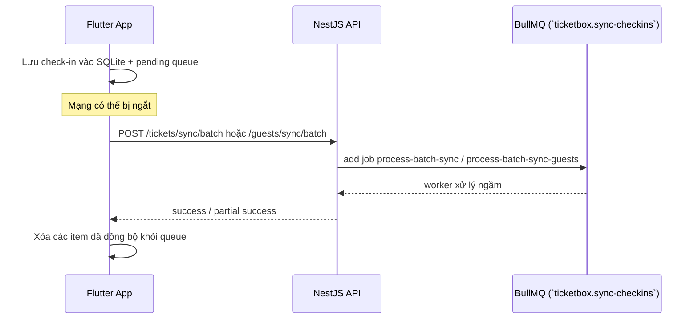

# Đặc Tả: Soát Vé Offline (Check-in)

## 1. Mô Tả

Module check-in là một trong những luồng vận hành cốt lõi của TicketBox vì nó trực tiếp ảnh hưởng đến trải nghiệm của nhân viên cổng và sự mượt mà của sự kiện. Khi hàng nghìn khách hàng đến cổng, hệ thống phải xử lý hàng loạt QR code, phân biệt loại vé/khách mời, ghi nhận trạng thái check-in và đồng bộ dữ liệu về backend với tốc độ cao. Đây là môi trường rất nhạy cảm với độ trễ mạng, lỗi kết nối và tình trạng nhiều thiết bị cùng quét trong cùng một thời điểm.

Vì vậy, thiết kế của module không chỉ đơn thuần là “quét mã” mà còn là một hệ thống phòng thủ toàn diện gồm: dữ liệu offline trên mobile, queue pending để retry, worker xử lý ngầm trên backend và chiến lược đồng bộ để tránh double-check-in. Mục tiêu chính của module là đảm bảo dù ở điều kiện mạng tốt hay xấu, nhân viên vẫn có thể quét được, và dữ liệu cuối cùng trên server vẫn đúng, nhất quán và không bị xung đột.

Từ góc nhìn nghiệp vụ, module check-in có hai mục tiêu quan trọng:

1. Giữ cho nhân viên ở cổng không bị kẹt vì lỗi mạng hay service chậm.
2. Đảm bảo mỗi vé hoặc khách mời chỉ được check-in đúng một lần và không bị ghi đè bởi các thao tác trùng lặp từ nhiều thiết bị.

Nếu chỉ dựa vào backend online thuần túy, hệ thống sẽ dễ thất bại khi mạng yếu. Ngược lại, nếu chỉ dùng local-only, dữ liệu sẽ không được đồng bộ đúng và có thể xảy ra lệch trạng thái giữa mobile và server. Chính vì vậy, giải pháp được chọn là mô hình online-first với offline fallback.

**Các thành phần tham gia:**

| Thành phần            | File nguồn                                  | Chức năng                                  |
| ---                   | ---                                         | ---       
| TicketController      | `ticket.controller.ts`                      | Cung cấp endpoint sync ticket, scan ticket, batch sync ticket, lấy thay đổi từ server                  |
| GuestController       | `guest.controller.ts`                       | Cung cấp endpoint sync guest, scan guest, batch sync guest, lấy thay đổi từ server 
| TicketService         | `ticket.service.ts`                         | Xử lý nghiệp vụ quét vé, đẩy batch sync vào queue 
| GuestService          | `guest.service.ts`                          | Xử lý nghiệp vụ quét khách mời, import CSV, đồng bộ guest 
| SyncCheckinProcessor  | `ticket/sync.processor.ts`                  | Worker xử lý job batch sync vé (`process-batch-sync`) trên queue `ticketbox.sync-checkins`          
| GuestSyncProcessor    | `guest/guest-sync.processor.ts`             | Worker xử lý job batch sync khách mời (`process-batch-sync-guests`) trên cùng queue `ticketbox.sync-checkins` 
| TicketProvider        | `mobile/lib/providers/ticket_provider.dart` | Logic quét QR, phân biệt ticket/guest, online-first + offline fallback |
| TicketRepository      | `mobile/lib/repositories/ticket_repository.dart` | Giao tiếp giữa provider và SQLite/API 
| DatabaseHelper        | `mobile/lib/services/database_helper.dart`  | Tạo bảng SQLite, index, queue pending, trạng thái check-in 
| SyncApiService        | `mobile/lib/services/sync_api_service.dart` | Gọi API scan/batch sync trên backend 

**Tổng quan kiến trúc:**

---

## 2. Luồng Chính

### 2.1. Chuẩn Bị Dữ Liệu Trước Khi Quét

Trước khi vào giờ check-in, nhân viên cần có dữ liệu sẵn trong app. Đây là bước đầu tiên nhưng cũng là bước quyết định tới việc module có hoạt động trơn tru khi mạng yếu hay không.

Cách xử lý:

1. App gọi endpoint sync để tải danh sách vé và khách mời của concert đó về mobile.
2. Backend trả về thông tin cơ bản nhất để app có thể tìm kiếm bản ghi khi quét QR.
3. Mobile lưu dữ liệu vào SQLite local, dùng local DB làm nguồn dữ liệu chính cho thao tác quét.
4. Nếu dữ liệu đã tồn tại, app sẽ thay thế bằng dữ liệu mới từ server để tránh trạng thái cũ bị giữ lại.
5. App cũng có thể gọi endpoint `changes` sau khi có mạng để cập nhật delta thay đổi từ server.

Dữ liệu tải xuống gồm:

- Vé: `id`, `qrCode`, `status`, `updatedAt`
- Khách mời: `id`, `guestCode`, `fullName`, `email`, `phone`, `isCheckedIn`, `updatedAt`

Lý do chọn cách này:

- Ở sân vận động, mạng có thể bị đứt hoặc chập chờn, nên app không thể phụ thuộc hoàn toàn vào API realtime.
- SQLite là lựa chọn phù hợp vì vừa nhanh vừa dễ đọc, không cần cài server phụ.
- Tải dữ liệu trước giúp nhân viên quét tự do mà không bị chậm bởi network latency.
- Cập nhật bằng delta giúp cân bằng giữa hiệu năng và tính mới của dữ liệu.

### 2.2. Phân Loại QR Code Khi Nhân Viên Quét

Một điểm thiết kế nhỏ nhưng cực kỳ quan trọng là phải phân biệt rõ loại mã quét: vé hay khách mời. Đây là bước đầu tiên trong luồng nghiệp vụ vì hành vi xử lý cho từng loại dữ liệu không giống nhau.

Cách xử lý:

1. App đọc QR code từ camera.
2. Kiểm tra nếu mã bắt đầu bằng `VIP`, xem như guest QR.
3. Nếu không phải `VIP`, xem như ticket QR.
4. Tìm bản ghi tương ứng trong SQLite local bằng `qrCode` cho ticket hoặc `guestCode` cho guest.
5. Nếu tìm thấy bản ghi hợp lệ, app sẽ tiếp tục tới bước scan online/online-fallback.
6. Nếu không tìm thấy, app hiển thị thông báo lỗi cụ thể.

Lý do chọn cách này:

- Không phải mọi QR code đều đại diện cho vé; có trường hợp khách mời có mã riêng.
- Phân loại ngay ở frontend giúp giảm số request không cần thiết và làm logic xử lý rõ ràng hơn.
- Nếu dùng một cách xử lý chung cho tất cả mã thì sẽ khó mở rộng về sau.

### 2.3. Online-First Scan và Fallback Offline

Đây là phần cốt lõi của module. Mô hình online-first nghĩa là app ưu tiên gọi backend ngay khi có mạng. Nếu backend thành công thì cập nhật trạng thái server và local. Nếu mạng lỗi thì app vẫn ghi nhận kết quả local trước, sau đó sync về backend khi có thể.

Cách xử lý:

1. App tìm bản ghi trong SQLite local.
2. Nếu tồn tại, app gọi endpoint scan tương ứng: `/tickets/scan` hoặc `/guests/scan`.
3. Nếu API thành công, app cập nhật local status thành checked-in và hiển thị kết quả cho nhân viên.
4. Nếu API timeout hoặc bị lỗi kết nối, app vẫn đánh dấu bản ghi là checked-in ở local.
5. App thêm bản ghi vào queue pending để gửi khi mạng trở lại.

Lý do chọn cách này:

- Người dùng cần phản hồi ngay lập tức, không nên luôn sử dụng cách luôn đưa vào hàng đợi offline và chờ network lâu.
- Fallback offline giải quyết được tình huống cổng sự kiện bị mất mạng tạm thời.
- Cách này giúp giữ nhịp làm việc không bị gián đoạn trong giờ cao điểm.

### 2.4. Pending Queue và Cơ Chế Retry

Một lần quét offline không phải là kết thúc của luồng. Nó tạo ra một tác vụ cần được gửi lại về backend. Vì vậy, hệ thống cần một queue local để lưu các thao tác check-in chưa được upload.

Cách xử lý:

1. Mỗi lần quét offline, app thêm một bản ghi vào pending queue.
2. Queue thường được lưu trong SQLite hoặc bảng local tương ứng.
3. Khi mạng trở lại, app tự động gọi batch sync để gửi toàn bộ pending item lên server.
4. Nếu server trả về lỗi, item vẫn được giữ lại để retry ở lần sau.
5. Khi sync thành công, item bị xóa khỏi queue local.

Lý do chọn cách này:

- Retry là giải pháp tự nhiên cho môi trường không ổn định, nhất là nơi đông người và mạng có thể sẽ không ổn định
- Gửi theo batch giúp giảm số request và tiêu tốn băng thông ít hơn.
- Queue làm việc như một “buffer tạm” giữa việc quét và việc lưu dữ liệu chính thống.

Để thuận tiện vận hành, backend chỉ dùng một BullMQ queue duy nhất là `ticketbox.sync-checkins` cho cả ticket và guest. Tuy nhiên, hai loại job khác nhau vẫn được phân biệt bằng `jobName`:

- `process-batch-sync`: job batch sync ticket, xử lý bởi `SyncCheckinProcessor`
- `process-batch-sync-guests`: job batch sync guest, xử lý bởi `GuestSyncProcessor`

### 2.5. Backend Batch Sync và Quy Tắc First Sync Wins

Khi đã có pending queue, backend cần xử lý các item đó một cách an toàn. Vì nhiều device có thể cùng sync cùng lúc, logic không thể dùng cách “ghi đè tùy ý” được.

Cách xử lý:

- Với ticket: nếu ticket đang ở status `VALID`, worker đổi thành `USED` và cập nhật `updatedAt`.
- Với guest: nếu `isCheckedIn = false`, worker đổi thành `true`.
- Nếu item đã được xử lý từ nơi khác trước đó, worker bỏ qua.
- Mỗi item được xử lý riêng trong transaction để tránh trạng thái bị hỏng khi có lỗi.

Lý do chọn cách này:

- Batch sync giảm tải cho hệ thống và tránh gửi request đơn lẻ cho từng quét.
- Transaction giúp bảo vệ tính toàn vẹn dữ liệu khi xử lý nhiều item cùng lúc.
- First Sync Wins là chiến lược phù hợp để tránh double-check-in trên các thiết bị khác nhau.

### 2.6. Cập Nhật Delta từ Server

Sau khi nhận dữ liệu về mobile, app không nhất thiết phải tải lại toàn bộ mỗi lần. Thay vào đó, app có thể gọi endpoint `changes` để lấy những thay đổi sau một thời điểm nhất định.

Cách xử lý:

- App lưu timestamp cuối cùng đã sync.
- Khi có mạng, app gọi endpoint `changes` cho ticket/guest.
- Backend trả về các bản ghi được cập nhật sau `since` để đảm bảo chỉ cập nhật khi có những thay đổi bên dưới hệ thông dữ liệu
- Mobile merge kết quả vào SQLite local.

Lý do chọn cách này:

- Giảm tải cho cả client và server.
- Giúp dữ liệu local luôn gần với dữ liệu chính nhất có thể.
- Phù hợp cho môi trường có nhiều thiết bị cùng làm việc trong một sự kiện.
- Trách tình trạng 1 vé có thể được check-in ở 2 cổng khác nhau do dữ liệu không được đồng bộ kịp thời

### 2.7. Vai Trò Của Backend trong Luồng Check-in

Backend không chỉ là nơi lưu trạng thái mà còn là nơi quyết định tính chính thống của dữ liệu. Các endpoint scan và sync batch đều có vai trò khác nhau.

Cách xử lý:

- `POST /tickets/scan` và `POST /guests/scan` phục vụ flow online trực tiếp.
- `POST /tickets/sync/batch` và `POST /guests/sync/batch` phục vụ flow offline sync.
- `GET /tickets/changes` và `GET /guests/changes` phục vụ re-sync delta.

Lý do chọn cách này:

- Tách biệt rõ luồng online và offline giúp hệ thống dễ bảo trì và debug.
- Chi phí phát triển thấp hơn nếu dùng một endpoint duy nhất cho mọi tình huống.
- Mỗi endpoint có trách nhiệm riêng nên dễ kiểm soát và mở rộng thêm rule mới.

---

# Bảng xử lý lỗi và kịch bản hệ thống

| Kịch bản | Xử lý | Kết quả |
|----------|-------|---------|
| Mạng bị ngắt khi quét | App vẫn cập nhật local và ghi vào queue | Người dùng vẫn quét được, dữ liệu sẽ sync khi mạng trở lại |
| Backend timeout khi scan | App giữ trạng thái local và queue pending | Không làm gián đoạn thao tác ở cổng |
| Ticket/guest đã check-in trước đó | Backend trả lỗi và không ghi đè | Tránh double check-in |
| Ticket/guest không tồn tại | App hiển thị thông báo lỗi | Không có thao tác sai lệch |
| Worker sync lỗi | Job được retry hoặc ghi log | Dữ liệu có thể chờ lần sync tiếp theo |
| Nhiều device cùng scan cùng một mã | Chỉ lần đầu thành công được giữ lại | Tránh trạng thái bị ghi đè hoặc trùng lặp |
| Local DB bị hỏng | App có thể mất dữ liệu local nhưng vẫn có thể re-sync từ server | Cần re-download dữ liệu từ server |
| Server bị nghẽn | Queue vẫn giữ thao tác và chờ xử lý | Không làm mất dữ liệu, chỉ chậm hơn |

### 3.1. Deep Dive về Double Check-in

Double check-in là một rủi ro rất nghiêm trọng trong hệ thống check-in. Nếu không kiểm soát, cùng một vé có thể bị check-in nhiều lần bởi nhiều nhân viên hoặc nhiều thiết bị ở cùng thời điểm. Cấu trúc hiện tại khắc phục bằng cách kiểm tra trạng thái trước khi cập nhật và dùng quy tắc first sync wins.

### 3.2. Deep Dive về Mất Mạng

Mất mạng là tình huống rất phổ biến ở sự kiện. Hệ thống chọn cách không làm gián đoạn thao tác mà thay vào đó chuyển sang buffer local. Điều này làm tăng độ tin cậy của trải nghiệm người dùng ở cổng.

### 3.3. Deep Dive về Tình Trạng Backend Chậm

Khi backend chậm, việc đợi trực tiếp sẽ làm nhân viên đứng chờ. Hệ thống dùng local acknowledgment và queue pending để “đóng gói” tác vụ, tránh làm người dùng thấy mình bị mắc kẹt.

---

## 4. Ràng Buộc

### 4.1. Ràng Buộc Về Dữ Liệu

- SQLite local phải có index trên trường `qrCode` và `guestCode` để quét offline nhanh.
- Queue pending phải được duy trì để retry khi mạng trở lại.
- Trạng thái local phải được cập nhật trước khi gọi API server để tránh cảm giác “treo”.
- Backend batch sync cần dùng transaction để tránh cập nhật sai khi nhiều thiết bị sync đồng thời.
- Một ticket hoặc guest chỉ được coi là checked-in khi lần đầu tiên được xác nhận thành công.

### 4.2. Ràng Buộc Về Hiệu Năng

- Thời gian phản hồi khi quét offline không được kéo dài quá mức chấp nhận.
- Quy trình sync về backend phải có khả năng gom nhóm nhiều item để giảm số request.
- Local DB phải đủ nhỏ và đủ nhanh để xử lý hàng trăm thao tác liên tiếp mà không bị lag.

### 4.3. Ràng Buộc Về Tính Toàn Vẹn

- Không được cho phép một vé bị check-in hai lần nếu trạng thái đã là used/checked-in.
- Không được ghi đè trạng thái “đã check-in” bằng các request muộn hơn.
- Nếu xảy ra lỗi trong sync, hệ thống phải giữ lại dữ liệu thay vì mất tác vụ.

---

## 5. Quyết Định Thiết Kế

### 5.1. Tại sao cần so sánh giữa online-only và online-first + offline fallback?

| Tiêu chí                 | Online-only scan                           | Online-first + Offline fallback 
| ---                      | ---                                        | --- 
| Latency khi quét         | Thấp khi mạng tốt, tăng mạnh khi mạng chậm | Thấp nhờ local acknowledgment ngay lập tức 
| Tính khả dụng ở cổng     | Kém khi mất mạng                           | Cao, vẫn hoạt động được offline 
| Khả năng chịu lỗi        | Kém, dễ thất bại khi mạng không ổn định    | Tốt hơn, có retry và queue pending 
| Độ phức tạp triển khai   | Thấp                                       | Trung bình, cần đồng bộ local và backend 
| Tính chính xác cuối cùng | Tốt nếu luôn online                        | Tốt nếu sync batch đúng cơ chế 

Online-first + offline fallback được chọn vì nó cân bằng trải nghiệm tại cổng và độ tin cậy dữ liệu. Bảng so sánh cho thấy phương án này chịu lỗi tốt hơn khi mạng chập chờn, trong khi vẫn giữ được phản hồi nhanh cho nhân viên quét.

### 5.2. Tại sao dùng SQLite local ở client?

| Tiêu chí                     | Không dùng local DB               | Dùng SQLite local |
| ---                          | ---                               |
| Tốc độ tra cứu khi quét      | Chậm hoặc phụ thuộc mạng          | Nhanh, truy vấn cục bộ ngay lập tức |
| Khả năng offline             | Không thể                         | Hoạt động ngay cả khi mất mạng |
| Độ phức tạp                  | Ít hơn nhưng dễ bị phụ thuộc mạng | Trung bình, cần đồng bộ dữ liệu |
| Tính ổn định                 | Kém tại cổng                      | Cao hơn trong môi trường sự kiện |
| Khả năng mở rộng             | giới hạn nếu mạng yếu             | Tốt cho nhiều thiết bị độc lập |

SQLite local được dùng vì nó cho phép quét và lookup dữ liệu tức thì ngay cả khi mạng kém. Cách này giúp trải nghiệm nhân viên ổn định và giảm phụ thuộc vào backend trong giờ cao điểm.

### 5.3. Tại sao phải có pending queue?

| Tiêu chí                       | Không dùng queue            | Dùng pending queue 
| ---                            | ---                         | --- 
| Mất dữ liệu khi offline        | Cao                         | Thấp, giữ lại thao tác chưa sync 
| Kiểm soát retry                | Không có                    | Có thể retry khi có mạng 
| Tốc độ phản hồi cho người dùng | Tốt nếu online              | Tốt nếu offline nhờ local first 
| Số request tới backend         | Nhiều hơn nếu sync từng lần | Ít hơn nhờ batch 
| Độ tin cậy                     | Kém khi mạng thất thường    | Tốt hơn nhờ duy trì queue 

Pending queue là cơ chế cần thiết để giữ các thao tác check-in khi mạng không ổn định. Nó giúp hệ thống tránh mất dữ liệu và cho phép đồng bộ batch khi mạng trở lại.

### 5.4. Tại sao dùng batch sync thay vì gửi từng item riêng lẻ?

| Tiêu chí                    | Sync từng item                    | Batch sync 
| ---                         | ---                               | --- 
| Số request tới backend      | Cao, mỗi check-in thành 1 request | Thấp, gom nhiều item cùng lúc 
| Chi phí mạng                | Lớn, nhiều header và kết nối      | Nhỏ hơn, ít kết nối hơn 
| Khả năng xử lý khi cao điểm | Dễ quá tải                        | Tốt hơn nhờ xử lý nhóm 
| Retry khi lỗi               | Phức tạp với nhiều request        | Dễ kiểm soát theo batch 
| Trải nghiệm người dùng      | Dễ bị gián đoạn                   | Ổn định hơn khi retry offline 

Batch sync được chọn vì nhiều thiết bị cùng check-in trong cùng một sự kiện. Nó giảm số request, tăng hiệu suất backend và giúp hệ thống retry đồng nhất khi network hồi phục.

### 5.5. Tại sao dùng quy tắc First Sync Wins?

| Tiêu chí                | Last write wins                | First sync wins 
| ---                     | ---                            | --- 
| Nguy cơ double check-in | Cao nếu không kiểm soát thứ tự | Thấp hơn, lần đầu tiên quyết định 
| Tính nhất quán          | Khó đảm bảo khi nhiều device   | Tốt hơn với quy tắc rõ ràng 
| Phức tạp xử lý xung đột | Cao                            | Thấp hơn vì bỏ qua cập nhật muộn hơn 
| Trạng thái cuối cùng    | Có thể bị đảo ngược            | Ổn định hơn, giữ lần đầu thành chính thức 
| Khả năng debug          | Khó                            | Dễ hơn nhờ quy tắc cố định 

First Sync Wins bảo vệ dữ liệu check-in trước xung đột do nhiều thiết bị, bằng cách chấp nhận lần đồng bộ đầu tiên và bỏ qua các tác vụ trùng muộn hơn.

### 5.6. Tại sao phải tách rõ luồng online và offline?

| Tiêu chí                | Dùng chung một luồng                  | Tách riêng online/offline 
| ---                     | ---                                   | --- 
| Độ phức tạp code        | Cao, nhiều điều kiện trong cùng logic | Thấp hơn, rõ ràng hơn 
| Khả năng bảo trì        | Khó                                   | Dễ hơn 
| Phân biệt trách nhiệm   | Mơ hồ                                 | Rõ ràng theo từng endpoint 
| Nội dung error handling | Dễ lẫn lộn                            | Tự nhiên cho từng luồng 
| Mở rộng thêm rule mới   | Khó                                   | Dễ hơn 

Tách luồng online và offline giúp hệ thống kiểm soát rõ nhiệm vụ từng endpoint, dễ debug và bảo trì trong những trường hợp check-in phức tạp, đồng thời giảm rủi ro khi thêm nghiệp vụ mới.

---

## 6. Tiêu Chí Chấp Nhận

| # | Hành vi | Kết quả mong đợi |
| --- | --- | --- |
| 1 | Khi có mạng, app quét QR và cập nhật trạng thái ngay trên server | Thành công, trạng thái đổi sang checked-in |
| 2 | Khi mất mạng, app vẫn quét được offline | App vẫn cho phép quét và ghi vào queue pending |
| 3 | Khi mạng trở lại, pending queue được sync | Server nhận dữ liệu và xóa queue local |
| 4 | Một vé hoặc guest được quét từ hai thiết bị cùng lúc | Chỉ lần đầu được chấp nhận, lần sau bị bỏ qua |
| 5 | Một ticket hoặc guest không tồn tại | App hiển thị thông báo lỗi rõ ràng |
| 6 | Một ticket/guest đã check-in trước đó | Backend từ chối và không ghi đè |
| 7 | App load dữ liệu ban đầu không thành công | Có thể hiển thị lỗi và đề xuất re-sync |
| 8 | Sync batch bị lỗi tạm thời | Item vẫn tồn tại trong queue và retry ở lần sau |

---

## 7. Ghi Chú Thiết Kế

Module này không chỉ là một feature nhỏ mà là một lớp bảo vệ quan trọng cho toàn bộ quy trình sự kiện. Nếu không có cơ chế offline và retry, hệ thống check-in sẽ rất dễ bị làm gián đoạn bởi yếu tố mạng. Vì vậy, lựa chọn thiết kế hiện tại là một giải pháp cân bằng giữa trải nghiệm người dùng và độ tin cậy của dữ liệu.