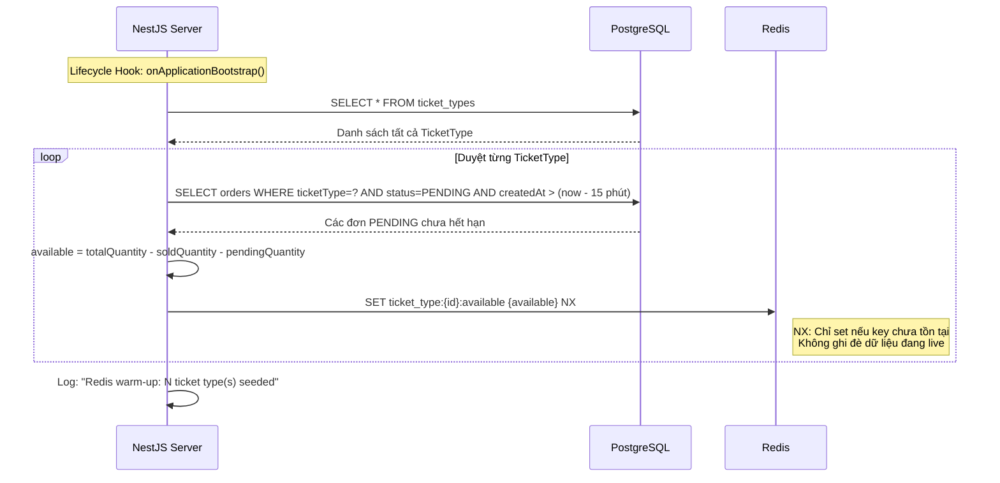
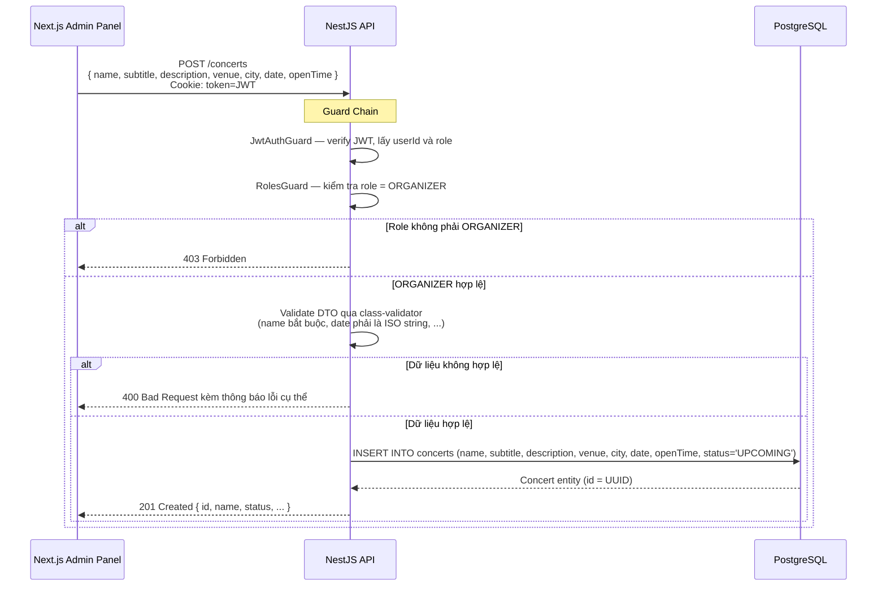
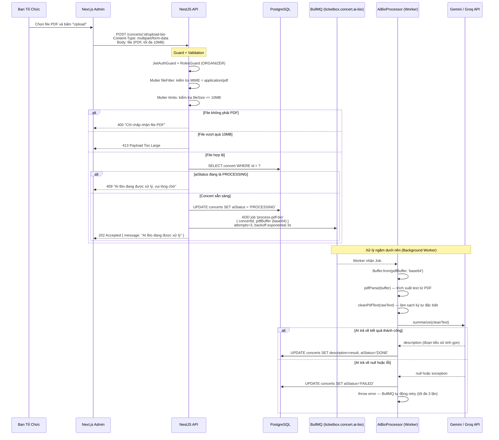
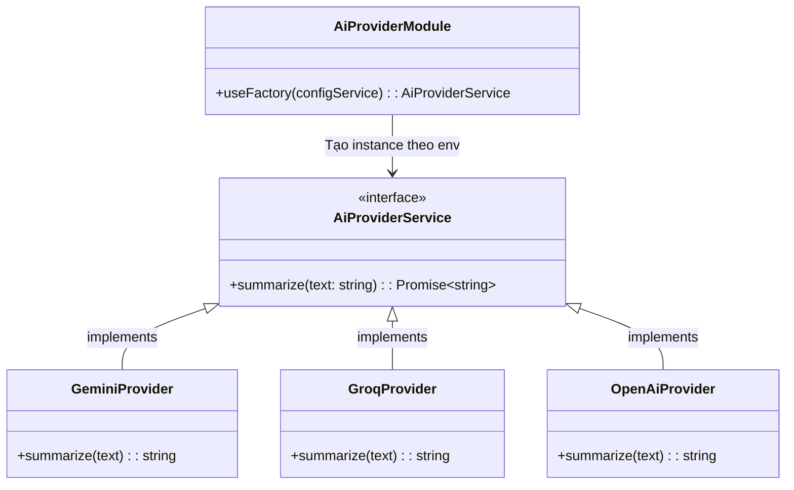
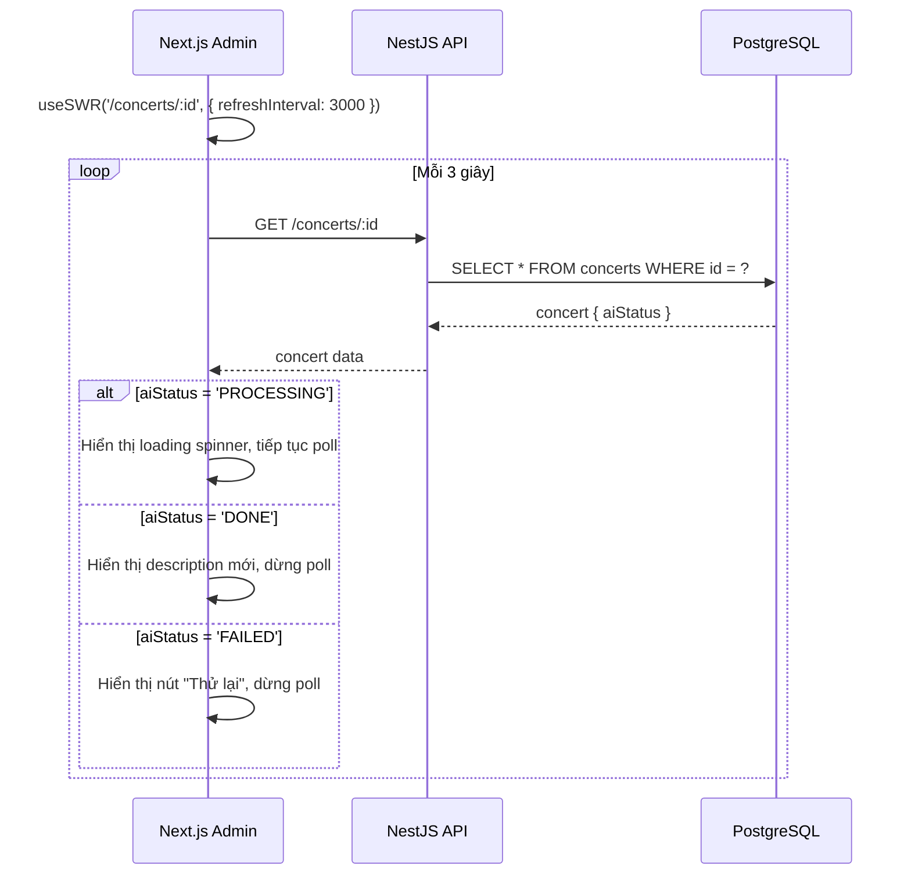
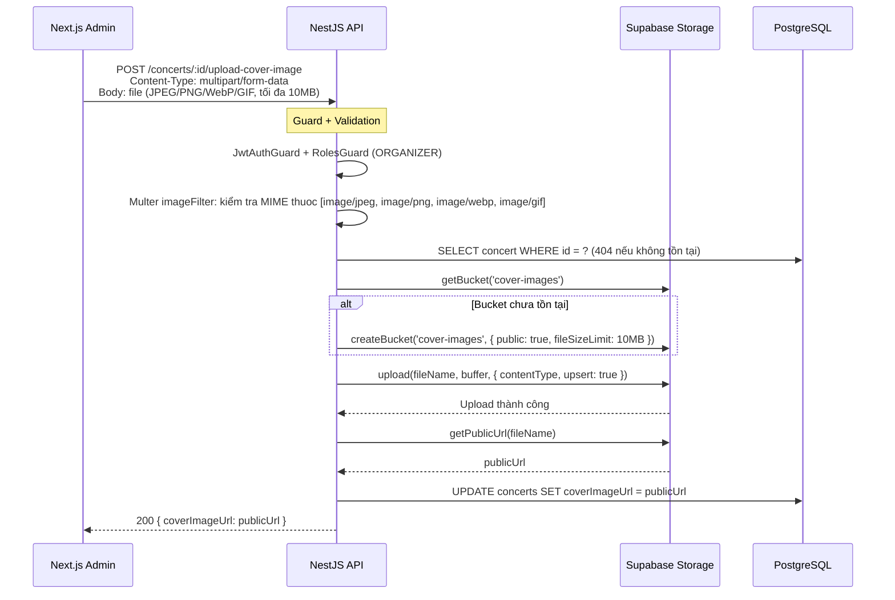
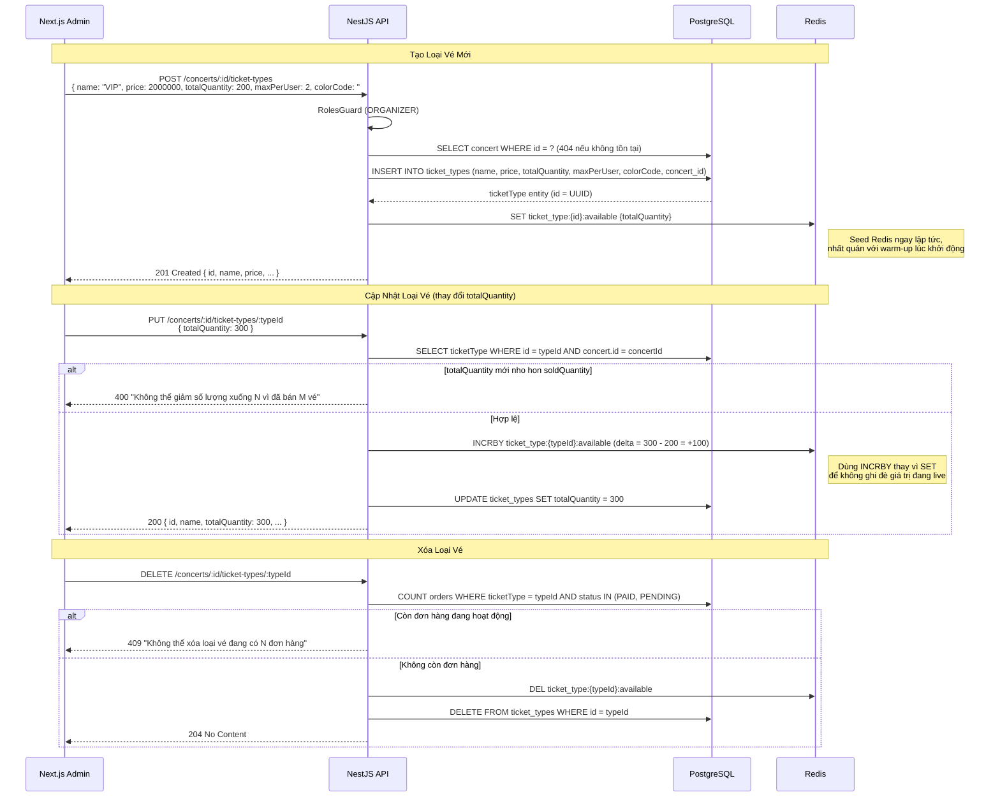
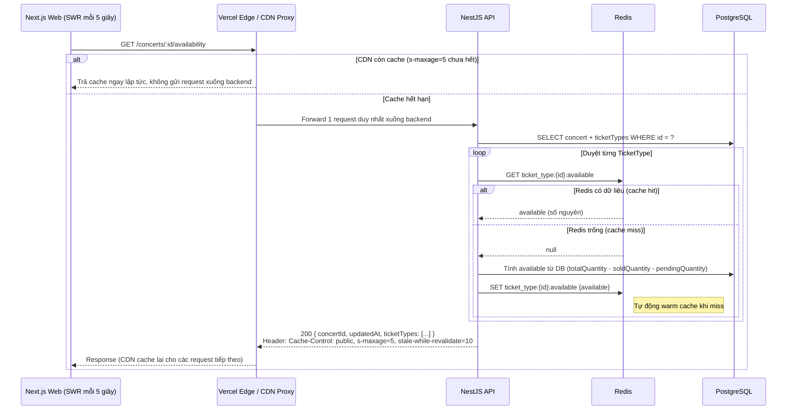
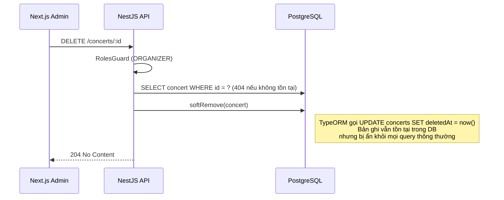

# Đặc Tả: Quản Lý Concert và AI Bio

## 1. Mô Tả

Module Concert chịu trách nhiệm quản lý toàn bộ vòng đời của sự kiện âm nhạc trong hệ thống TicketBox: từ lúc Ban Tổ Chức (ORGANIZER) tạo concert mới, cấu hình các loại vé (TicketType), upload ảnh bìa và sơ đồ chỗ ngồi lên Supabase Storage, cho đến việc tự động sinh tiểu sử nghệ sĩ từ file PDF Press Kit bằng công nghệ AI (Gemini/Groq/OpenAI).

Module này cũng đóng vai trò **engine cung cấp số lượng vé khả dụng (availability)** cho toàn bộ hệ thống. Dữ liệu vé được lưu trong Redis (in-memory) để phục vụ hàng nghìn request mỗi giây mà không cần truy vấn PostgreSQL. Khi server khởi động, Concert Module thực hiện **Redis Warm-up** để đồng bộ số vé từ database sang Redis, đảm bảo không xảy ra cold miss trong phút đầu tiên.

**Các thành phần tham gia:**

| Thành phần        | File nguồn              | Chức năng                                                                            |
| ----------------- | ----------------------- | ------------------------------------------------------------------------------------ |
| ConcertController | `concert.controller.ts` | Định tuyến API, validate file upload (PDF/ảnh), phân quyền qua decorator `@Roles`    |
| ConcertService    | `concert.service.ts`    | Xử lý nghiệp vụ CRUD, upload ảnh lên Supabase, warm-up Redis, tính toán availability |
| AiBioProcessor    | `ai-bio.processor.ts`   | Background Worker xử lý PDF và gọi AI API để sinh tiểu sử                            |
| AiProviderModule  | `ai-provider.module.ts` | Factory Pattern lựa chọn AI provider theo biến môi trường (Gemini/Groq/OpenAI)       |

---

## 2. Luồng Chính

### 2.1. Khởi Tạo Cache Redis khi Server Khởi Động (Warm-up)

Khi server NestJS khởi động, module Concert tự động đồng bộ số vé khả dụng từ PostgreSQL sang Redis thông qua lifecycle hook `onApplicationBootstrap()`. Đây là bước thiết yếu để tránh **cold miss** — nếu Redis trống khi người dùng truy cập lần đầu, hệ thống phải fallback về Postgres với latency cao hơn gấp 20 lần.

Điểm đáng chú ý trong thiết kế warm-up:

- Dùng lệnh Redis `SET NX` (Set if Not eXists) thay vì `SET` thông thường. Lý do: nếu server restart nhưng Redis vẫn còn dữ liệu từ phiên trước, `SET NX` sẽ giữ nguyên giá trị hiện tại (đã bị trừ bởi các giao dịch trước đó). Nếu dùng `SET`, giá trị mới sẽ ghi đè giá trị đang live, gây lệch với booking flow đang hoạt động.

- Hàm `calculateAvailableFromDB()` tính chính xác: `totalQuantity - soldQuantity - pendingQuantity`. Trong đó `pendingQuantity` là tổng số vé của các đơn PENDING chưa quá 15 phút. Nếu không trừ đơn PENDING, Redis sẽ hiển thị nhiều vé hơn thực tế, dẫn đến overselling.

- Nếu warm-up thất bại (Redis lỗi kết nối), server vẫn khởi động bình thường — chỉ log cảnh báo. Endpoint availability có cơ chế fallback về PostgreSQL khi Redis cache miss.

---

### 2.2. Tạo Concert Mới

Các trường dữ liệu chính khi tạo concert:

| Trường            | Kiểu      | Bắt buộc | Ghi chú                                            |
| ----------------- | --------- | -------- | -------------------------------------------------- |
| `name`            | string    | Co       | Tên concert                                        |
| `subtitle`        | string    | Không    | Tiêu đề phụ (nghệ sĩ, chủ đề)                      |
| `description`     | text      | Có       | Mô tả chi tiết, có thể được ghi đè bởi AI Bio      |
| `venue`           | string    | Có       | Tên địa điểm (Sân vận động Mỹ Đình, ...)           |
| `city`            | string    | Có       | Thành phố                                          |
| `date`            | timestamp | Có       | Ngày giờ diễn ra                                   |
| `openTime`        | timestamp | Có       | Thời điểm mở bán vé                                |
| `coverImageUrl`   | string    | Không    | URL ảnh bìa trên Supabase Storage                  |
| `seatMapImageUrl` | string    | Không    | URL sơ đồ chỗ ngồi trên Supabase Storage           |
| `status`          | enum      | Tự động  | UPCOMING (mặc định), ONGOING, COMPLETED, CANCELLED |
| `aiStatus`        | string    | Tự động  | IDLE, PROCESSING, DONE, FAILED                     |

---

### 2.3. Cập Nhật Tiểu Sử Nghệ Sĩ bằng AI (Bất Đồng Bộ)

Đây là luồng xử lý bất đồng bộ phức tạp nhất của module. ORGANIZER upload file PDF Press Kit, backend chuyển file vào hàng đợi BullMQ, Worker đọc PDF và gọi AI API để sinh tiểu sử nghệ sĩ.

**Kiến trúc AI Provider — Strategy Pattern:**

Module AI Provider được thiết kế theo Strategy Pattern, cho phép chuyển đổi giữa các nhà cung cấp AI chỉ bằng thay đổi biến môi trường `AI_PROVIDER`:

Factory trong `AiProviderModule` đọc biến `AI_PROVIDER` từ `.env` và khởi tạo provider tương ứng. Mọi provider đều implement cùng interface `AiProviderService` với method `summarize(text)`, nên Worker không cần biết đang dùng provider nào.

---

### 2.4. Client Polling Trạng Thái AI Bio

Sau khi nhận 202 Accepted, Frontend dùng SWR để poll trạng thái AI Bio mỗi 3 giây cho đến khi nhận được kết quả.

Khi ORGANIZER muốn thử lại sau khi FAILED, Frontend gọi `POST /concerts/:id/reset-bio` để chuyển `aiStatus` về `IDLE`, sau đó upload lại file PDF.

---

### 2.5. Upload Ảnh Concert và Sơ Đồ Chỗ Ngồi

Cả hai luồng upload ảnh sử dụng chung phương thức nội bộ `uploadImageToSupabase()`, chỉ khác nhau về tên bucket và trường lưu trong database.

Upload sơ đồ chỗ ngồi tương tự nhưng dùng bucket `seat-maps` và cập nhật trường `seatMapImageUrl`.

Quy tắc đặt tên file: `{loại}_{concertId}_{timestamp}.{ext}` — đảm bảo mỗi lần upload tạo file mới, không bị cache CDN trả file cũ.

---

### 2.6. CRUD Loại Vé (TicketType)

Điểm đáng chú ý trong đồng bộ Redis:

- **Tạo mới:** Dùng `SET` trực tiếp vì key chưa tồn tại.
- **Cập nhật:** Dùng `INCRBY delta` thay vì `SET giá_trị_mới`. Lý do: nếu dùng SET, giá trị sẽ ghi đè số vé hiện tại trong Redis (đã bị trừ bởi booking flow). INCRBY chỉ cộng/trừ phần chênh lệch, giữ nguyên các thay đổi từ booking.
- **Xóa:** Dùng `DEL` để xóa Redis key trước khi xóa record trong DB — đảm bảo availability endpoint không trả dữ liệu cũ.

---

### 2.7. Truy Vấn Số Vé Còn Lại (Availability)

Endpoint này được gọi liên tục bởi SWR client (mỗi 5 giây) để hiển thị số vé còn lại theo thời gian thực. Đây là **điểm chịu tải nặng nhất** của toàn hệ thống — khi 80.000 người truy cập, endpoint này nhận hàng chục nghìn request mỗi giây.

**Chiến lược Cache 4 tầng xếp chồng:**

| Tầng | Công nghệ                            | TTL           | Vai trò                                                              |
| ---- | ------------------------------------ | ------------- | -------------------------------------------------------------------- |
| 1    | Next.js ISR (`revalidate: 60`)       | 60 giây       | HTML tĩnh, phục vụ danh sách concert không cần query DB              |
| 2    | SWR Client (`refreshInterval: 5000`) | 5 giây        | Poll API, hiển thị data cũ ngay lập tức rồi cập nhật khi có data mới |
| 3    | CDN Proxy (`s-maxage=5`)             | 5 giây        | Hấp thụ 99.99% request — chỉ 1 request lọt xuống backend mỗi 5 giây  |
| 4    | Redis In-Memory                      | Không hết hạn | Đọc số vé trong dưới 1ms, không truy cập PostgreSQL                  |

Với 10.000 người cùng truy cập trang concert, chuỗi cache hoạt động: 10.000 SWR request bay lên CDN, CDN chỉ chuyển tiếp 1 request xuống backend (mỗi 5 giây), backend đọc Redis trong dưới 1ms. PostgreSQL chỉ được truy cập khi Redis cache miss (rất hiếm khi xảy ra trong điều kiện bình thường).

---

### 2.8. Xóa Concert (Soft Delete)

Hệ thống dùng Soft Delete (`@DeleteDateColumn()` của TypeORM) thay vì xóa cứng. TypeORM tự động thêm điều kiện `WHERE deletedAt IS NULL` vào mọi truy vấn, nên concert đã xóa sẽ biến mất khỏi danh sách nhưng vẫn tồn tại trong database. Dữ liệu tài chính (Order, Ticket) vẫn tham chiếu được đến concert đã xóa để phục vụ đối chiếu.

---

## 3. Kịch Bản Lỗi

### 3.1. Upload AI Bio

| Kịch bản                                     | HTTP | Xử lý của hệ thống                                                                                                 |
| -------------------------------------------- | ---- | ------------------------------------------------------------------------------------------------------------------ |
| File upload không phải PDF                   | 400  | Multer `fileFilter` từ chối trước khi load file vào memory — tiết kiệm tài nguyên                                  |
| File PDF vượt quá 10MB                       | 413  | Multer `limits.fileSize` từ chối ngay lập tức                                                                      |
| Upload PDF khi job trước đang PROCESSING     | 409  | Kiểm tra `concert.aiStatus === 'PROCESSING'` — trả về Conflict, tránh race condition 2 worker cùng chạy            |
| Lỗi kết nối Google Gemini hoặc Groq          | --   | Worker retry 3 lần với exponential backoff (3 giây, 6 giây, 12 giây). Nếu vẫn lỗi thì chuyển aiStatus thành FAILED |
| PDF hợp lệ nhưng không chứa text (file scan) | --   | `pdfParse` trả về text rỗng, AI trả null, aiStatus chuyển thành FAILED                                             |
| ORGANIZER muốn thử lại sau khi FAILED        | 200  | Gọi `POST /concerts/:id/reset-bio` để chuyển aiStatus về IDLE, sau đó upload lại                                   |

### 3.2. Upload Ảnh

| Kịch bản                                           | HTTP | Xử lý của hệ thống                                                              |
| -------------------------------------------------- | ---- | ------------------------------------------------------------------------------- |
| File không phải ảnh (gửi PDF vào endpoint ảnh)     | 400  | Multer `imageFileFilter` kiểm tra MIME type, chỉ chấp nhận JPEG, PNG, WebP, GIF |
| File ảnh vượt 10MB                                 | 413  | Multer `limits.fileSize` từ chối                                                |
| Concert không tồn tại                              | 404  | `findOne()` throw NotFoundException                                             |
| Supabase chưa cấu hình (thiếu biến môi trường)     | 500  | Throw InternalServerErrorException kèm log chi tiết                             |
| Supabase upload thất bại (lỗi mạng hoặc hết quota) | 500  | Throw InternalServerErrorException, log error để debug                          |

### 3.3. CRUD TicketType

| Kịch bản                                    | HTTP | Xử lý của hệ thống                                                                                                             |
| ------------------------------------------- | ---- | ------------------------------------------------------------------------------------------------------------------------------ |
| Tạo loại vé cho concert không tồn tại       | 404  | `findOne(concertId)` throw 404 trước khi INSERT                                                                                |
| Giảm totalQuantity xuống dưới soldQuantity  | 400  | Guard kiểm tra, trả thông báo rõ ràng kèm số đã bán                                                                            |
| Xóa loại vé đang có Order PAID hoặc PENDING | 409  | Count active orders, từ chối xóa kèm số đơn hàng đang hoạt động                                                                |
| Redis không khả dụng khi tạo TicketType     | --   | Redis SET thất bại nhưng DB đã lưu thành công. Warm-up sẽ bổ sung khi server restart, hoặc fallback availability sẽ tự SET lại |

### 3.4. Availability

| Kịch bản                                             | HTTP | Xử lý của hệ thống                                                 |
| ---------------------------------------------------- | ---- | ------------------------------------------------------------------ |
| Concert không tồn tại                                | 404  | `findOne()` throw 404                                              |
| Redis cache miss (key bị xóa hoặc Redis vừa restart) | 200  | Tự động fallback tính từ PostgreSQL và SET lại Redis để warm cache |
| Redis hoàn toàn không khả dụng                       | 200  | Fallback về PostgreSQL cho tất cả TicketType, log warning          |

---

## 4. Ràng Buộc

### 4.1. Hiệu Năng

- **API Availability** (`GET /concerts/:id/availability`) áp dụng header `Cache-Control: public, s-maxage=5, stale-while-revalidate=10` để CDN hấp thụ tải. Trong điều kiện 10.000 request mỗi giây, chỉ 1 request thực sự xuống backend.

- **Redis Warm-up** không được block server start. Nếu warm-up thất bại (Redis lỗi), server vẫn khởi động bình thường và sử dụng PostgreSQL fallback cho các request đầu tiên.

- **Upload AI Bio** trả về 202 Accepted trong dưới 100ms. Toàn bộ quá trình xử lý PDF và gọi AI diễn ra ngầm qua BullMQ Worker, không ảnh hưởng đến response time.

### 4.2. Bảo Mật

- Toàn bộ endpoint ghi (POST, PUT, DELETE) yêu cầu role `ORGANIZER`. Decorator `@Roles(UserRole.ORGANIZER)` được khai báo ở cấp Controller — áp dụng cho tất cả endpoint.

- Endpoint đọc (GET) được đánh dấu `@Public()` để phục vụ khán giả xem concert mà không cần đăng nhập.

- File upload được validate ở 2 lớp: (1) Multer `fileFilter` kiểm tra MIME type trước khi đọc file vào memory, (2) Multer `limits` chặn dung lượng quá lớn.

### 4.3. Tính Toàn Vẹn Dữ Liệu

- **Concert dùng Soft Delete** — TypeORM tự động lọc bản ghi có `deletedAt` khác null. Dữ liệu tài chính (Order, Ticket) vẫn tham chiếu được đến concert đã xóa.

- **TicketType không cho xóa** khi còn Order đang hoạt động (PAID hoặc PENDING) — bảo vệ tính nhất quán của dữ liệu đặt vé.

- **Redis được đồng bộ tại 3 điểm:** (1) onApplicationBootstrap warm-up khi khởi động, (2) CRUD TicketType cập nhật bằng INCRBY/SET/DEL, (3) Availability fallback tự động SET khi cache miss.

---

## 5. Quyết Định Thiết Kế

### 5.1. Tại sao xử lý AI bất đồng bộ qua BullMQ thay vì đồng bộ?

| Tiêu chí        | Xử lý đồng bộ (await trong Controller) | BullMQ Worker (bất đồng bộ)           |
| --------------- | -------------------------------------- | ------------------------------------- |
| Response time   | 10-30 giây (chờ AI trả lời)            | Dưới 100ms (trả 202 ngay)             |
| Connection pool | Chiếm 1 connection trong 30 giây       | Giải phóng ngay                       |
| Retry khi lỗi   | Phải tự implement                      | BullMQ built-in (exponential backoff) |
| Khả năng scale  | Bị giới hạn bởi số connection          | Worker xử lý độc lập                  |

**Quyết định:** Dùng BullMQ Worker. Gọi Gemini/Groq API có thể mất 10-30 giây. Nếu xử lý đồng bộ, mỗi request sẽ chiếm 1 connection trong suốt thời gian chờ AI. Khi 10 ORGANIZER upload cùng lúc, server cần giữ 10 connection chỉ cho AI, làm cạn kiệt connection pool cho các request khác.

### 5.2. Tại sao dùng Strategy Pattern cho AI Provider?

| Tiêu chí       | Hardcode 1 provider  | Strategy Pattern      | Chain of Responsibility            |
| -------------- | -------------------- | --------------------- | ---------------------------------- |
| Đổi provider   | Viết lại code Worker | Thay 1 biến env       | Tự động fallback                   |
| Độ phức tạp    | Thấp                 | Trung bình            | Cao                                |
| Tuân thủ SOLID | Không                | Open/Closed Principle | Open/Closed Principle              |
| Debug khi lỗi  | Dễ                   | Dễ                    | Khó (không biết provider nào chạy) |

**Quyết định:** Strategy Pattern. Tuân thủ Open/Closed Principle — thêm provider mới chỉ cần tạo class mới implement `AiProviderService`, không cần sửa code Worker hay Controller. Chain of Responsibility tuy mạnh hơn nhưng quá phức tạp cho nhu cầu hiện tại.

### 5.3. Tại sao dùng Supabase Storage thay vì lưu file trên server?

| Tiêu chí    | Lưu file trên disk server | Supabase Storage             | AWS S3                       |
| ----------- | ------------------------- | ---------------------------- | ---------------------------- |
| Persistence | Mất file khi deploy lại   | Persistent, CDN tích hợp     | Persistent, enterprise-grade |
| Chi phí     | Miễn phí                  | Free tier đủ dùng            | Tính phí theo dung lượng     |
| Cấu hình    | Đơn giản                  | Đơn giản (đã dùng cho OAuth) | Phức tạp (IAM, policy)       |
| CDN         | Không                     | Có sẵn                       | Phải kết hợp CloudFront      |

**Quyết định:** Supabase Storage. Hệ thống đã sử dụng Supabase cho Google OAuth, nên tận dụng infrastructure có sẵn mà không thêm dependency mới. Bucket được tạo tự động (idempotent) và file được upload với `upsert: true` để hỗ trợ upload lại.

### 5.4. Tại sao dùng SET NX thay vì SET cho Redis Warm-up?

| Tiêu chí                   | SET (ghi đè)                            | SET NX (chỉ set nếu chưa có)           |
| -------------------------- | --------------------------------------- | -------------------------------------- |
| Hành vi khi Redis còn data | Ghi đè giá trị live                     | Giữ nguyên giá trị live                |
| Hành vi khi Redis trống    | Seed bình thường                        | Seed bình thường                       |
| Rủi ro                     | Ghi đè số vé đã bị trừ bởi booking flow | Nếu Redis bị flush, cần restart server |

**Quyết định:** SET NX. Trong trường hợp server restart mà Redis vẫn còn data (Redis là persistent), việc ghi đè sẽ làm mất những thay đổi từ booking flow đang hoạt động. SET NX bảo toàn giá trị live. Trường hợp Redis bị flush hoàn toàn thì rất hiếm, và khi đó restart server sẽ seed lại toàn bộ.

---

## 6. Tiêu Chí Chấp Nhận

| #   | Hành vi                                      | Kết quả mong đợi                                                                                                          |
| --- | -------------------------------------------- | ------------------------------------------------------------------------------------------------------------------------- |
| 1   | ORGANIZER tạo concert mới với dữ liệu hợp lệ | Concert lưu vào DB thành công, trả về 201 với UUID                                                                        |
| 2   | AUDIENCE gọi POST /concerts                  | 403 Forbidden                                                                                                             |
| 3   | Upload PDF hợp lệ (dưới 10MB)                | Server trả 202 ngay lập tức. aiStatus chuyển PROCESSING. Sau 5-30 giây, aiStatus chuyển DONE và description được cập nhật |
| 4   | Upload file Word (.docx) thay vì PDF         | 400 "Chỉ chấp nhận file PDF"                                                                                              |
| 5   | Upload PDF khi job trước đang xử lý          | 409 "AI Bio đang được xử lý, vui lòng chờ"                                                                                |
| 6   | AI API (Gemini/Groq) bị lỗi tạm thời         | Worker retry 3 lần. Nếu vẫn lỗi, aiStatus chuyển FAILED                                                                   |
| 7   | Tạo TicketType mới                           | TicketType lưu vào DB. Redis key `ticket_type:{id}:available` được SET với giá trị totalQuantity                          |
| 8   | Cập nhật totalQuantity từ 200 lên 300        | Redis INCRBY +100. DB cập nhật. Availability hiển thị đúng                                                                |
| 9   | Giảm totalQuantity xuống dưới số đã bán      | 400 với thông báo cụ thể                                                                                                  |
| 10  | Xóa TicketType có đơn PAID                   | 409 "Không thể xóa loại vé đang có N đơn hàng"                                                                            |
| 11  | Gọi GET /concerts/:id/availability           | Response trả về trong dưới 5ms (Redis hit). Header Cache-Control đúng giá trị                                             |
| 12  | Redis bị flush, gọi availability             | Fallback tính từ PostgreSQL, tự động seed lại Redis                                                                       |
| 13  | Restart server khi Redis còn dữ liệu         | SET NX không ghi đè. Số vé giữ nguyên                                                                                     |
| 14  | Xóa concert                                  | Soft delete: concert biến mất khỏi danh sách nhưng Order lịch sử vẫn truy cập được                                        |
| 15  | Upload ảnh concert (JPEG 5MB)                | Ảnh lưu trên Supabase Storage, URL trả về, trường coverImageUrl cập nhật trong DB                                         |
| 16  | Upload ảnh không phải định dạng cho phép     | 400 "Chỉ chấp nhận file ảnh (JPEG, PNG, WebP, GIF)"                                                                       |
