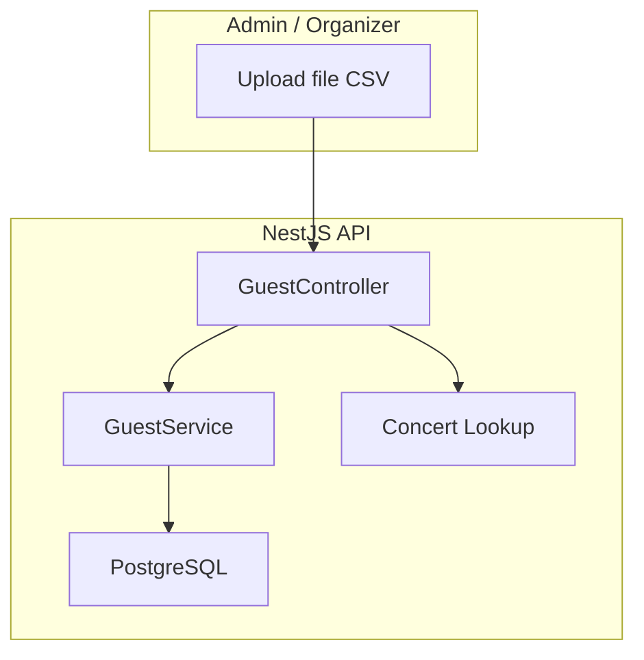
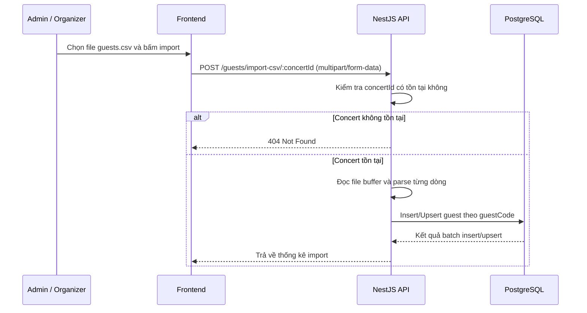

# Đặc Tả: Nhập Khách Mời Từ CSV (Guest Import)

## 1. Mô Tả

Module guest import là một tính năng vận hành quan trọng trong hệ thống TicketBox vì nó quyết định chất lượng dữ liệu của toàn bộ luồng khách mời từ lúc chuẩn bị sự kiện cho tới khi check-in tại cổng. Nếu một sự kiện có hàng trăm hoặc hàng nghìn khách mời, việc nhập thủ công từng người là không hiệu quả và dễ gây sai lệch. Vì vậy, module này cung cấp một giao diện để import dữ liệu hàng loạt từ file CSV, giảm công sức vận hành và tăng độ chính xác khi thiết lập danh sách khách mời.

Từ góc nhìn nghiệp vụ, tính năng này không chỉ đơn thuần là “đọc file và lưu vào DB”. Nó còn là công cụ chuẩn bị dữ liệu cho nhiều luồng khác nhau: check-in, quản lý khách VIP, thống kê tham dự, báo cáo sự kiện và các tác vụ giao tiếp sau này. Một danh sách khách mời nhập vào đúng sẽ giúp backend hỗ trợ quét QR, phân loại khách và thống kê trạng thái tham dự tốt hơn. Một danh sách nhập sai thì có thể dẫn đến các lỗi downstream rất khó phát hiện.

Vì vậy, module này cần phải được thiết kế vừa linh hoạt với dữ liệu đầu vào, vừa chặt chẽ khi lưu vào hệ thống. Dữ liệu CSV có thể đến từ nhiều nguồn khác nhau, cấu trúc cột không giống nhau, một số dòng có thể thiếu thông tin và một số file có thể rất lớn. Hệ thống cần phải xử lý được toàn bộ trường hợp đó mà vẫn giữ được tính toàn vẹn dữ liệu.

**Các thành phần tham gia:**

| Thành phần      | File nguồn                   | Chức năng                                                       
|                 |                              |                                                                 
| GuestController | `guest.controller.ts`        | Định tuyến endpoint upload CSV và các API CRUD guest            
| GuestService    | `guest.service.ts`           | Parse CSV stream, tạo/cập nhật guest, tính thống kê import      
| Guest Entity    | `entities/guest.entity.ts`   | Schema: fullName, email, phone, guestCode, isCheckedIn, concert 
| Guest DTO       | `guest/dto/guest.dto.ts`     | Validation cho các request tạo/cập nhật guest                   
| ConcertService  | `concert/concert.service.ts` | Kiểm tra concert tồn tại để gắn dữ liệu đúng sự kiện            

**Tổng quan kiến trúc:**

---

## 2. Luồng Chính

### 2.1. Bắt Đầu Từ Request Import

Quy trình import bắt đầu khi admin hoặc organizer chọn một file CSV và gửi cùng với concertId. Đây là bước khởi tạo rất quan trọng vì mỗi bản ghi guest phải thuộc về một sự kiện cụ thể; nếu không gắn đúng concert thì hệ thống sẽ không thể sử dụng dữ liệu đó trong các workflow sau này.

Cách xử lý:

1. Frontend gửi file bằng multipart/form-data tới endpoint `POST /guests/import-csv/:concertId`.
2. Backend kiểm tra `concertId` có tồn tại hay không.
3. Nếu concert không tồn tại, trả về lỗi `404`.
4. Nếu concert hợp lệ, backend đọc file buffer, phân tích nội dung và bắt đầu tạo/upsert guest.

Lý do chọn cách này:

- Endpoint riêng làm rõ vị trí nghiệp vụ của import trong tổng thể hệ thống.
- `concertId` ở URL giúp dữ liệu luôn gắn đúng sự kiện, tránh nhập sai đối tượng.
- Việc tách khỏi CRUD guest thông thường giúp phân tách trách nhiệm và dễ bảo trì hơn.

### 2.2. Parse CSV Theo Stream

Một điểm thiết kế rất quan trọng là không đọc toàn bộ file vào RAM. Nếu một file CSV có hàng chục nghìn dòng, việc đọc toàn bộ vào mảng trong bộ nhớ sẽ làm tăng nguy cơ tốn RAM, chậm và thậm chí crash server. Vì vậy, hệ thống dùng stream parsing để xử lý từng dòng một cách liên tục.

Cách xử lý:

1. Đọc file buffer từ request upload.
2. Chuyển buffer sang stream bằng `Readable.from(fileBuffer.toString())`.
3. Dùng `csv-parser` để lấy từng dòng.
4. Với mỗi dòng, trích xuất dữ liệu như `fullName`, `email`, `phone`.
5. Nếu dòng hợp lệ, đưa vào batch xử lý; nếu không hợp lệ thì đánh dấu lỗi và bỏ qua.
6. Khi batch đủ `500` dòng, thực hiện insert/upsert vào DB.

Lý do chọn cách này:

- Giảm chi phí bộ nhớ so với đọc toàn bộ file vào array.
- Phù hợp cho file có kích thước vừa và lớn.
- Cho phép xử lý liên tục và không cần chờ toàn bộ file được parse trước.

### 2.3. Chuẩn Hóa Tên Cột và Dữ Liệu Đầu Vào

Một vấn đề thường gặp với CSV là tên cột khác nhau giữa các file export. Một hệ thống có thể dùng `fullName`, một hệ thống khác dùng `name`, và một hệ thống khác lại dùng `Họ và tên`. Nếu hệ thống quá cứng, import sẽ thất bại ngay. Vì thế, module cần có khả năng map dữ liệu linh hoạt từ nhiều dạng tên cột khác nhau.

Cách xử lý để có thể tránh tình trạng quá cứng nhắc về tên cột:

- Tìm `fullName` từ các key như `fullName`, `name`, `Họ và tên`, `Họ tên`.
- Tìm `email` từ các key như `email`, `Email`.
- Tìm `phone` từ các key như `phone`, `Số điện thoại`, `SĐT`, `Phone`.
- Nếu giá trị rỗng hoặc chỉ là khoảng trắng, giữ `null` hoặc bỏ qua.
- Nếu `fullName` không có sau khi trim, coi dòng đó là lỗi.

Lý do chọn cách này:

- Tăng khả năng tương thích với file từ nhiều nguồn khác nhau.
- Giảm số lỗi do format CSV không chuẩn.
- Giữ cho quy trình import bền hơn khỏi sự khác biệt về export.

### 2.4. Gom Batch để Tăng Hiệu Năng

Sau khi parse dữ liệu, hệ thống không ghi từng dòng trực tiếp một vì cách này quá chậm và tốn tài nguyên. Thay vào đó, logic gom hàng loạt vào batch rồi gọi database một lần cho một nhóm dữ liệu.

Cách xử lý:

1. Mỗi dòng hợp lệ được chuyển thành object guest.
2. Object này được thêm vào danh sách batch tạm thời.
3. Khi batch đạt ngưỡng `500`, service gọi query builder để insert/upsert vào DB.
4. Sau mỗi batch, hệ thống reset danh sách tạm và tiếp tục xử lý dòng tiếp theo.

Lý do chọn cách này:

- Giảm số lần tương tác với database.
- Tăng throughput đối với file có số dòng lớn.
- Làm giảm tổng thời gian xử lý và cải thiện trải nghiệm người dùng.

### 2.5. Upsert Dựa Trên guestCode

Đây là quyết định thiết kế cốt lõi của module. Hệ thống không insert mới mỗi lần mà dùng `guestCode` làm khóa nhận diện. Nếu khách mời đã tồn tại thì bản ghi sẽ được update; nếu chưa thì tạo mới.

Cách xử lý:

- Tạo hoặc lấy `guestCode` cho mỗi dòng CSV.
- Dùng query `orUpdate` trên `guestCode` để cập nhật bản ghi nếu đã tồn tại.
- Nếu bản ghi đã tồn tại, lấy dữ liệu mới như tên, email, phone cập nhật vào record hiện có.
- Nếu chưa tồn tại, tạo bản ghi mới với `isCheckedIn = false` và gắn vào concert được chọn.

Lý do chọn cách này:

- Import lại cùng một file nhiều lần sẽ không tạo dữ liệu trùng lặp.
- `guestCode` là giá trị riêng và có sức mạnh nhận diện tốt hơn tên hay email.
- Cách này phù hợp cho các workflow lặp lại, như import lại dữ liệu đã chỉnh sửa hoặc bổ sung.

### 2.6. Xử Lý Dữ Liệu Trùng và Dữ Liệu Không Hợp Lệ

Không phải mọi dòng trong file đều đúng. Một dòng có thể thiếu tên, thiếu thông tin liên hệ hoặc có định dạng nhầm. Hệ thống cần phân biệt giữa lỗi cục bộ và lỗi toàn bộ. Nếu chỉ có một dòng sai thì không nên dừng toàn bộ quy trình.

Cách xử lý:

- Nếu dòng thiếu `fullName`, coi như dòng lỗi và tăng `failed`.
- Nếu dữ liệu có một số trường thiếu nhưng vẫn có thể dùng, giữ lại phần còn lại.
- Nếu stream hoặc DB gặp lỗi ở một batch, log lỗi và cố gắng tiếp tục ở những dòng còn lại nếu có thể.
- Không làm crash toàn bộ quy trình chỉ vì một dòng dữ liệu xấu.

Lý do chọn cách này:

- Import hàng loạt cần có tính bền vững, không thể đầu hàng khi gặp một dòng lỗi nhỏ.
- Việc bỏ qua dòng lỗi tốt hơn việc bỏ qua cả file.
- Điều này cho phép admin sửa dữ liệu ở bước sau mà không phải bắt đầu lại từ đầu.

### 2.7. Trả Về Thống Kê Import

Sau khi xử lý xong, endpoint phải phản hồi đầy đủ cho phía admin, không chỉ đơn thuần là “thành công” hay “thất bại”. Admin cần biết mức độ nào đã được import, có bao nhiêu dòng bị bỏ qua và có vấn đề gì.

Cách xử lý:

- Tính `total` = tổng số dòng đã đọc.
- Tính `imported` = số dòng được xử lý thành công.
- Tính `failed` = số dòng bị bỏ qua vì lỗi dữ liệu hoặc lỗi xử lý.
- Trả về payload JSON có thể dùng để render UI hoặc ghi log.

Lý do chọn cách này:

- Giúp người vận hành đánh giá chất lượng dữ liệu sau mỗi lần import.
- Cho phép kiểm tra nhanh file có vấn đề ở những dòng nào.
- Làm cho workflow có độ minh bạch và dễ audit hơn.

### 2.8. Mối Tương Quan Với Luồng Check-in

Guest import không chỉ là một công việc chuẩn bị dữ liệu, mà còn là nền tảng cho luồng check-in sau này. Nếu guest được import đúng, thì khi nhân viên quét QR hoặc quét mã khách mời tại cổng, dữ liệu sẽ được tra thấy nhanh và chính xác.

Cách xử lý:

- Guest import tạo dữ liệu tiềm năng cho scan tại cổng.
- `guestCode` và trạng thái `isCheckedIn` là các thông tin sẽ được dùng bởi luồng check-in.
- Nếu guest đã có trong hệ thống nhưng chưa được import đúng, hệ thống check-in sẽ không tìm thấy bản ghi hoặc sẽ làm sai trạng thái.

Lý do chọn cách này:

- Module này vừa được nhìn như một feature nhập liệu, vừa là tiền đề cho các feature vận hành sau.
- Điều này cho thấy import CSV không phải là nhiệm vụ cô lập, mà là một phần của kiến trúc dữ liệu chung.

---

## 3. Kịch Bản Lỗi

| Kịch bản               | Xử lý                             | Hậu quả 
| ---                    | ---                               | --- 
| File không được upload | Controller ném lỗi                | Request bị từ chối 
| Concert không tồn tại  | Service trả `404 Not Found`       | Import không được thực hiện 
| Dòng CSV thiếu tên     | Bỏ qua dòng và tăng `failed`      | Một số khách mời không được tạo 
| Batch insert lỗi       | Fallback sang single insert       | Dữ liệu vẫn được lưu, chỉ chậm hơn 
| Stream đọc file lỗi    | Service reject request và trả lỗi | Import bị hủy và frontend cần thử lại 
| File có nhiều cột lạ   | Bỏ qua cột không dùng             | Import vẫn thành công với data cần thiết 
| Dữ liệu trùng          | Upsert theo `guestCode`           | Không tạo bản ghi lặp 
| DB timeout             | Retry/rollback phù hợp            | Import có thể bị chậm hoặc lỗi toàn bộ nếu không kiểm soát 

### 3.1. Deep Dive về File Có Cột Không Khớp

Một file CSV có thể được export từ nhiều hệ thống khác nhau, nên tên cột không nhất thiết đồng nhất. Nếu hệ thống chấp nhận đúng tuyệt đối, import sẽ rất dễ fail. Do đó, việc map tên cột linh hoạt là một phần thiết kế quan trọng hơn là một tiện ích nhỏ.

### 3.2. Deep Dive về Trường Hợp Dữ Liệu Trùng

Nếu cùng một khách mời được import nhiều lần, hệ thống không nên tạo bản ghi lặp. Điều này không chỉ ảnh hưởng đến chất lượng dữ liệu mà còn đến tính chính xác của các thống kê và check-in. Với upsert dựa trên `guestCode`, hệ thống có khả năng “idempotent” tốt hơn nhiều.

### 3.3. Deep Dive về Trường Hợp File Quá Lớn

File CSV quá lớn có thể khiến một số hệ thống timeout hoặc dùng RAM quá mức. Thiết kế stream parsing và batch processing làm giảm tải. Tuy nhiên, nếu file quá lớn, vẫn nên có cơ chế ghi log rõ từng batch và cho phép retry ở mức file thay vì bắt đầu lại toàn bộ.

### 3.4. Deep Dive về Trường Hợp Import Lặp Nhiều Lần

Trong thực tế, admin có thể import lại cùng file sau khi chỉnh sửa. Nếu hệ thống dùng insert mới mỗi lần, số lượng dữ liệu sẽ tăng không kiểm soát. Việc dùng upsert giúp maintain được một bản ghi thống nhất cho một `guestCode` nhất định.

---

## 4. Ràng Buộc

### 4.1. Ràng Buộc Về Dữ Liệu

- Không được load toàn bộ nội dung file CSV vào một array khổng lồ trong bộ nhớ.
- Việc insert/update phải dùng `orUpdate` trên cột `guestCode` để hỗ trợ import lại nhiều lần.
- Guest phải gắn đúng `concertId` được chọn từ request.
- Nếu thiếu `fullName`, dòng đó được coi là lỗi và không tạo guest.
- `guestCode` là unique key và được dùng như khóa nhận diện cho bản ghi import.

### 4.2. Ràng Buộc Về Hiệu Năng

- Import file lớn không được làm chậm hệ thống quá mức.
- Batch insert phải đủ lớn để giảm tối đa tổng số query.
- Nếu file quá lớn, service phải có cơ chế xử lý liên tục thay vì dừng ở giữa chừng.

### 4.3. Ràng Buộc Về Tính Toàn Vẹn

- Không được tạo guest thiếu thông tin bắt buộc.
- Không được tạo bản ghi trùng cho cùng một `guestCode`.
- Nếu một dòng lỗi thì không được làm hỏng toàn bộ file import.

### 4.4. Ràng Buộc Về UX và Vận Hành

- Admin phải nhận được phản hồi thống kê ngay sau khi import hoàn tất.
- Nếu import bị lỗi, hệ thống phải cung cấp thông tin đủ để biết lỗi ở đâu.
- Không được để một file import bị “silent fail” mà không có cảnh báo.

---

## 5. Quyết Định Thiết Kế

### 5.1. Tại sao cần so sánh giữa load-all CSV và stream parsing + batch processing?

| Tiêu chí                  | Load-all CSV        | Stream parsing + batch processing 
| ---                       | ---                 | --- 
| Sử dụng RAM               | Cao, có thể rất lớn | Thấp, xử lý theo dòng 
| Khả năng xử lý file lớn   | Kém                 | Tốt 
| Khả năng phục hồi khi lỗi | Kém                 | Tốt hơn vì có thể bỏ qua dòng lỗi và tiếp tục 
| Thời gian phản hồi        | Chậm khi file lớn   | Liên tục hơn, không cần chờ load hết 
| Độ phức tạp triển khai    | Thấp                | Trung bình 

Stream parsing + batch processing được chọn vì nó xử lý được file size lớn hơn, giảm bộ nhớ và tăng độ ổn định cho server. Bảng so sánh cho thấy phương án này phù hợp với thực tế import CSV có nhiều hàng và dữ liệu không đồng nhất.

### 5.2. Tại sao không chọn cách đọc toàn bộ file vào RAM trước khi xử lý?

| Tiêu chí                          | Read-all-then-process                  | Process-as-you-go |
| ---                               | ---                                    | --- 
| Tiêu thụ RAM                      | Cao                                    | Thấp 
| Khả năng xử lý file lớn           | Kém                                    | Tốt 
| Độ trễ bắt đầu xử lý              | Lâu, phải chờ load toàn bộ             | Nhanh, xử lý ngay khi dòng đến 
| Độ tin cậy khi lỗi                | Thấp, lỗi có thể phá hỏng toàn bộ file | Cao hơn, có thể bỏ qua dòng xấu 
| Phù hợp với môi trường production | Ít                                     | Nhiều 

Đọc toàn bộ file trước sẽ khiến server dễ bị quá tải và không phù hợp cho files lớn. Phương án stream cho phép hệ thống xử lý từng dòng liên tục và giảm rủi ro do dữ liệu xấu.

### 5.3. Tại sao lại dùng batch processing thay vì ghi mỗi dòng một lần?

| Tiêu chí               | Write-per-row | Batch write 
| ---                    | ---           | --- 
| Số request/transaction | Cao           | Thấp 
| Latency tổng           | Cao hơn       | Thấp hơn khi gom nhiều dòng 
| Khả năng scale         | Kém           | Tốt hơn 
| Độ phức tạp xử lý lỗi  | Thấp          | Trung bình nhưng đáng giá 
| Tác động đến DB        | Nhiều lock nhỏ| Ít lock lớn hơn 

Batch processing được chọn vì nó giảm số lượng transaction đến DB và giúp quy trình import ổn định hơn khi xử lý lượng lớn dữ liệu. Đây là thiết kế phù hợp cho tính năng guest import quy mô lớn.
### 5.4. Tại sao dùng upsert thay vì insert mới mỗi lần?

| Tiêu chí              | Insert mới mỗi lần               | Upsert theo `guestCode` 
| ---                   | ---                              | --- 
| Dữ liệu trùng         | Dễ tạo bản ghi lặp               | Tránh trùng nhờ khóa nhận diện 
| Quản lý sửa đổi       | Khó đồng bộ dữ liệu đã chỉnh sửa | Dễ cập nhật bản ghi hiện có 
| Độ ổn định import lại | Kém                              | Tốt hơn 
| Tốc độ import khi lặp | Trung bình                       | Tốt hơn nếu dùng batch upsert 
| Khả năng audit        | Khó kiểm tra duplicate           | Dễ theo dõi bản ghi duy nhất 

Upsert được chọn vì guest import có thể chạy nhiều lần trên cùng một danh sách hoặc danh sách sửa đổi. Nó cho phép cập nhật dữ liệu hiện có thay vì tạo ra các bản ghi mới trùng lặp.

### 5.5. Tại sao dùng `guestCode` làm khóa nhận diện?

| Tiêu chí                | Dùng name/email                   | Dùng `guestCode` 
| ---                     | ---                               | --- 
| Tính duy nhất           | Dễ trùng nếu trùng tên hoặc email | Ổn định và ít trùng hơn 
| Thay đổi theo thời gian | Email/phone có thể thay đổi       | `guestCode` cố định cho bản ghi 
| Khả năng phân biệt      | Kém khi dữ liệu nhập sai          | Tốt hơn khi import hàng loạt 
| Idempotency             | Không đảm bảo                     | Đảm bảo hơn  
| Tính dễ tra cứu         | Phụ thuộc vào nhiều trường        | Dùng một khóa duy nhất 

`guestCode` được chọn làm khóa nhận diện vì nó ổn định hơn và giúp quy trình import trở nên idempotent. Khi import lại, hệ thống biết bản ghi nào cần update và bản ghi nào cần tạo mới.

### 5.6. Tại sao không dừng toàn bộ import khi gặp một dòng lỗi?

| Tiêu chí           | Dừng toàn bộ import      | Bỏ qua dòng lỗi và tiếp tục 
| ---                | ---                      | --- 
| Ảnh hưởng đến file | Toàn bộ file bị hủy      | Chỉ dòng lỗi bị bỏ qua 
| Trải nghiệm admin  | Tồi, phải làm lại từ đầu | Tốt hơn, chỉ cần sửa dòng lỗi 
| Tính bền vững      | Kém                      | Cao hơn
| Khả năng phục hồi  | Thấp                     | Tốt hơn 
| Dữ liệu giữ lại    | Ít                       | Nhiều hơn 

Không dừng toàn bộ import giúp hệ thống bền hơn với dữ liệu thực tế, nơi CSV thường có vài dòng lỗi. Phương án này cho phép lưu phần lớn dữ liệu hợp lệ và báo rõ các dòng bị lỗi.

### 5.7. Tại sao phải gắn dữ liệu với concert ngay từ đầu?

| Tiêu chí                   | Không gắn concert ngay  | Gắn concert ngay từ đầu 
| ---                        | ---                     | --- 
| Tính chính xác của dữ liệu | Dễ sai, dữ liệu rải rác | Đúng sự kiện ngay từ đầu 
| Quản lý sau này            | Khó lọc/định tuyến      | Dễ phân nhóm theo concert 
| Tương tác với check-in     | Khó liên kết            | Tốt, check-in dựa trên concert 
| Báo cáo & thống kê         | Sai lệch dễ xảy ra      | Chính xác hơn 
| Khả năng mở rộng           | Kém                     | Tốt hơn 

Khóa concert ngay từ đầu là bắt buộc vì guest import là dữ liệu nhánh của một sự kiện cụ thể. Nếu không gắn đúng concert, dữ liệu sẽ không thể dùng chính xác cho check-in, report và các workflow khác.

---

## 6. Tiêu Chí Chấp Nhận

| # | Hành vi                   | Kết quả mong đợi |
| 1 | File CSV hợp lệ được upload cho một concert | Guest được tạo hoặc update đúng vào concert đó |
| 2 | Import lại cùng file nhiều lần | Không tạo dữ liệu trùng do `guestCode` là unique key |
| 3 | File có dòng thiếu thông tin bắt buộc | Dòng đó bị bỏ qua và thống kê `failed` tăng |
| 4 | Batch insert lỗi | Hệ thống fallback sang single insert và vẫn lưu dữ liệu |
| 5 | Hệ thống trả về kết quả import | Admin thấy rõ số dòng total/imported/failed |
| 6 | Guest có đầy đủ thông tin | Dữ liệu lưu đúng vào DB và có thể dùng cho check-in |
| 7 | CSV có nhiều cột không dùng | Hệ thống bỏ qua cột không cần và vẫn import các trường cần thiết |
| 8 | Import file lớn | Hệ thống xử lý liên tục không crash do RAM |

---

## 7. Ghi Chú Thiết Kế

Feature này không chỉ là tiện ích nhập dữ liệu; nó là tiền đề cho toàn bộ quy trình check-in và quản lý khách mời. Nếu dữ liệu import sai, toàn bộ luồng downstream như scan, xác nhận và thống kê sẽ bị ảnh hưởng. Vì vậy, module này cần được thiết kế vừa linh hoạt về dữ liệu đầu vào, vừa chặt chẽ về dữ liệu đầu ra. Cách triển khai hiện tại đạt được sự cân bằng đó: stream parsing để xử lý dữ liệu lớn, batch insert để tối ưu hiệu năng, upsert theo `guestCode` để đảm bảo idempotency, và xử lý lỗi từng dòng để tránh làm hỏng toàn bộ file import.