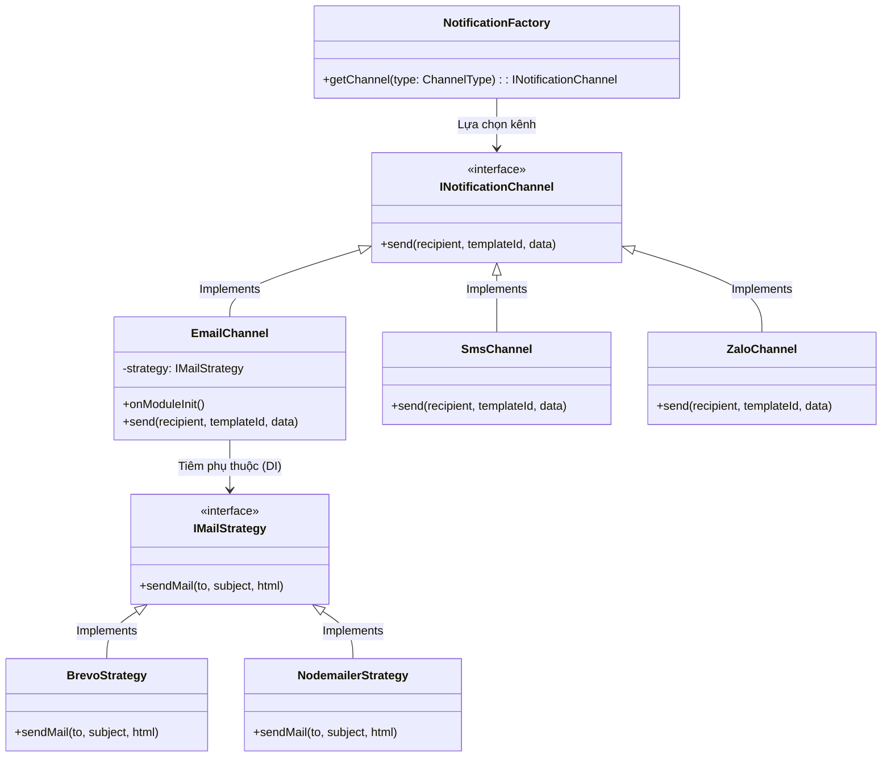
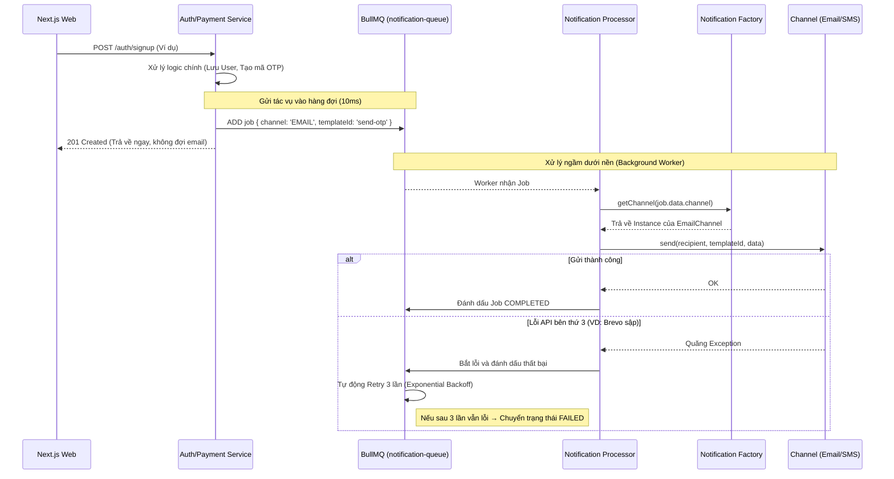
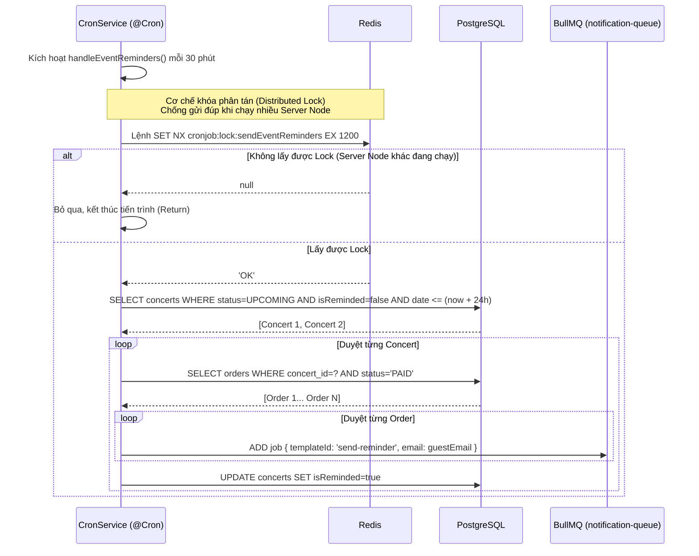

# Đặc Tả: Hệ Thống Thông Báo Đa Kênh (Notification Module)

## Mô Tả

Module Notification là trung tâm xử lý việc gửi các thông điệp giao tiếp với khán giả (mã xác thực OTP, vé điện tử e-ticket, email nhắc nhở sự kiện). 

Để đáp ứng yêu cầu hiệu năng cao, hệ thống được thiết kế để không làm chặn (block) các luồng xử lý chính của người dùng. Mọi tác vụ gửi thông báo đều được đưa vào Hàng Đợi Bất Đồng Bộ (BullMQ).
Đặc biệt, kiến trúc mã nguồn của module áp dụng triệt để **Strategy Pattern** và **Factory Pattern**. Việc xây dựng kế thừa này đảm bảo tính mở rộng (Open/Closed Principle) — khi cần tích hợp thêm kênh SMS hay Zalo, lập trình viên chỉ cần viết class mới mà không làm vỡ các luồng xử lý (Controller/Processor) hiện tại.

---

## Kiến Trúc Hệ Thống

Sơ đồ lớp (Class Diagram) dưới đây thể hiện sự đóng gói và tính đa hình trong thiết kế của hệ thống:

---

## Luồng Chính

### Luồng 1 — Đẩy Thông Báo Bất Đồng Bộ Qua BullMQ

(Áp dụng khi gửi OTP, quên mật khẩu, gửi vé sau khi thanh toán thành công)

### Luồng 2 — Nhắc Nhở Sự Kiện (Cronjob & Distributed Lock)

Chạy ngầm định kỳ mỗi 30 phút. Tìm các concert sẽ diễn ra trong vòng 24h tới để gửi email nhắc nhở đồng loạt cho tất cả khán giả đã mua vé.

---

## Kịch Bản Lỗi

| Kịch Bản Lỗi | Xử Lý Của Hệ Thống | Hậu Quả & Cách Khắc Phục |
|---|---|---|
| Dịch vụ gửi Email (Brevo) bị sập mạng tạm thời (HTTP 500 / Timeout) | Worker ném Exception. BullMQ bắt lỗi và tự động **Retry 3 lần** (với thời gian chờ tăng dần - Exponential Backoff). | Khách hàng sẽ nhận OTP/Vé chậm vài phút, nhưng không bị mất thông báo. |
| Sau 3 lần Retry vẫn tiếp tục lỗi | Job bị đẩy vào danh sách `FAILED` lưu trữ vĩnh viễn trên Redis. | Lập trình viên vào trang quản trị Bull Board để kiểm tra log và bấm retry thủ công khi Brevo hoạt động lại. |
| Server Backend đột ngột nhận lệnh tắt (Restart/Deploy/Crash) | Ứng dụng NestJS kích hoạt **Graceful Shutdown** (`app.enableShutdownHooks()`). | Server sẽ từ chối nhận request API mới, nhưng sẽ "đợi" Worker gửi nốt cái email đang dang dở rồi mới tắt hẳn tiến trình Node.js. Đảm bảo zero data loss. |
| Cấu hình thiếu biến môi trường `BREVO_API_KEY` | Hàm `onModuleInit()` phát hiện cấu hình lỗi. | Tự động Fallback (chuyển đổi) sang dùng `NodemailerStrategy` để hệ thống không bị crash lúc khởi động. |
| Dev truyền sai mã kênh (Ví dụ: `channel: 'TELEGRAM'`) | NotificationFactory chạy vào khối `default` của lệnh switch. | Ném lỗi `InternalServerErrorException`, Job bị đánh FAILED ngay lập tức. |

---

## Ràng Buộc

### Hiệu Năng

- **Non-Blocking Architecture:** Bắt buộc **tuyệt đối không được dùng** `await emailService.sendMail()` trực tiếp bên trong các Controller như `AuthController`, `PaymentController`. Việc gửi email tốn từ 1-3 giây, nếu đợi sẽ làm treo Request của Frontend, dẫn tới cạn kiệt Connection Pool của server khi có tải cao. Bắt buộc phải thông qua `Queue.add()`.

### Thiết Kế Mã Nguồn

- **Tuân thủ Nguyên Tắc SOLID (Open/Closed Principle):** Khi nghiệp vụ yêu cầu tích hợp thêm đối tác Zalo ZNS, lập trình viên không được sửa đổi code bên trong `NotificationProcessor`. Chỉ cần tạo một class `ZaloChannel` `implements INotificationChannel`, sau đó đăng ký vào `NotificationFactory`. Lớp xử lý sẽ tự động đa hình.

### Tính Toàn Vẹn Dữ Liệu

- **Concurrency Control trên Cronjob:** Trong môi trường Production (như Render), hệ thống Backend có thể scale ngang (chạy 3, 4 container giống hệt nhau). Nếu không cẩn thận, 3 container sẽ cùng quét DB và gửi 3 email nhắc nhở cho cùng 1 khán giả. Bắt buộc dùng lệnh Redis `SET NX` làm **Distributed Lock** với TTL=20 phút để tranh quyền, bảo đảm chỉ 1 server duy nhất được phép chạy truy vấn và gửi email.

---

## Tiêu Chí Chấp Nhận

| # | Hành vi | Kết quả mong đợi |
|---|---|---|
| 1 | Khi user gọi API POST `/auth/signup` | Máy chủ phản hồi mã 201 Created trả về ngay lập tức (dưới 200ms). Email chứa mã OTP sẽ đến hòm thư sau khoảng 2-3 giây. |
| 2 | Xóa bỏ biến `BREVO_API_KEY` trong file `.env`, khởi động lại server | Xem console log phải in ra dòng cảnh báo "Falling back to Nodemailer" và hệ thống vẫn chạy tiếp bình thường, không bị văng lỗi crash app. |
| 3 | Bật 2 terminal khởi chạy server NestJS độc lập (khác port). Chỉnh sửa tay giờ của một Concert sắp diễn ra trong vòng 24 tiếng | Chỉ có duy nhất 1 terminal in ra `"Tiến hành gửi nhắc nhở cho concert..."`, terminal còn lại in ra `"Server khác đang chạy. Bỏ qua"`. |
| 4 | Khán giả thanh toán thành công | Nhận được vé điện tử có giao diện HTML đẹp mắt, mã QR code sinh tự động khớp với DB và hiển thị đúng tên khu vực (VIP, SVIP), giá tiền đã mua. |
