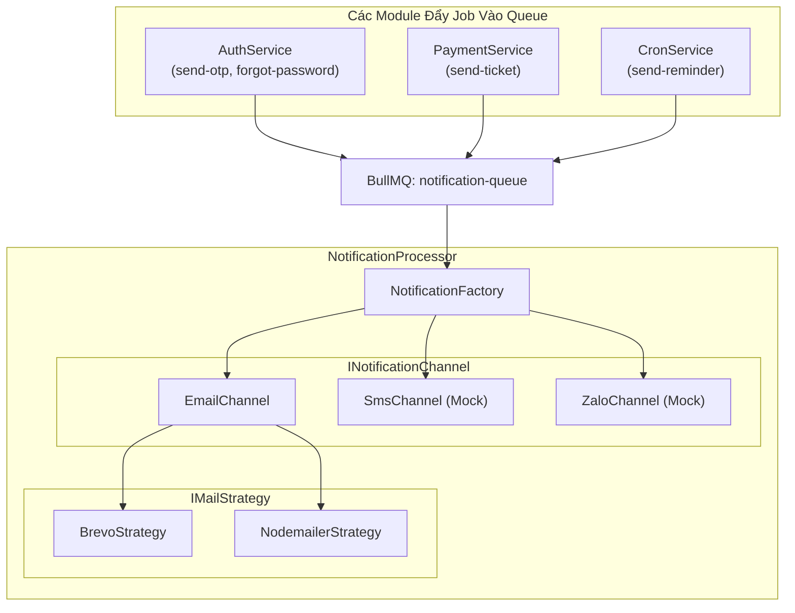
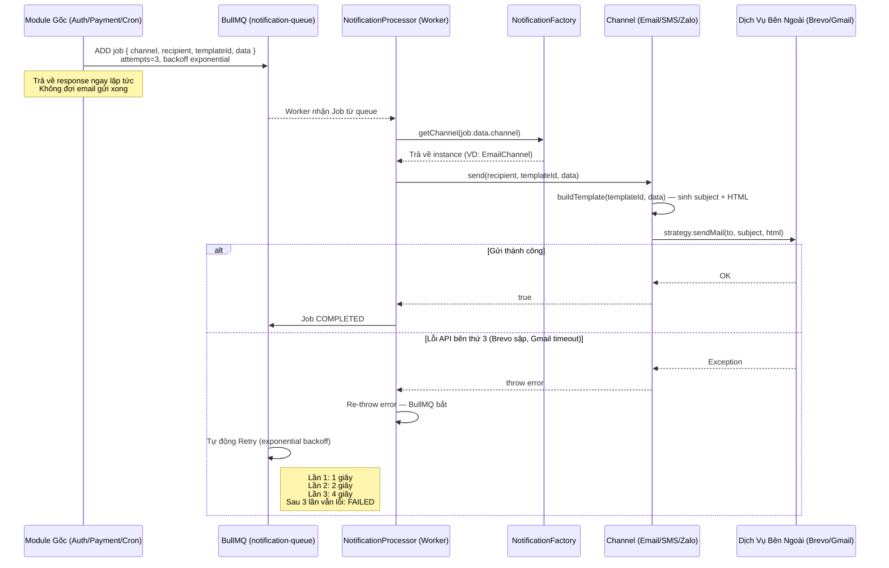
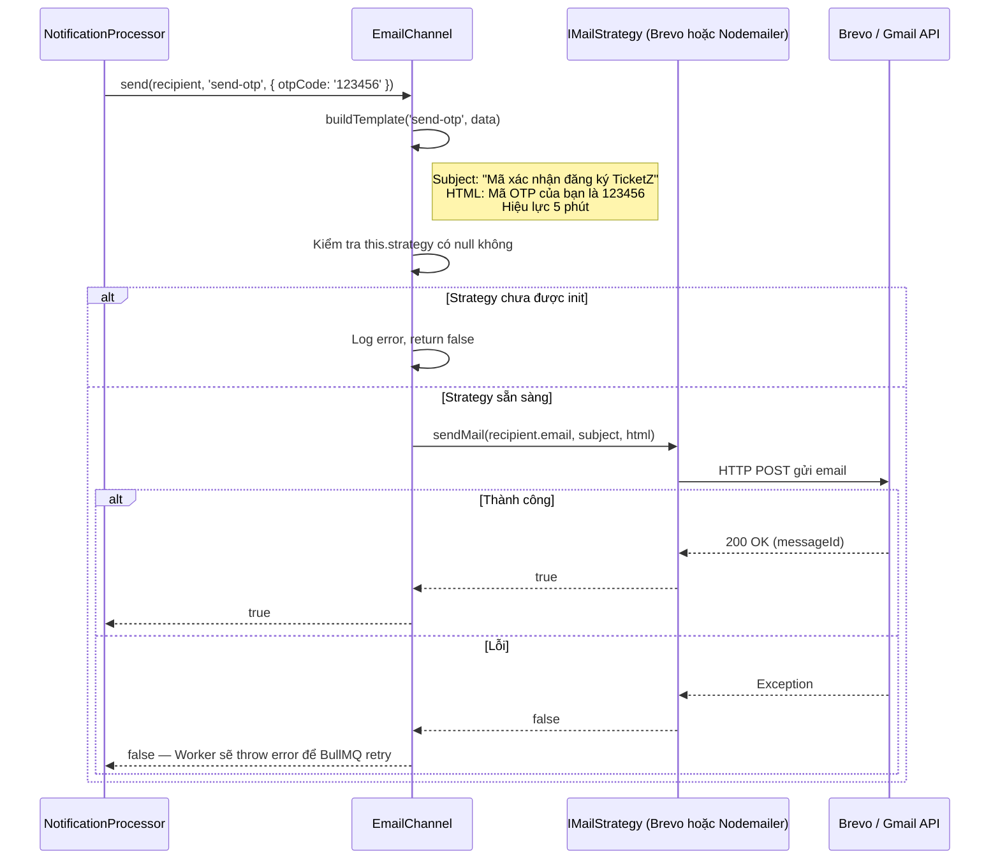
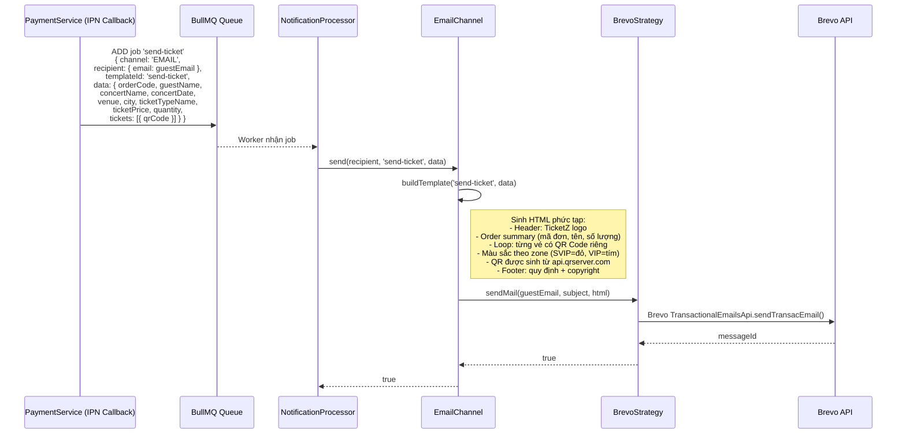
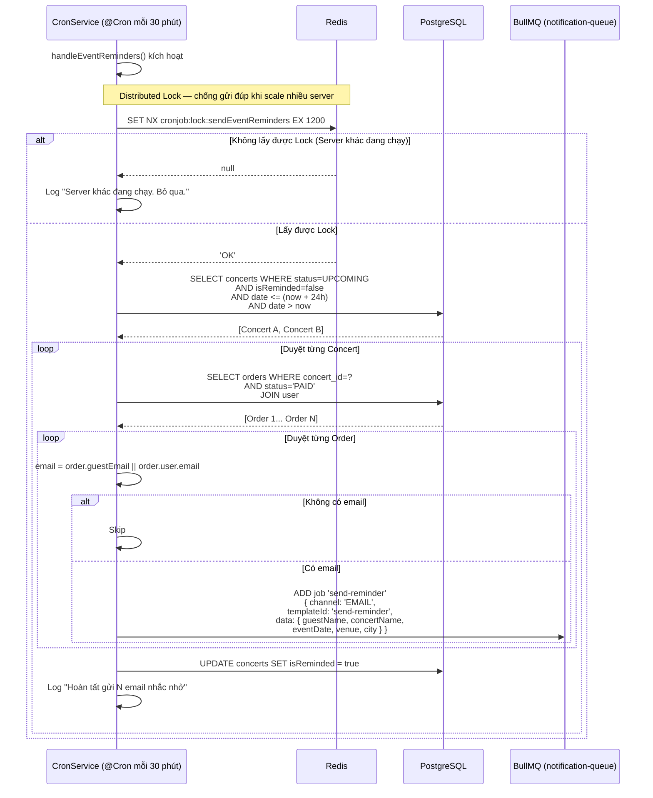
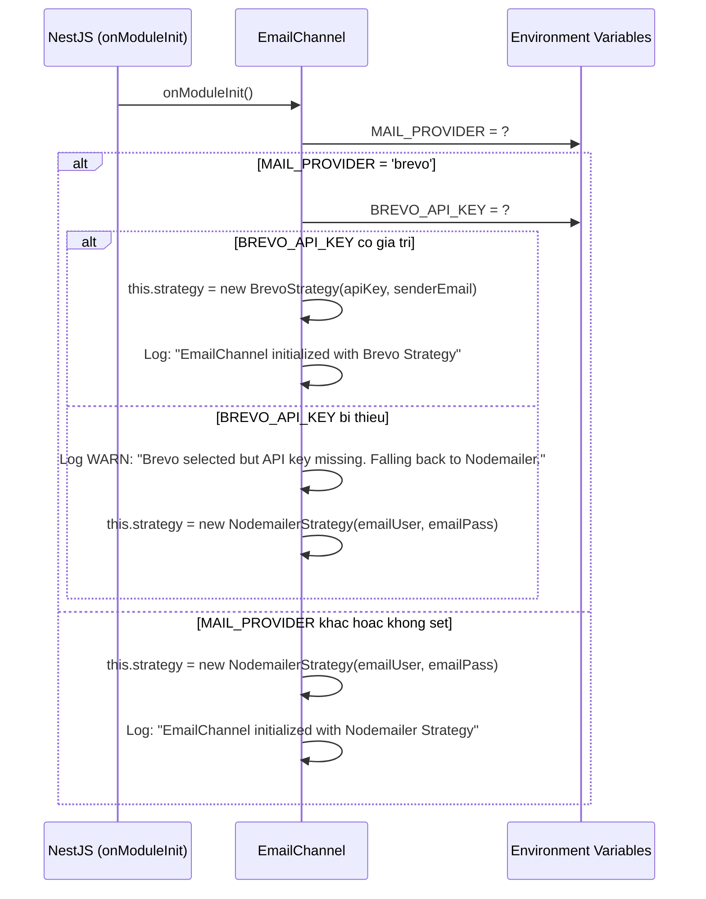
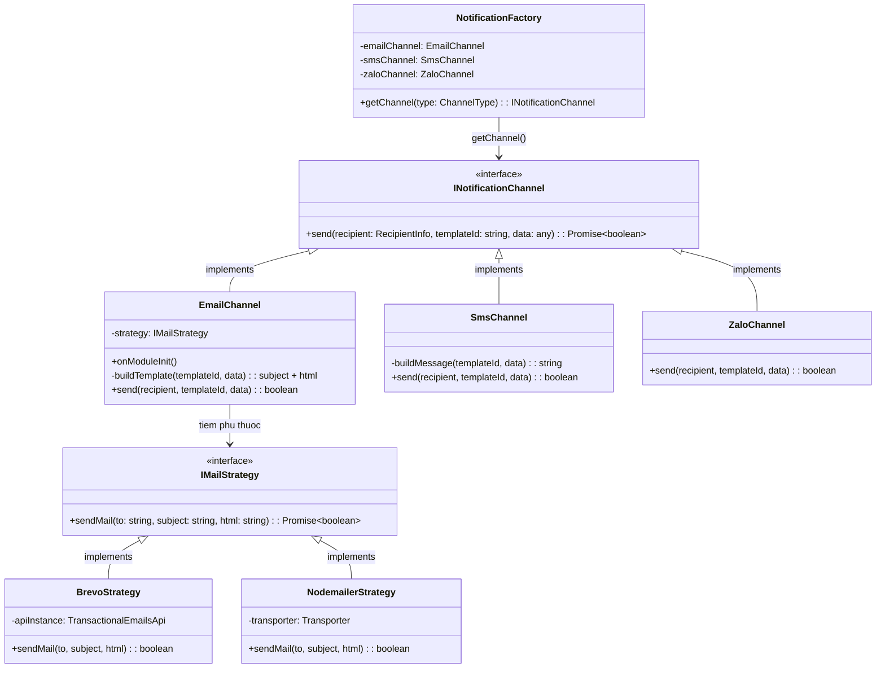

# Đặc Tả: Hệ Thống Thông Báo Đa Kênh (Notification Module)

## 1. Mô Tả

Module Notification là trung tâm gửi thông điệp của toàn bộ hệ thống TicketBox. Mọi email gửi đến người dùng — mã xác thực OTP, vé điện tử e-ticket sau thanh toán, nhắc nhở sự kiện trước 24 giờ — đều đi qua module này.

Module được thiết kế theo nguyên tắc **không bao giờ chặn (block) luồng request chính**. Tất cả tác vụ gửi thông báo đều được đẩy vào hàng đợi bất đồng bộ (BullMQ), Worker xử lý ngầm dưới nền. API trả về response ngay lập tức (dưới 200ms) thay vì chờ 2-3 giây để Brevo/Gmail gửi email xong.

Kiến trúc mã nguồn áp dụng triệt để hai Design Pattern:

- **Strategy Pattern (2 tầng):** Tầng 1 — lựa chọn kênh gửi (Email, SMS, Zalo). Tầng 2 — bên trong kênh Email, lựa chọn nhà cung cấp gửi mail (Brevo API hoặc Nodemailer/Gmail SMTP).
- **Factory Pattern:** `NotificationFactory` đóng vai trò factory, nhận `ChannelType` và trả về instance tương ứng. Worker không biết (và không cần biết) mình đang dùng kênh nào — chỉ gọi `channel.send()`.

Thiết kế này đảm bảo tuân thủ **Open/Closed Principle** — khi cần tích hợp thêm kênh Zalo ZNS hoặc SMS Twilio, lập trình viên chỉ viết class mới implement interface, không sửa đổi code Worker hay Controller.

**Các thành phần tham gia:**

| Thành phần              | File nguồn                                  | Chức năng                                                                     |
| ----------------------- | ------------------------------------------- | ----------------------------------------------------------------------------- |
| NotificationProcessor   | `notification.processor.ts`                 | BullMQ Worker: nhận job từ queue, gọi Factory lấy channel, gọi `send()`      |
| NotificationFactory     | `notification.factory.ts`                   | Factory Pattern: map `ChannelType` → instance của `INotificationChannel`      |
| INotificationChannel    | `interfaces/notification.interface.ts`      | Interface chung cho mọi kênh: `send(recipient, templateId, data)`            |
| EmailChannel            | `channels/email.channel.ts`                 | Kênh Email: build HTML template, gọi mail strategy (Brevo hoặc Nodemailer)   |
| SmsChannel              | `channels/sms.channel.ts`                   | Kênh SMS: build text message (hiện tại mock, chưa tích hợp gateway thật)     |
| ZaloChannel             | `channels/zalo.channel.ts`                  | Kênh Zalo ZNS: gửi qua Zalo OA API (hiện tại mock)                          |
| IMailStrategy           | `strategies/email/mail-strategy.interface.ts`| Interface cho mail provider: `sendMail(to, subject, html)`                   |
| BrevoStrategy           | `strategies/email/brevo.strategy.ts`        | Gửi email qua Brevo (Sendinblue) Transactional API                           |
| NodemailerStrategy      | `strategies/email/nodemailer.strategy.ts`   | Gửi email qua Gmail SMTP (nodemailer) — dùng làm fallback                    |
| CronService (reminder)  | `booking/cron.service.ts`                   | Cronjob mỗi 30 phút: quét concert sắp diễn ra, đẩy job nhắc nhở vào queue   |

**Tổng quan kiến trúc:**



---

## 2. Luồng Chính

### 2.1. Đẩy Thông Báo Bất Đồng Bộ Qua BullMQ

Đây là luồng chung cho tất cả loại thông báo. Module gốc (Auth, Payment, Cron) đẩy job vào BullMQ queue, Worker xử lý ngầm.



**Cấu trúc dữ liệu của mỗi Job:**

```typescript
interface NotificationJobData {
  channel: ChannelType;        // 'EMAIL' | 'SMS' | 'ZALO'
  recipient: RecipientInfo;    // { email?, phone?, zaloId?, name? }
  templateId: string;          // 'send-otp' | 'send-ticket' | 'send-reminder' | 'forgot-password'
  data: any;                   // Dữ liệu động cho template (otpCode, concertName, tickets[], ...)
}
```

**Ai đẩy job vào queue?**

| Module gốc     | Thời điểm trigger                              | templateId        | Dữ liệu chính                              |
| -------------- | ---------------------------------------------- | ----------------- | ------------------------------------------- |
| AuthService    | Sau khi INSERT otp (signup)                    | `send-otp`        | `{ otpCode }` — mã OTP 6 số                |
| AuthService    | Sau khi INSERT otp (forgot-password)           | `forgot-password` | `{ otpCode }` — mã OTP khôi phục           |
| PaymentService | Sau khi thanh toán thành công (IPN callback)   | `send-ticket`     | `{ tickets[], concertName, venue, ... }`    |
| CronService    | Mỗi 30 phút, quét concert sắp diễn ra <= 24h  | `send-reminder`   | `{ guestName, concertName, eventDate, ... }` |

---

### 2.2. Luồng Gửi Email OTP (Chi Tiết Bên Trong EmailChannel)



---

### 2.3. Luồng Gửi Vé Điện Tử Sau Thanh Toán

Đây là template email phức tạp nhất — chứa thông tin đơn hàng, danh sách vé với QR Code, màu sắc theo khu vực (SVIP đỏ, VIP tím, GA xanh).



**Chi tiết template `send-ticket`:**

Email vé điện tử được thiết kế theo phong cách dark-mode premium với các thành phần:

- **Header:** Logo TicketZ (neon green `#CCFF00` trên nền đen)
- **Order Summary:** Mã đơn hàng, tên khách hàng, số lượng vé — bảng 2 cột
- **Ticket Cards:** Mỗi vé là 1 card với layout 2 phần:
  - Bên trái (70%): Tên concert, ngày giờ, địa điểm, khu vực (màu theo zone), giá vé
  - Bên phải (30%): QR Code 100x100px sinh từ `api.qrserver.com`
- **Border-left:** 4px solid, màu theo zone — SVIP (`#FF2D20`), VIP (`#C084FC`), SKY (`#CCFF00`), mặc định (`#38BDF8`)
- **Footer:** Cảnh báo không chia sẻ QR lên mạng xã hội

---

### 2.4. Cronjob Nhắc Nhở Sự Kiện (Distributed Lock)

Chạy ngầm định kỳ mỗi 30 phút. Tìm các concert sẽ diễn ra trong vòng 24 giờ tới và chưa được nhắc (`isReminded = false`), gửi email nhắc nhở đồng loạt cho tất cả khán giả đã mua vé.



**Distributed Lock cho Cronjob:**

| Tham số         | Giá trị                             | Lý do                                                                         |
| --------------- | ----------------------------------- | ----------------------------------------------------------------------------- |
| Lock key        | `cronjob:lock:sendEventReminders`   | Định danh duy nhất cho cronjob reminder                                       |
| Lock TTL        | 1200 giây (20 phút)                | Cron chạy mỗi 30 phút. TTL 20 phút đảm bảo lock tự nhả trước chu kỳ tiếp theo |
| Cơ chế nhả lock | Tự động (TTL expire)                | Không cần gọi DEL — tránh trường hợp server crash mà không nhả được lock      |

Khi chạy nhiều server NestJS (horizontal scaling trên Render), Redis SET NX đảm bảo chỉ 1 server duy nhất lấy được lock. Nếu không có lock, 3 server sẽ cùng quét DB và gửi 3 email nhắc nhở cho cùng 1 khán giả.

---

### 2.5. Khởi Tạo Email Strategy (onModuleInit)

Khi NestJS boot, `EmailChannel` tự động chọn strategy gửi mail dựa trên biến môi trường `MAIL_PROVIDER`:



Điểm đáng chú ý: nếu cấu hình `MAIL_PROVIDER=brevo` nhưng thiếu `BREVO_API_KEY`, hệ thống tự động fallback về Nodemailer thay vì crash. Đây là cơ chế phòng thủ cho môi trường dev/staging nơi API key có thể chưa được cấu hình.

---

## 3. Chi Tiết Kỹ Thuật

### 3.1. Class Diagram — Strategy Pattern 2 Tầng



### 3.2. Bảng Email Template

| templateId        | Khi nào gửi                           | Subject                                   | Nội dung chính                                    |
| ----------------- | ------------------------------------- | ----------------------------------------- | ------------------------------------------------- |
| `send-otp`        | Sau signup                            | "Mã xác nhận đăng ký TicketZ"             | Mã OTP 6 số, hiệu lực 5 phút                     |
| `forgot-password` | Sau forgot-password                   | "Khôi phục mật khẩu TicketZ"              | Mã OTP khôi phục, hiệu lực 5 phút                |
| `send-ticket`     | Sau thanh toán thành công (IPN)       | "Vé điện tử của bạn - Đơn hàng {code}"    | Card vé với QR Code, thông tin concert, giá vé    |
| `send-reminder`   | Cronjob 30 phút, concert trong 24h   | "[Nhắc nhở] Sự kiện {name} sắp diễn ra!" | Tên concert, ngày giờ, địa điểm, lời nhắc QR      |

### 3.3. Cấu Hình BullMQ Queue

| Tham số          | Giá trị                                    | Lý do                                                                  |
| ---------------- | ------------------------------------------ | ---------------------------------------------------------------------- |
| Queue name       | `notification-queue`                       | Tất cả loại thông báo dùng chung 1 queue                              |
| attempts         | 3                                          | Retry 3 lần trước khi đánh FAILED                                     |
| backoff type     | `exponential`                              | Tăng dần thời gian chờ: 1s → 2s → 4s                                  |
| backoff delay    | 1000ms                                     | Base delay cho exponential                                             |
| Concurrency      | Mặc định (1 worker)                        | Đủ cho lượng email hiện tại, tránh rate limit của Brevo                |

---

## 4. Kịch Bản Lỗi

### 4.1. Gửi Email

| Kịch bản                                          | Xử lý của hệ thống                                                          | Hậu quả                                                                    |
| ------------------------------------------------- | ---------------------------------------------------------------------------- | --------------------------------------------------------------------------- |
| Brevo API bị sập (HTTP 500 / Timeout)              | Worker throw error. BullMQ tự retry 3 lần (exponential backoff: 1s, 2s, 4s) | Khách hàng nhận OTP/vé chậm vài phút, nhưng không bị mất thông báo          |
| Sau 3 lần retry vẫn lỗi                           | Job chuyển trạng thái FAILED, lưu trữ trên Redis                            | Lập trình viên vào Bull Board kiểm tra log và retry thủ công                |
| Thiếu biến môi trường `BREVO_API_KEY`              | `onModuleInit()` phát hiện, log WARN, fallback sang NodemailerStrategy       | Hệ thống vẫn chạy, email gửi qua Gmail SMTP thay vì Brevo                  |
| `MAIL_PROVIDER` không hợp lệ (ví dụ: 'mailgun')   | Rơi vào nhánh `else` của switch, mặc định dùng Nodemailer                   | Không crash, không lỗi                                                      |
| Truyền sai `channel` (ví dụ: `'TELEGRAM'`)         | NotificationFactory throw `InternalServerErrorException`                     | Job FAILED ngay lập tức, không retry (lỗi logic, không phải lỗi tạm thời)  |
| Recipient không có email (recipient.email = null)  | EmailChannel kiểm tra, log error, return false                               | Job thành công (không throw) nhưng email không được gửi, log cảnh báo        |

### 4.2. Cronjob Nhắc Nhở

| Kịch bản                               | Xử lý của hệ thống                         | Hậu quả                                                    |
| --------------------------------------- | ------------------------------------------- | ----------------------------------------------------------- |
| 3 server cùng chạy cronjob đồng thời   | Redis SET NX chỉ cho 1 server lấy lock     | 2 server còn lại log "Server khác đang chạy. Bỏ qua."       |
| Server crash giữa cronjob              | Lock TTL 20 phút tự hết hạn                | Lần chạy tiếp theo trên server khác sẽ xử lý bình thường    |
| Concert có 1000 order PAID              | Cronjob đẩy 1000 job vào queue              | Worker xử lý tuần tự, Brevo rate limit khoảng 300 email/ngày (free tier) |
| Order không có email (guestEmail=null, user.email=null) | Cronjob skip order đó                | Không gửi, không lỗi                                        |

### 4.3. Graceful Shutdown

| Kịch bản                                             | Xử lý của hệ thống                                                     |
| ---------------------------------------------------- | ----------------------------------------------------------------------- |
| Server nhận SIGTERM (deploy mới / restart)            | `app.enableShutdownHooks()` — NestJS ngừng nhận request API mới         |
| Worker đang gửi email dang dở khi nhận SIGTERM        | BullMQ Worker hoàn thành job hiện tại rồi mới tắt tiến trình Node.js   |
| Worker đang idle khi nhận SIGTERM                     | Tắt ngay, không ảnh hưởng                                               |

---

## 5. Ràng Buộc

### 5.1. Hiệu Năng

- **Non-Blocking Architecture:** Bắt buộc tuyệt đối không dùng `await emailService.sendMail()` trực tiếp trong Controller. Gửi email tốn 1-3 giây, nếu đợi sẽ làm treo request của Frontend. Tất cả phải thông qua `notificationQueue.add()`.

- **Response time không bị ảnh hưởng:** `queue.add()` chỉ mất dưới 10ms (ghi 1 job vào Redis). API trả về ngay lập tức.

- **Worker xử lý tuần tự:** Mỗi thời điểm chỉ xử lý 1 email, tránh rate limit của Brevo (300 email/ngày free tier, 100k/ngày business).

### 5.2. Bảo Mật

- **Graceful Shutdown** (`app.enableShutdownHooks()`) đảm bảo khi server tắt, Worker không bỏ dở email đang gửi. Job đang xử lý sẽ hoàn thành trước khi tiến trình Node.js kết thúc.

- **Không log nội dung email:** Logger chỉ ghi templateId và recipient email, không log HTML content hay OTP code — tránh rò rỉ thông tin nhạy cảm qua log.

### 5.3. Tính Toàn Vẹn Dữ Liệu

- **Concurrency Control trên Cronjob nhắc nhở:** Distributed Lock bằng Redis `SET NX` với TTL=20 phút. Đảm bảo chỉ 1 server duy nhất được phép quét DB và gửi email.

- **Flag `isReminded`** trên Concert entity: sau khi gửi nhắc nhở thành công, đánh dấu `isReminded = true` để cronjob lần sau không gửi lại.

- **Retry không gây duplicate email:** BullMQ tự quản lý trạng thái job. Nếu Worker crash giữa chừng, job được đánh dấu ACTIVE và retry — không tạo job mới.

---

## 6. Quyết Định Thiết Kế

### 6.1. Tại sao dùng BullMQ Queue thay vì gửi email đồng bộ?

| Tiêu chí        | Gửi đồng bộ (await trong Controller) | BullMQ Queue (bất đồng bộ)             |
| --------------- | ------------------------------------- | -------------------------------------- |
| Response time   | 1-3 giây (chờ Brevo/Gmail)            | Dưới 200ms (trả 201 ngay)              |
| Connection pool | Chiếm 1 connection trong 3 giây       | Giải phóng ngay                         |
| Retry khi lỗi   | Phải tự implement try/catch/setTimeout | BullMQ built-in (exponential backoff)  |
| Monitoring      | Không                                 | Bull Board dashboard, job history       |
| Scalability     | Bị giới hạn bởi connection pool       | Worker xử lý độc lập, có thể scale     |

**Quyết định:** BullMQ Queue cho mọi email.

**Lý do:** Gửi email qua Brevo API mất 1-3 giây. Nếu 100 người đăng ký cùng lúc, server giữ 100 connection trong 3 giây — cạn kiệt pool, các request khác (booking, payment) bị timeout. BullMQ tách biệt "nhận request" (nhanh) khỏi "gửi email" (chậm), đảm bảo API luôn responsive.

### 6.2. Tại sao dùng Strategy Pattern 2 tầng thay vì if/else?

| Tiêu chí                 | if/else trong Processor    | Strategy Pattern 2 tầng           |
| ------------------------ | -------------------------- | --------------------------------- |
| Thêm kênh mới (Zalo)     | Sửa code Processor         | Tạo class mới, đăng ký vào Factory |
| Thêm mail provider mới   | Sửa code EmailChannel      | Tạo class mới implement interface |
| Tuân thủ SOLID            | Vi phạm Open/Closed        | Tuân thủ Open/Closed Principle    |
| Unit test                | Khó mock                   | Dễ mock (inject interface)        |
| Số lượng file             | Ít (1 file to)             | Nhiều (mỗi kênh 1 file)           |

**Quyết định:** Strategy Pattern 2 tầng — tầng Channel + tầng Mail Strategy.

**Lý do:** Hệ thống hiện chỉ dùng Email, nhưng đã chuẩn bị sẵn interface cho SMS (Twilio) và Zalo (ZNS). Khi cần tích hợp, chỉ viết code implement interface rồi đăng ký vào Factory — không sửa Processor, không sửa AuthService, không sửa PaymentService. Tầng 2 (Mail Strategy) cho phép đổi provider email (Brevo → SendGrid → Mailgun) chỉ bằng thay biến `.env`.

### 6.3. Tại sao dùng Brevo làm mail provider chính thay vì Nodemailer/Gmail?

| Tiêu chí             | Nodemailer + Gmail SMTP      | Brevo (Sendinblue) API         | SendGrid                        |
| -------------------- | ---------------------------- | ------------------------------ | -------------------------------- |
| Giới hạn miễn phí    | 500 email/ngày               | 300 email/ngày                 | 100 email/ngày                   |
| Tốc độ gửi           | 1-3 giây (SMTP handshake)    | 0.5-1 giây (HTTP API)          | 0.5-1 giây                      |
| Độ tin cậy           | Thấp (Gmail block nếu spam)  | Cao (dedicated IP)             | Cao                              |
| Chi phí nâng cấp     | Không có option              | 25k email/tháng = $25          | 40k email/tháng = $14.95        |
| Cấu hình             | App Password (2FA)           | API Key                        | API Key                         |

**Quyết định:** Brevo chính, Nodemailer fallback.

**Lý do:** Gmail SMTP bị Google giới hạn chặt — khi vượt 500 email/ngày hoặc gửi nhanh quá, Gmail lock tài khoản. Brevo dùng dedicated IP, deliverability cao hơn, không bị dính spam filter. Nodemailer giữ lại làm fallback cho dev/staging hoặc khi Brevo chưa cấu hình — đảm bảo hệ thống không bao giờ crash vì thiếu mail config.

### 6.4. Tại sao tất cả loại thông báo dùng chung 1 queue?

| Tiêu chí              | 1 queue chung                           | Nhiều queue riêng (otp-queue, ticket-queue, ...) |
| --------------------- | --------------------------------------- | ------------------------------------------------ |
| Độ phức tạp           | Thấp (1 Processor)                     | Cao (N Processor, N worker config)               |
| Thứ tự ưu tiên       | FIFO, không ưu tiên                    | Có thể ưu tiên queue quan trọng                  |
| Monitoring            | 1 dashboard                             | N dashboard                                      |
| Throughput            | Bị giới hạn bởi 1 worker               | Song song N worker                               |
| Phù hợp khi           | Lượng email dưới 1000/ngày              | Lượng email hàng chục nghìn/ngày                  |

**Quyết định:** 1 queue chung `notification-queue`.

**Lý do:** Với quy mô hiện tại (vài trăm email/ngày), 1 queue đủ xử lý. Worker xử lý tuần tự cũng giúp tránh rate limit của Brevo. Khi cần scale lên hàng chục nghìn email, có thể tách thành nhiều queue mà không cần sửa interface — chỉ thay đổi queue name khi `add()`.

---

## 7. Tiêu Chí Chấp Nhận

| #   | Hành vi                                                          | Kết quả mong đợi                                                                                         |
| --- | ---------------------------------------------------------------- | --------------------------------------------------------------------------------------------------------- |
| 1   | User gọi POST /auth/signup                                      | Server trả 201 dưới 200ms. Email OTP đến hòm thư sau 2-5 giây                                            |
| 2   | Brevo API bị lỗi tạm thời (HTTP 500)                            | Worker retry 3 lần. Email đến chậm vài phút nhưng không mất                                              |
| 3   | Sau 3 lần retry vẫn lỗi                                         | Job chuyển FAILED. Lập trình viên có thể retry thủ công qua Bull Board                                   |
| 4   | Xóa `BREVO_API_KEY` trong `.env`, khởi động lại server           | Console log in "Falling back to Nodemailer". Hệ thống vẫn chạy, email gửi qua Gmail SMTP                |
| 5   | Thanh toán thành công qua VNPAY                                  | Nhận email vé điện tử HTML dark-mode, mỗi vé có QR Code riêng, màu sắc đúng theo khu vực                |
| 6   | Bật 2 server NestJS, chỉnh concert sắp diễn ra trong 24 giờ     | Chỉ 1 server log "Tiến hành gửi nhắc nhở...", server còn lại log "Server khác đang chạy. Bỏ qua."       |
| 7   | Concert đã được nhắc nhở rồi (isReminded = true)                 | Cronjob lần sau không gửi lại email cho concert này                                                      |
| 8   | Truyền `channel: 'TELEGRAM'` vào queue                          | Job FAILED ngay với `InternalServerErrorException`                                                        |
| 9   | Order không có email (guestEmail và user.email đều null)          | Cronjob skip order này, không throw error                                                                 |
| 10  | Server nhận SIGTERM khi Worker đang gửi email                    | Worker hoàn thành email đang gửi rồi mới tắt (Graceful Shutdown)                                         |
| 11  | Email OTP gửi qua Brevo có đúng format                           | Subject: "Mã xác nhận đăng ký TicketZ". Body chứa mã OTP 6 số nổi bật, hiệu lực 5 phút                  |
| 12  | Email nhắc nhở sự kiện gửi đúng nội dung                         | Chứa tên concert, ngày giờ, địa điểm, tên khán giả. Giao diện dark-mode                                 |
