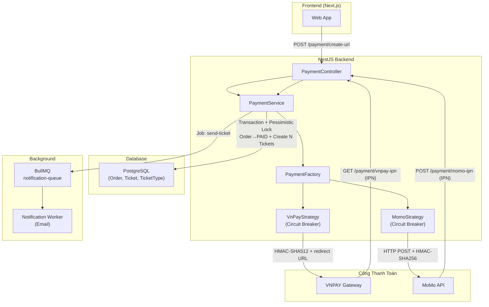
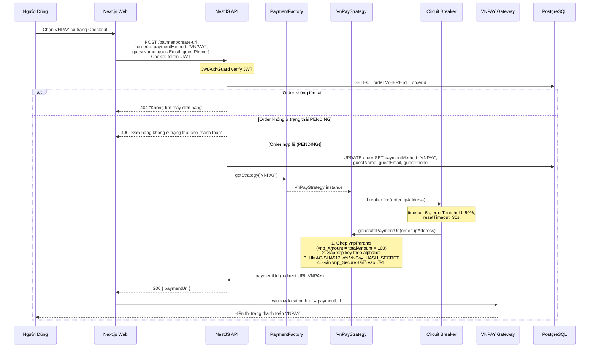
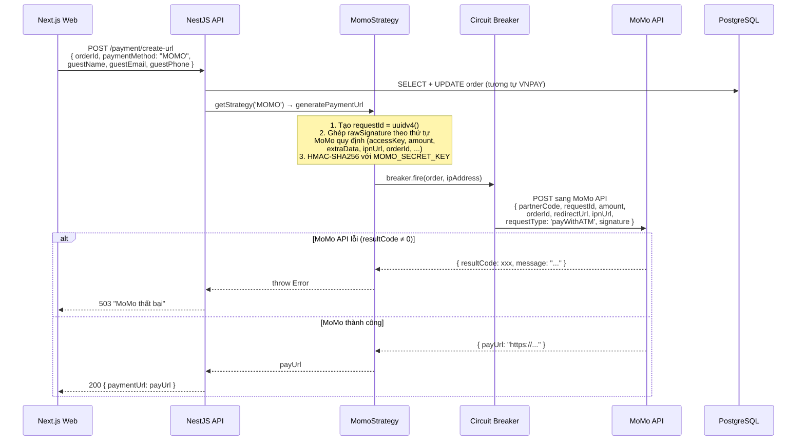
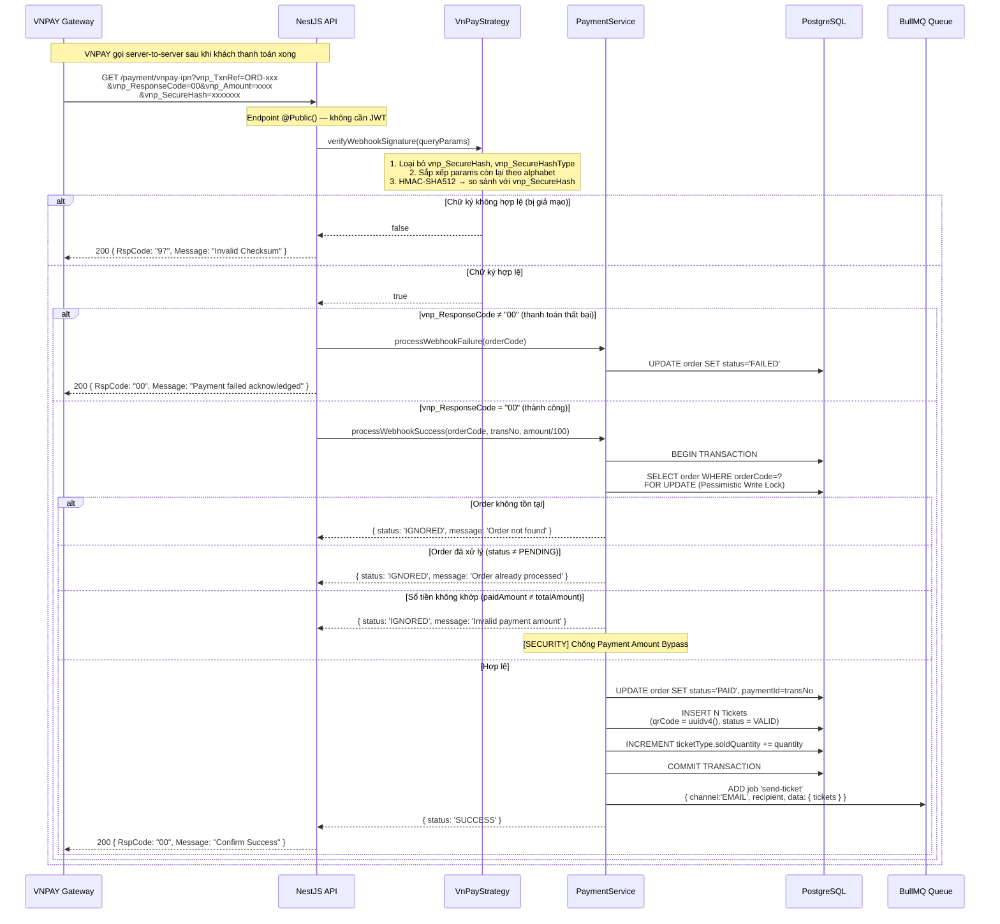
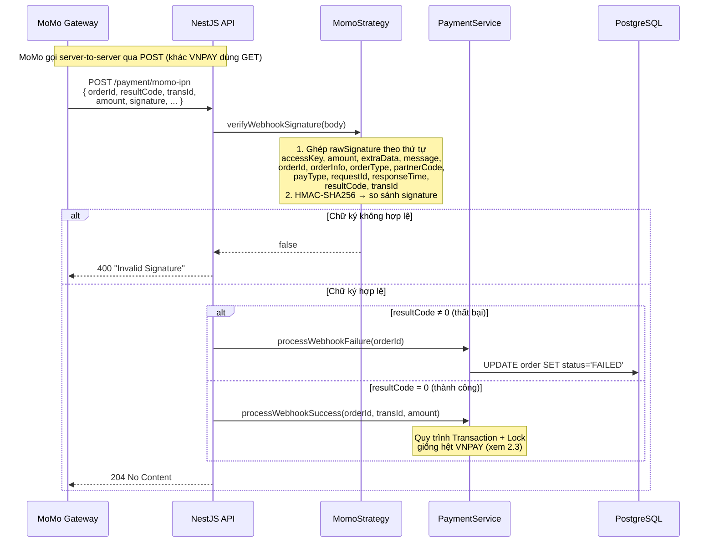
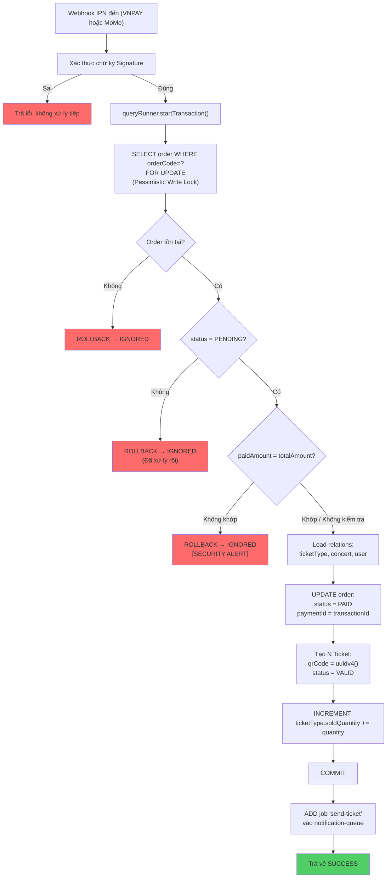
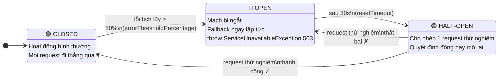

# Đặc Tả: Thanh Toán (Payment Module)

## 1. Mô Tả

Module Payment chịu trách nhiệm toàn bộ vòng đời giao dịch tài chính trong hệ thống TicketBox: tạo URL thanh toán, nhận callback webhook từ cổng thanh toán, xác minh chữ ký chống giả mạo, và kích hoạt sinh vé sau khi thanh toán thành công. Hệ thống hỗ trợ đồng thời hai phương thức thanh toán:

- **VNPAY:** Thanh toán qua cổng VNPAY (Internet Banking, ATM nội địa, QR Pay). Tạo URL bằng redirect với query params đã ký HMAC-SHA512.
- **MoMo:** Thanh toán qua ví điện tử MoMo. Tạo URL bằng cách gọi HTTP POST sang MoMo API, nhận `payUrl` trong response JSON, ký HMAC-SHA256.

Đây là module nhạy cảm nhất trong hệ thống vì liên quan trực tiếp đến tiền. Mọi thao tác cập nhật đơn hàng và sinh vé đều thực hiện trong một **TypeORM Transaction với Pessimistic Write Lock** để đảm bảo tính nguyên tử tuyệt đối.

**Các thành phần tham gia:**

| Thành phần        | File nguồn                                    | Chức năng                                                                                  |
| ----------------- | --------------------------------------------- | ------------------------------------------------------------------------------------------ |
| PaymentController | `payment/payment.controller.ts`               | 3 endpoint: create-url, vnpay-ipn, momo-ipn                                                |
| PaymentService    | `payment/payment.service.ts`                  | Tạo URL thanh toán và xử lý webhook (Transaction + Lock)                                   |
| PaymentFactory    | `payment/payment.factory.ts`                  | Factory Pattern: ánh xạ PaymentMethod → Strategy tương ứng                                 |
| VnPayStrategy     | `payment/strategies/vnpay.strategy.ts`        | Tạo URL VNPAY (HMAC-SHA512) + Circuit Breaker                                              |
| MomoStrategy      | `payment/strategies/momo.strategy.ts`         | Tạo URL MoMo (POST API, HMAC-SHA256) + Circuit Breaker                                     |
| Order Entity      | `entities/order.entity.ts`                   | Schema: orderCode, totalAmount, status (enum), paymentMethod, paymentId, idempotencyKey   |
| Ticket Entity     | `entities/ticket.entity.ts`                  | Schema: qrCode (UUID v4), status (VALID/USED/REVOKED), quan hệ với Order                   |
| CreatePaymentDto  | `payment/dto/create-payment.dto.ts`           | Validation: orderId, paymentMethod, guestName, guestEmail, guestPhone                      |

**Tổng quan kiến trúc:**

---

## 2. Luồng Chính

### 2.1. Tạo URL Thanh Toán (VNPAY)

---

### 2.2. Tạo URL Thanh Toán (MoMo)

Điểm khác biệt giữa VNPAY và MoMo:

- **VNPAY:** Xây dựng URL hoàn toàn cục bộ từ params + hash, không gọi HTTP ra ngoài khi tạo URL. VNPAY chủ động redirect user về `VNPay_RETURN_URL` sau khi user thanh toán xong.
- **MoMo:** Phải gọi HTTP POST sang MoMo API để nhận `payUrl`, sau đó FE redirect sang URL đó. MoMo gọi IPN qua POST (không phải GET như VNPAY).
- **Thuật toán hash:** VNPAY dùng HMAC-SHA512, MoMo dùng HMAC-SHA256.
- **Số tiền:** VNPAY nhân 100 (`totalAmount * 100`), MoMo dùng nguyên số VND.

---

### 2.3. Xử Lý Webhook Thành Công (VNPAY IPN)

---

### 2.4. Xử Lý Webhook Thành Công (MoMo IPN)

Lưu ý: MoMo yêu cầu response HTTP 204 No Content (không có body), trong khi VNPAY yêu cầu response 200 với JSON `{ RspCode, Message }` theo format riêng.

---

### 2.5. Cơ Chế Bảo Vệ Giao Dịch (Transaction + Lock)

Đây là phần quan trọng nhất của toàn bộ module — được thực thi trong `processWebhookSuccess()`:

**Tại sao cần Pessimistic Write Lock (`FOR UPDATE`)?**

VNPAY có thể retry IPN nhiều lần nếu không nhận được response hợp lệ. Nếu 2 request IPN đến đồng thời (race condition), cả 2 đều thấy Order `PENDING` và tạo vé gấp đôi. Pessimistic Lock đảm bảo chỉ một transaction được xử lý — transaction thứ 2 phải chờ transaction thứ 1 commit xong trước khi đọc lại Order, lúc đó status đã là `PAID`, nên trả về `IGNORED`.

---

## 3. Chi Tiết Kỹ Thuật

### 3.1. Strategy Pattern và Factory

```mermaid
flowchart TD
    A(["POST /payment/create-url\npaymentMethod: 'VNPAY' | 'MOMO'"])
    A --> B["PaymentFactory.getStrategy(paymentMethod)"]

    B --> C{"paymentMethod?"}
    C -- "'VNPAY'" --> D["VnPayStrategy"]
    C -- "'MOMO'"  --> E["MomoStrategy"]
    C -- "other"   --> F(["throw BadRequestException\n400 Phương thức không hợp lệ"])

    D --> G["strategy.createPaymentUrl(order, ipAddress)"]
    E --> G

    G --> H["Circuit Breaker.fire(order, ipAddress)"]
    H --> I["generatePaymentUrl() — internal"]
    I --> J(["paymentUrl"])

    style F fill:#ff6b6b,color:#fff
    style J fill:#51cf66,color:#fff
    style A fill:#339af0,color:#fff
```

Thêm cổng mới (ZaloPay, ShopeePay, ...): (1) Tạo class mới implement `PaymentStrategy`, (2) Inject vào `PaymentFactory`, (3) Thêm `case` vào `switch`. Không sửa code cũ — tuân thủ Open/Closed Principle.

### 3.2. Circuit Breaker Configuration (Opossum)

Cả hai Strategy đều bọc hàm tạo URL bằng Circuit Breaker:

| Thông số                 | Giá trị | Ý nghĩa                                         |
| ------------------------ | ------- | ----------------------------------------------- |
| `timeout`                | `5000ms` | Quá 5s không phản hồi → coi là lỗi              |
| `errorThresholdPercentage` | `50%` | 50% request lỗi → ngắt mạch (state: OPEN)       |
| `resetTimeout`           | `30000ms` | Sau 30s → thử lại (state: HALF-OPEN)           |

**Vòng đời Circuit Breaker:**

### 3.3. Bảng So Sánh VNPAY vs MoMo

| Tiêu chí            | VNPAY                                          | MoMo                                              |
| ------------------- | ---------------------------------------------- | ------------------------------------------------- |
| Tạo URL             | Xây dựng cục bộ (không gọi HTTP ra ngoài)      | Gọi HTTP POST sang MoMo API, nhận `payUrl`        |
| Thuật toán hash     | HMAC-SHA512                                    | HMAC-SHA256                                       |
| Sắp xếp params      | Alphabetical (bắt buộc)                        | Thứ tự cố định theo MoMo quy định                 |
| IPN Method          | GET (query params)                             | POST (JSON body)                                  |
| Đơn vị số tiền      | VND × 100 (xu)                                 | VND nguyên (không nhân)                           |
| Response IPN        | 200 JSON `{ RspCode, Message }`                | 204 No Content                                    |
| IP Address          | Bắt buộc truyền `vnp_IpAddr`                   | Không cần                                         |
| Retry IPN           | VNPAY retry nếu không nhận response hợp lệ    | Không retry (cần xử lý thành công lần đầu)        |
| Mã thành công       | `vnp_ResponseCode = "00"` (string)             | `resultCode = 0` (number)                         |

## 4. Kịch Bản Lỗi

### 4.1. Tạo URL Thanh Toán

| Kịch bản                               | HTTP  | Response                                                        |
| -------------------------------------- | ----- | --------------------------------------------------------------- |
| `orderId` không tồn tại trong DB       | 404   | `"Không tìm thấy đơn hàng {orderId}"`                           |
| Order không ở trạng thái PENDING       | 400   | `"Đơn hàng không ở trạng thái chờ thanh toán (hiện tại: PAID)"` |
| `paymentMethod` không hợp lệ          | 400   | `"paymentMethod phải là VNPAY hoặc MOMO"` (DTO validation)      |
| `orderId` bỏ trống                    | 400   | `"orderId không được để trống"` (DTO validation)                 |
| VNPAY/MoMo timeout (> 5s)             | 503   | `"Cổng thanh toán VNPAY/MoMo hiện đang quá tải..."`             |
| Circuit Breaker OPEN                   | 503   | Fallback ngay lập tức — không gọi cổng                          |
| MoMo API trả `resultCode ≠ 0`         | 500   | Re-throw error từ Strategy                                       |
| Không có JWT Cookie                    | 401   | Unauthorized (JwtAuthGuard global)                               |

### 4.2. VNPAY IPN Webhook

| Kịch bản                                    | Response cho VNPAY                              |
| ------------------------------------------- | ----------------------------------------------- |
| Chữ ký `vnp_SecureHash` sai (bị giả mạo)   | `{ RspCode: "97", Message: "Invalid Checksum" }` |
| Order không tồn tại trong DB               | `{ RspCode: "00", Message: "Order not found" }` — IGNORED |
| Order đã `PAID` (đã xử lý rồi)             | `{ RspCode: "00", Message: "Order already processed" }` |
| `paidAmount ≠ totalAmount` (hack bypass)   | `{ RspCode: "00", Message: "Invalid payment amount" }` — SECURITY ALERT |
| `vnp_ResponseCode ≠ "00"` (thất bại)       | `{ RspCode: "00", Message: "Payment failed acknowledged" }` |
| Lỗi server bất ngờ (exception)             | `{ RspCode: "99", Message: "Unknown Error" }` → VNPAY sẽ retry |

### 4.3. MoMo IPN Webhook

| Kịch bản                           | Response cho MoMo         |
| ---------------------------------- | -------------------------- |
| Chữ ký `signature` sai (giả mạo)  | 400 `"Invalid Signature"`  |
| `resultCode ≠ 0` (thất bại)        | 204 No Content             |
| `resultCode = 0` (thành công)      | 204 No Content             |
| Lỗi server bất ngờ                 | 500 Internal Server Error  |

---

## 5. Ràng Buộc

### 5.1. Bảo Mật

- **Chữ ký webhook:** Mọi IPN callback đều phải qua bước `verifyWebhookSignature()` trước khi xử lý. VNPAY dùng HMAC-SHA512 so sánh `vnp_SecureHash`, MoMo dùng HMAC-SHA256 so sánh `signature`. Nếu sai → từ chối ngay.

- **Payment Amount Bypass:** Webhook VNPAY gửi `vnp_Amount` (đơn vị xu), MoMo gửi `amount` (đơn vị VND). Backend chia 100 (VNPAY) rồi so sánh với `order.totalAmount`. Nếu khác → từ chối, log `[SECURITY ALERT]`. Mục đích: ngăn hacker sửa số tiền trong payload webhook thành 100đ để lấy vé miễn phí.

- **Pessimistic Write Lock:** `SELECT ... FOR UPDATE` trên bảng Order ngăn chặn 2 webhook IPN đến đồng thời tạo vé gấp đôi (race condition).

- **Endpoint webhook là @Public():** Cổng thanh toán gọi server-to-server không có JWT. Tuy nhiên, bảo mật được đảm bảo hoàn toàn bởi xác thực chữ ký — không ai giả danh VNPAY/MoMo được nếu không có HASH_SECRET/SECRET_KEY.

### 5.2. Hiệu Năng

- **Circuit Breaker** bảo vệ hệ thống khi cổng thanh toán quá tải: timeout 5s, ngắt mạch khi 50% lỗi, phục hồi sau 30s. Ngăn hàng đợi request bị tắc nghẽn khi cổng có vấn đề.

- **Gửi email bất đồng bộ:** Sau khi commit transaction thành công, job gửi email vé được đẩy vào BullMQ — không làm chậm webhook response. VNPAY cần response nhanh để không retry.

- **Không load relations khi lock:** `findOne(Order, { where: { orderCode }, lock: { mode: 'pessimistic_write' } })` không dùng `relations` — câu SQL sạch `SELECT ... FOR UPDATE`. Relations được load riêng sau khi đã lock thành công để tránh deadlock.

### 5.3. Tính Toàn Vẹn Dữ Liệu

- **Atomic transaction:** Order→PAID + Insert N Tickets + INCREMENT soldQuantity xảy ra trong cùng một transaction. Nếu bất kỳ bước nào lỗi → rollback toàn bộ → DB không bao giờ ở trạng thái nửa vời.

- **Idempotency:** Nếu VNPAY retry IPN lần 2, Order đã `PAID` → trả về `IGNORED` mà không tạo vé thêm.

- **qrCode là UUID v4:** Đảm bảo tính ngẫu nhiên và duy nhất toàn cầu — không thể đoán/brute-force.

---

## 6. Quyết Định Thiết Kế

### 6.1. Tại sao dùng Pessimistic Lock thay vì Optimistic Lock?

| Tiêu chí          | Optimistic Lock (`@Version`)          | Pessimistic Lock (`FOR UPDATE`)           |
| ----------------- | ------------------------------------- | ----------------------------------------- |
| Cơ chế            | Check version khi commit, retry nếu conflict | Block row ngay từ khi đọc               |
| Phù hợp           | Xung đột hiếm (đọc nhiều, ghi ít)    | Xung đột có thể xảy ra (webhook retry)   |
| Performance       | Tốt hơn (không block)                 | Kém hơn (block)                           |
| Độ an toàn        | Có thể miss nếu không retry đúng cách | Đảm bảo tuyệt đối chỉ 1 transaction thắng |

**Quyết định:** Pessimistic Lock.

**Lý do:** Webhook IPN liên quan đến tiền — không chấp nhận bất kỳ rủi ro nào. VNPAY retry nhiều lần, scenario 2 request đến gần như đồng thời là hoàn toàn có thể xảy ra. Optimistic Lock cần code retry phức tạp và vẫn có khả năng miss. Pessimistic Lock đơn giản, chắc chắn, đánh đổi một chút performance nhưng đảm bảo tuyệt đối không sinh vé gấp đôi.

### 6.2. Tại sao dùng Strategy Pattern cho thanh toán?

| Tiêu chí            | If/else trong Service                  | Strategy Pattern                        |
| ------------------- | -------------------------------------- | --------------------------------------- |
| Thêm cổng mới       | Sửa PaymentService (vi phạm OCP)       | Tạo class mới + register vào Factory   |
| Test                | Khó mock riêng từng cổng              | Dễ mock từng Strategy độc lập          |
| Độ phức tạp         | Thấp ban đầu                           | Cao hơn ban đầu                         |
| Bảo trì dài hạn     | Code Service phình to                  | Mỗi cổng là 1 file độc lập             |

**Quyết định:** Strategy Pattern + Factory.

**Lý do:** VNPAY và MoMo có flow tạo URL hoàn toàn khác nhau (cách ghép params, hash algorithm, gọi HTTP hay không). Nhét tất cả vào 1 service sẽ tạo ra code khó maintain. Strategy Pattern tách biệt hoàn toàn — thêm ZaloPay sau này chỉ cần tạo `zaloPay.strategy.ts`, không động vào code hiện tại.

### 6.3. Tại sao reload relations sau khi lock thay vì join ngay từ đầu?

Câu `SELECT ... FOR UPDATE` trong TypeORM **không hỗ trợ relations** — nếu thêm `relations` vào findOne với lock mode, TypeORM sẽ sinh câu SQL có `LEFT JOIN` khiến `FOR UPDATE` có thể không lock đúng row, hoặc sinh deadlock khi nhiều relations bị lock cùng lúc. Giải pháp: lock Order trước bằng câu SELECT sạch, sau khi đã giữ lock thì mới `findOneOrFail` lấy relations bổ sung.

---

## 7. Tiêu Chí Chấp Nhận

| #   | Hành vi                                                          | Kết quả mong đợi                                                                                        |
| --- | ---------------------------------------------------------------- | ------------------------------------------------------------------------------------------------------- |
| 1   | POST /payment/create-url với VNPAY hợp lệ                        | Trả về `paymentUrl` bắt đầu bằng `https://sandbox.vnpayment.vn/...`                                    |
| 2   | POST /payment/create-url với MoMo hợp lệ                         | Gọi MoMo API thành công, trả về `paymentUrl` từ MoMo                                                   |
| 3   | POST /payment/create-url với Order đã PAID                       | 400 "Đơn hàng không ở trạng thái chờ thanh toán"                                                       |
| 4   | POST /payment/create-url không có JWT Cookie                     | 401 Unauthorized                                                                                        |
| 5   | POST /payment/create-url với `paymentMethod = "ZALOPAY"`         | 400 "paymentMethod phải là VNPAY hoặc MOMO"                                                             |
| 6   | VNPAY IPN với chữ ký hợp lệ + `responseCode=00`                 | Order → PAID, sinh N Ticket (qrCode = UUID), soldQuantity tăng, gửi email vé qua queue                 |
| 7   | VNPAY IPN với chữ ký bị sửa đổi                                  | Response `{ RspCode: "97" }`, Order không thay đổi                                                      |
| 8   | VNPAY IPN với `paidAmount ≠ totalAmount`                         | Response IGNORED, log `[SECURITY ALERT]`, Order không thay đổi                                          |
| 9   | VNPAY IPN gọi 2 lần cho cùng 1 Order (retry)                    | Lần đầu SUCCESS, lần 2 IGNORED — không sinh vé gấp đôi                                                 |
| 10  | MoMo IPN với `resultCode=0`                                      | Order → PAID, sinh N Ticket, response 204                                                               |
| 11  | MoMo IPN với `resultCode≠0`                                      | Order → FAILED, response 204                                                                            |
| 12  | MoMo IPN với chữ ký sai                                          | 400 "Invalid Signature"                                                                                  |
| 13  | VNPAY/MoMo quá tải (timeout 5s liên tục 50% request)             | Circuit Breaker OPEN → 503 ngay lập tức                                                                 |
| 14  | Circuit Breaker OPEN → sau 30s                                   | HALF-OPEN → thử request tiếp theo → nếu thành công thì CLOSED                                          |
| 15  | Số ticket sinh ra = order.quantity                               | Đúng số vé, mỗi vé có `qrCode` duy nhất (UUID v4)                                                      |
| 16  | 2 webhook IPN đến đồng thời (concurrent)                         | Chỉ đúng 1 lần xử lý thành công (Pessimistic Lock), lần còn lại IGNORED                                |
| 17  | Kiểm tra DB sau khi Order PAID                                   | `order.status = PAID`, `order.paymentId` có giá trị, `ticketType.soldQuantity` tăng đúng `quantity`    |
| 18  | Email vé được gửi sau khi thanh toán thành công                  | Job `send-ticket` xuất hiện trong notification-queue, worker gửi email với thông tin vé                 |
