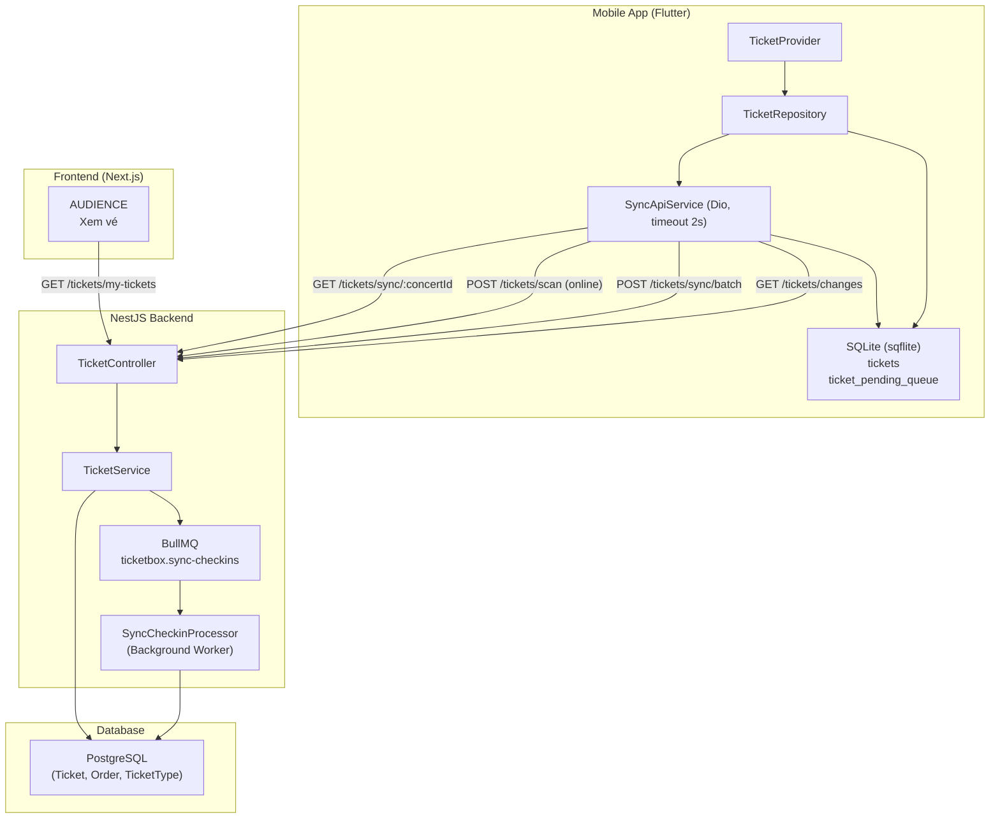
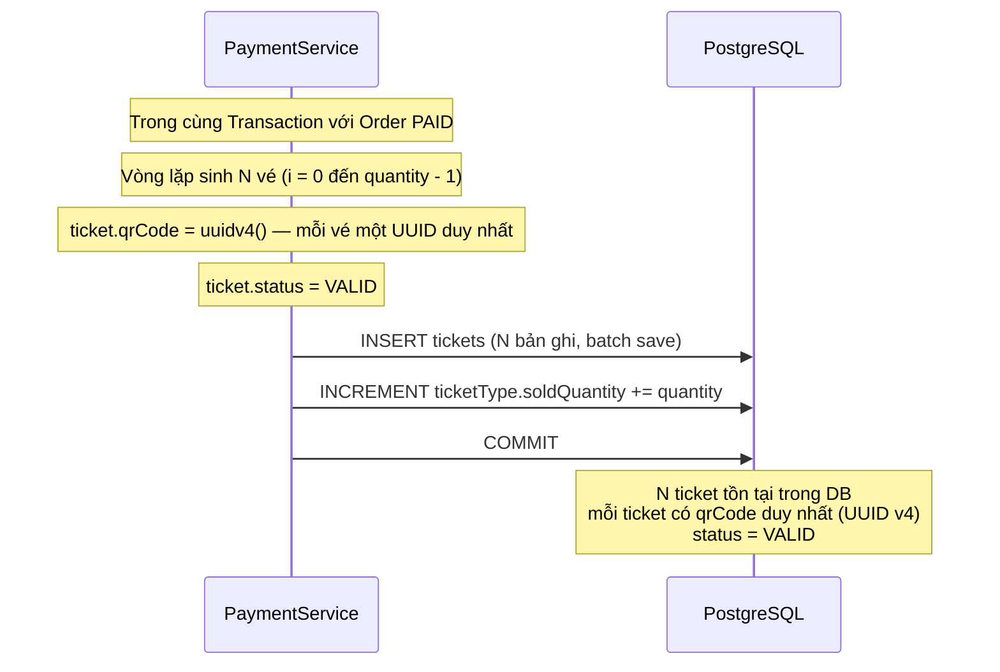
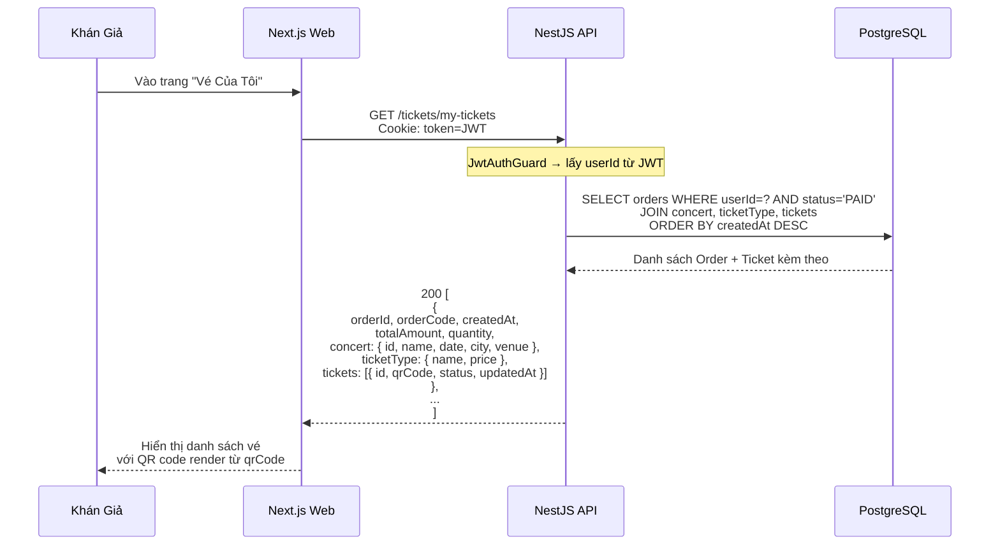
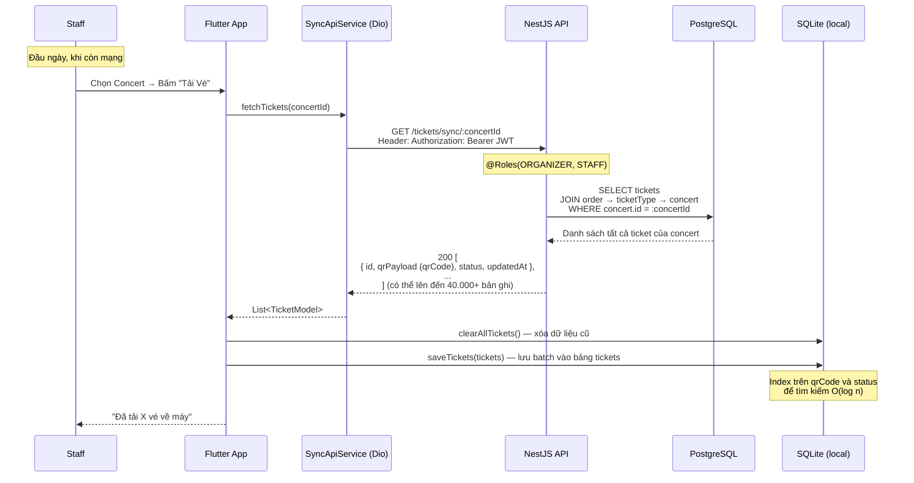
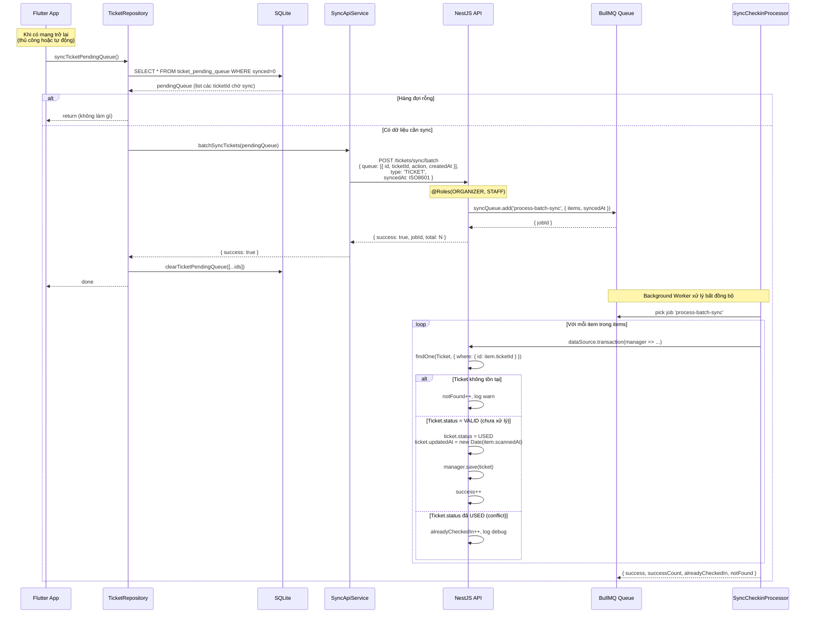
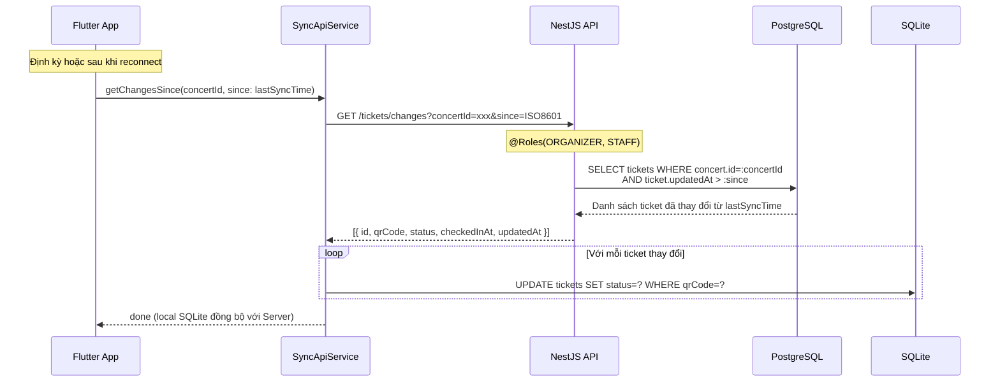

# Đặc Tả: Quản Lý Vé (Ticket Module)

## 1. Mô Tả

Module Ticket chịu trách nhiệm toàn bộ vòng đời của một chiếc vé trong hệ thống TicketBox: từ khi được sinh ra sau thanh toán thành công, đến khi hiển thị cho khán giả, được tải về máy Staff để soát offline, và đồng bộ lịch sử quét về Server. Module này phục vụ 3 nhóm người dùng với vai trò hoàn toàn khác nhau:

- **Khán giả (AUDIENCE):** Xem danh sách vé đã mua kèm QR code để vào cổng.
- **Staff / Organizer:** Tải toàn bộ vé về SQLite trên điện thoại (offline), soát vé bằng camera, đồng bộ kết quả lên Server.
- **Hệ thống nội bộ:** Sinh vé tự động khi thanh toán thành công (do Payment Module gọi trực tiếp qua TypeORM transaction).

**Thiết kế cốt lõi — Online-First, Offline Fallback:**

Ứng dụng Flutter của Staff luôn thử gọi API Server khi quét vé. Chỉ khi mạng timeout (> 2 giây) hoặc lỗi kết nối, hệ thống mới chuyển sang chế độ offline: cập nhật SQLite cục bộ và ghi vào `ticket_pending_queue` để đồng bộ sau. Cơ chế này đảm bảo soát vé không bị gián đoạn dù mất mạng.

**Các thành phần tham gia:**

| Thành phần          | File nguồn                                      | Chức năng                                                                          |
| ------------------- | ----------------------------------------------- | ---------------------------------------------------------------------------------- |
| TicketController    | `ticket/ticket.controller.ts`                   | 5 endpoint: my-tickets, sync/:concertId, scan, sync/batch, changes                |
| TicketService       | `ticket/ticket.service.ts`                      | Nghiệp vụ: getMyTickets, findTicketByConcertId, scanTicketById, batchSync, getChangesSince |
| SyncCheckinProcessor| `ticket/sync.processor.ts`                      | BullMQ Worker: xử lý job `process-batch-sync` bất đồng bộ                         |
| TicketProvider      | `mobile/lib/providers/ticket_provider.dart`     | State management Flutter: scanQR, validateTicket, offline fallback                 |
| TicketRepository    | `mobile/lib/repositories/ticket_repository.dart`| Repository: syncTicketsOffline, scanTicket, addTicketToPendingQueue                |
| SyncApiService      | `mobile/lib/services/sync_api_service.dart`     | HTTP client: gọi tất cả API ticket từ Mobile (Dio, timeout 2s)                    |
| DatabaseHelper      | `mobile/lib/services/database_helper.dart`      | SQLite (sqflite): quản lý bảng tickets, ticket_pending_queue                       |
| Ticket Entity       | `entities/ticket.entity.ts`                     | Schema: qrCode (UUID v4), status (VALID/USED/REVOKED), updatedAt                  |
| Order Entity        | `entities/order.entity.ts`                      | Quan hệ 1-N với Ticket (cascade delete)                                            |

**Tổng quan kiến trúc:**



---

## 2. Luồng Chính

### 2.1. Sinh Vé Sau Thanh Toán

Vé được sinh tự động trong `processWebhookSuccess()` của Payment Module — **không có endpoint riêng**. Xảy ra bên trong một TypeORM Transaction:



Quan hệ entity: `Ticket` → `Order` (ManyToOne, `onDelete: CASCADE`). Xóa Order sẽ xóa toàn bộ Ticket của Order đó.

---

### 2.2. Khán Giả Xem Vé (My Tickets)



Chỉ trả về các Order có `status = PAID` — Order `PENDING`/`FAILED`/`CANCELLED` bị loại bỏ. Mỗi Order có thể chứa nhiều Ticket (tương ứng `quantity`). `qrCode` là UUID v4 dùng để render QR code hiển thị cho khán giả đưa staff quét.

---

### 2.3. Staff Tải Vé Về Máy (Offline Pre-Sync)



Đồng thời với việc tải vé, ứng dụng cũng gọi `syncGuestsOffline(concertId)` để tải danh sách VIP Guest về — cùng một thao tác "Tải Vé" của Staff.

---

### 2.4. Quét Vé Online-First

```mermaid
sequenceDiagram
    participant S as Staff
    participant APP as Flutter App (ScannerScreen)
    participant TP as TicketProvider
    participant REPO as TicketRepository
    participant SQ as SQLite
    participant API as SyncApiService (Dio, timeout 2s)
    participant BE as NestJS API
    participant DB as PostgreSQL

    S->>APP: Camera quét QR code → nhận qrCode string

    Note over APP: _determineTicketType(qrCode)<br/>qrCode bắt đầu bằng "VIP" → GUEST<br/>còn lại → TICKET
    APP->>TP: scanQR(qrCode) → validateTicket(qrCode)

    TP->>REPO: getTicketByQr(qrCode)
    REPO->>SQ: SELECT * FROM tickets WHERE qrCode=?

    alt Không tìm thấy trong SQLite
        SQ-->>TP: null
        TP-->>APP: { success: false, message: "Mã vé không tồn tại" }
    else Vé đã CHECKED_IN (local)
        SQ-->>TP: ticket (status=CHECKED_IN)
        TP-->>APP: { success: false, message: "Vé đã được sử dụng" }
    else Vé hợp lệ (VALID local)
        SQ-->>TP: ticket (status=VALID)

        Note over TP: Thử Online trước
        TP->>API: scanTicket(ticketId, concertId)<br/>timeout: sendTimeout=2s, receiveTimeout=2s
        API->>BE: POST /tickets/scan<br/>{ ticketId, concertId, scannedAt }

        alt API thành công (có mạng)
            BE->>DB: SELECT ticket WHERE id=?
            alt Vé đã USED trên Server
                DB-->>BE: ticket (status=USED)
                BE-->>API: 400 "Vé đã được sử dụng"
                API-->>TP: throw error (message contains 'used')
                TP->>SQ: UPDATE status='CHECKED_IN' (đồng bộ local)
                TP-->>APP: { success: false, message: "Vé đã được sử dụng" }
            else Vé hợp lệ
                DB->>DB: UPDATE ticket SET status='USED', updatedAt=now()
                BE-->>API: { success: true, checkedInAt }
                API-->>TP: result
                TP->>SQ: UPDATE status='CHECKED_IN' (đồng bộ local)
                TP-->>APP: { success: true, message: "VÉ HỢP LỆ!" }
            end

        else Timeout (> 2s) hoặc mất mạng
            API-->>TP: throw TimeoutException
            Note over TP: Fallback sang Offline Mode
            TP->>SQ: UPDATE status='CHECKED_IN'
            TP->>REPO: addTicketToPendingQueue(ticketId, action='CHECK_IN')
            REPO->>SQ: INSERT ticket_pending_queue<br/>{ id=timestamp, ticketId, action, createdAt, synced=0 }
            TP-->>APP: { success: true, message: "VÉ HỢP LỆ! (Offline)", isOffline: true }
        end
    end
```



---

### 2.5. Đồng Bộ Kết Quả Quét Lên Server (Batch Sync)



---

### 2.6. Kéo Thay Đổi Từ Server (Delta Sync)



Delta Sync giải quyết vấn đề: nếu Staff-A (cổng 1) quét vé online và cập nhật Server, Staff-B (cổng 2, đang offline) vẫn có bản ghi VALID trong SQLite. Khi B có mạng, `GET /tickets/changes` kéo về danh sách ticket đã được quét từ lần sync cuối, cập nhật SQLite để tránh Staff-B quét lại vé đã hết hiệu lực.

---

## 3. Chi Tiết Kỹ Thuật

### 3.1. SQLite Schema (Mobile)

```sql
-- Bảng chính lưu toàn bộ vé của concert
CREATE TABLE tickets(
  id TEXT PRIMARY KEY,
  qrCode TEXT NOT NULL UNIQUE,   -- UUID v4, dùng để match QR scan
  status TEXT NOT NULL,           -- 'VALID' | 'CHECKED_IN' (local) | 'USED' (server)
  checkedInAt TEXT,               -- ISO8601 timestamp
  synced INTEGER DEFAULT 0,       -- 0: chưa đồng bộ, 1: đã đồng bộ
  updatedAt TEXT DEFAULT CURRENT_TIMESTAMP
);

-- Index tìm kiếm nhanh
CREATE INDEX idx_tickets_qr ON tickets(qrCode);      -- O(log n) lookup khi quét QR
CREATE INDEX idx_tickets_status ON tickets(status);   -- Query count theo status

-- Hàng đợi lịch sử quét offline chờ đồng bộ
CREATE TABLE ticket_pending_queue(
  id TEXT PRIMARY KEY,     -- timestamp milliseconds (unique)
  ticketId TEXT NOT NULL,  -- UUID vé cần đồng bộ
  action TEXT NOT NULL,    -- 'CHECK_IN'
  createdAt TEXT NOT NULL, -- ISO8601 thời điểm quét
  synced INTEGER DEFAULT 0
);

CREATE INDEX idx_ticket_pending_queue_synced ON ticket_pending_queue(synced);
```

**Lưu ý:** Status vé trong SQLite là `CHECKED_IN` (từ góc nhìn Mobile/Staff), trong khi PostgreSQL dùng `USED` (từ góc nhìn hệ thống). Mapping: Mobile `CHECKED_IN` = Server `USED`.

### 3.2. Phân Loại QR Code

```dart
String _determineTicketType(String qrCode) {
  if (qrCode.startsWith('VIP')) {
    return 'GUEST';   // VIP Guest (khách mời)
  }
  return 'TICKET';    // Vé thông thường
}
```

- `TICKET`: UUID v4 thuần (không có prefix) → dùng bảng `tickets` trong SQLite, gọi `POST /tickets/scan`
- `GUEST`: Bắt đầu bằng `VIP` → dùng bảng `guests` trong SQLite, gọi `POST /guests/scan`
- `UNKNOWN`: Không xác định được → thử tra cả 2 bảng, lấy bảng nào tìm thấy trước

### 3.3. Xử Lý Conflict Trong Batch Sync

Khi 2 cổng soát vé cùng quét 1 vé offline và đều đồng bộ lên server:

```
Cổng A (sync lúc 10:01): ticketId=xxx, scannedAt=10:00:00
Cổng B (sync lúc 10:02): ticketId=xxx, scannedAt=10:00:30
```

1. Cổng A sync trước → ticket.status = `USED`, ticket.updatedAt = `10:00:00`
2. Cổng B sync sau → `SyncCheckinProcessor` kiểm tra status đã `USED` → `alreadyCheckedIn++` → bỏ qua, không ghi đè
3. **Kết quả:** Server lưu thời điểm check-in của Cổng A (người đến trước), Cổng B bị bỏ qua

Không có transaction xung đột vì mỗi ticket trong `items` được xử lý trong transaction riêng. Nếu 1 ticket lỗi, các ticket khác trong batch vẫn tiếp tục xử lý.

### 3.4. API Timeout Strategy (Mobile)

```dart
// Trong SyncApiService.scanTicket()
options: Options(
  sendTimeout: const Duration(seconds: 2),
  receiveTimeout: const Duration(seconds: 2),
),
```

Timeout 2 giây cho từng request scan. Nếu quá 2s → `DioExceptionType.connectionTimeout` hoặc `receiveTimeout` → ném `TimeoutException` → `TicketProvider` bắt exception → fallback sang offline mode. Không block giao diện, Staff vẫn quét vé liên tục.

### 3.5. Bảng Endpoint Ticket

| Endpoint                       | Method | Role             | Mô tả                                                      |
| ------------------------------ | ------ | ---------------- | ---------------------------------------------------------- |
| `/tickets/my-tickets`          | GET    | AUDIENCE (auth)  | Xem danh sách vé đã mua (chỉ PAID Orders)                  |
| `/tickets/sync/:concertId`     | GET    | ORGANIZER, STAFF | Tải toàn bộ vé của concert về máy (pre-sync)               |
| `/tickets/scan`                | POST   | ORGANIZER, STAFF | Quét vé online — nhận `ticketId`, cập nhật USED ngay      |
| `/tickets/sync/batch`          | POST   | ORGANIZER, STAFF | Đồng bộ hàng loạt từ offline queue — đưa vào BullMQ       |
| `/tickets/changes`             | GET    | ORGANIZER, STAFF | Kéo delta thay đổi từ Server kể từ `?since=ISO8601`        |

### 3.6. BullMQ Queue Config

- **Queue name:** `ticketbox.sync-checkins`
- **Job name:** `process-batch-sync`
- **Processor:** `SyncCheckinProcessor` (`@Processor('ticketbox.sync-checkins')`)
- **Cấu trúc job data:** `{ items: [{ ticketId, type, action, scannedAt }], syncedAt: ISO8601 }`
- **Xử lý:** Mỗi item là 1 transaction riêng — isolate lỗi, không làm abort cả batch

---

## 4. Kịch Bản Lỗi

### 4.1. Khán Giả Xem Vé

| Kịch bản                               | HTTP | Response                                     |
| -------------------------------------- | ---- | -------------------------------------------- |
| Không có JWT Cookie                    | 401  | Unauthorized                                 |
| Không có vé nào (chưa mua)            | 200  | `[]` (mảng rỗng)                             |
| Có vé nhưng Order status = PENDING     | 200  | `[]` — chỉ trả PAID Orders                  |

### 4.2. Staff Tải Vé (Pre-Sync)

| Kịch bản                               | HTTP | Response                                        |
| -------------------------------------- | ---- | ----------------------------------------------- |
| `concertId` không tồn tại             | 404  | `"Concert không tồn tại"`                       |
| Role AUDIENCE gọi endpoint này        | 403  | Forbidden                                        |
| Concert không có vé nào               | 200  | `[]` (mảng rỗng)                                |

### 4.3. Quét Vé (Online)

| Kịch bản                               | HTTP | Response                                        |
| -------------------------------------- | ---- | ----------------------------------------------- |
| `ticketId` không tồn tại trong DB     | 404  | `"Không tìm thấy vé hợp lệ."`                  |
| Vé đã USED (quét lần 2)               | 400  | `"Vé này đã được sử dụng trước đó."`           |
| `ticketId` bỏ trống                   | 400  | `"Ticket ID không hợp lệ"` (Controller guard)  |
| Role AUDIENCE gọi endpoint này        | 403  | Forbidden                                        |

### 4.4. Quét Vé (Offline — Mobile)

| Kịch bản                               | Kết quả Mobile                                               |
| -------------------------------------- | ------------------------------------------------------------ |
| QR không có trong SQLite              | Báo "Mã vé không tồn tại" — không fallback offline           |
| QR đã CHECKED_IN trong SQLite         | Báo "Vé đã được sử dụng" — không fallback                   |
| Timeout API (> 2s)                    | Cập nhật SQLite, ghi `ticket_pending_queue`, báo "VÉ HỢP LỆ! (Offline)" |
| Server trả lỗi 400 "already used"     | Cập nhật SQLite thành CHECKED_IN, báo "Vé đã được sử dụng"  |
| Lỗi server khác (5xx)                 | Fallback offline — cập nhật SQLite + pending queue           |

### 4.5. Batch Sync

| Kịch bản                               | HTTP | Response                                        |
| -------------------------------------- | ---- | ----------------------------------------------- |
| `queue` rỗng                          | 400  | `"Không có dữ liệu để đồng bộ"`               |
| Queue hợp lệ                          | 201  | `{ success: true, jobId, total: N }`            |
| `ticketId` trong queue không tồn tại  | —    | Worker log warn, `notFound++`, tiếp tục batch   |
| Ticket đã USED (conflict 2 cổng)      | —    | Worker log debug, `alreadyCheckedIn++`, bỏ qua |

---

## 5. Ràng Buộc

### 5.1. Bảo Mật

- **Phân quyền rõ ràng:** `/tickets/my-tickets` chỉ AUDIENCE — staff không được xem vé của người khác. `/tickets/sync/:concertId` chỉ ORGANIZER/STAFF — khán giả không tải được danh sách toàn bộ vé của event.

- **Không dùng qrCode để quét online:** Endpoint `POST /tickets/scan` nhận `ticketId` (UUID của bản ghi Ticket trong DB), **không phải** `qrCode`. Điều này ngăn attacker tạo QR giả nếu biết format qrCode — vì ticketId không được in ra QR, chỉ lưu trong DB và SQLite của Staff.

- **qrCode là UUID v4:** Không thể đoán, không thể brute-force, unique toàn cầu.

### 5.2. Hiệu Năng

- **Batch insert vé:** Trong `processWebhookSuccess()`, N Ticket được tạo trong mảng rồi `manager.save(tickets)` một lần — không gọi N lần INSERT riêng lẻ.

- **Batch insert SQLite:** `DatabaseHelper.saveTickets()` dùng `db.batch()` để insert hàng chục nghìn ticket trong một lần commit — không commit từng dòng.

- **Index SQLite:** Index trên `qrCode` đảm bảo mỗi lần Staff quét QR, truy vấn SQLite chạy O(log n) thay vì O(n) full scan.

- **BullMQ Async:** Batch sync không xử lý đồng bộ trong request — đẩy vào Queue và trả về `jobId` ngay lập tức. Ngăn request timeout khi sync hàng nghìn vé.

- **Delta Sync:** `GET /tickets/changes?since=ISO8601` chỉ trả về ticket có `updatedAt > since`, không tải lại toàn bộ. Tối ưu bandwidth và thời gian đồng bộ lần 2 trở đi.

### 5.3. Tính Toàn Vẹn Dữ Liệu

- **Idempotency trong Batch Sync:** Nếu cùng một `ticketId` được sync 2 lần (mạng lỗi, app retry), lần thứ 2 vào `SyncCheckinProcessor` thấy ticket đã `USED` → `alreadyCheckedIn++` → không xử lý lại. Không có side effect.

- **`updatedAt` từ Client:** Khi sync offline, `ticket.updatedAt` được set bằng `item.scannedAt` (thời điểm Staff thực sự quét), **không phải** thời điểm sync lên Server. Đảm bảo `GET /tickets/changes?since=T` trả về đúng bản ghi theo thời điểm thực tế check-in.

- **Xóa ticket theo cascade:** `Ticket.order` có `onDelete: CASCADE` — nếu Order bị xóa cứng (không phải soft delete), toàn bộ Ticket của Order đó cũng bị xóa theo.

---

## 6. Quyết Định Thiết Kế

### 6.1. Tại sao dùng `ticketId` để scan thay vì `qrCode`?

| Tiêu chí          | Scan bằng qrCode                          | Scan bằng ticketId                         |
| ----------------- | ----------------------------------------- | ------------------------------------------ |
| API nhận gì       | `qrCode` (UUID v4 in trên QR)             | `ticketId` (UUID của bản ghi DB, không in) |
| Rủi ro giả mạo    | Attacker biết format → có thể brute-force | `ticketId` không bao giờ lộ qua QR         |
| Tra cứu DB        | `WHERE qrCode = ?` (indexed unique)       | `WHERE id = ?` (primary key, O(1))         |
| Độ phức tạp Mobile| Cần tra cứu SQLite lấy ticketId từ qrCode | Cùng bước tra cứu SQLite                   |

**Quyết định:** Scan online dùng `ticketId`, scan offline (match QR) dùng `qrCode` trong SQLite.

**Lý do:** `qrCode` là giá trị public in trên vé. Nếu API scan nhận `qrCode`, attacker biết rằng format là UUID v4 và có thể thử enumerate, dù khó. Dùng `ticketId` (UUID của row trong DB) như một secret key thứ 2 — giá trị này chỉ tồn tại trong SQLite của Staff sau khi tải về, không bao giờ xuất hiện trên QR code.

### 6.2. Tại sao dùng BullMQ cho Batch Sync thay vì xử lý trực tiếp?

| Tiêu chí              | Xử lý trực tiếp trong request          | Đẩy vào BullMQ Queue                      |
| --------------------- | --------------------------------------- | ----------------------------------------- |
| Request timeout       | Có thể timeout nếu sync 5000+ vé       | Trả về ngay (jobId), không timeout        |
| DB connection pool    | Block connection trong suốt quá trình  | Worker lấy connection khi sẵn sàng        |
| Retry khi lỗi         | Không có                               | BullMQ retry tự động (nếu cấu hình)       |
| Visibility            | Không biết tiến độ                     | Có jobId để query status                  |
| Xử lý 10 cổng cùng lúc | Đua nhau, có thể deadlock             | Queue tuần tự hóa, Worker xử lý lần lượt |

**Quyết định:** BullMQ Queue + background Worker.

**Lý do:** Ngày sự kiện, 10 Staff ở 10 cổng có thể đồng thời gửi batch sync ngay khi mạng xuất hiện. Xử lý trực tiếp trong request có thể gây spike DB rất lớn. BullMQ hấp thụ load spike — 10 job vào queue, Worker xử lý theo khả năng của DB, không có request nào timeout.

### 6.3. Tại sao Online-First (thử mạng trước) thay vì Offline-First?

| Tiêu chí               | Offline-First                            | Online-First                              |
| ---------------------- | ---------------------------------------- | ----------------------------------------- |
| Consistency            | Thấp (luôn dùng local data)              | Cao (server là source of truth)           |
| Phát hiện vé đã dùng   | Chậm (chờ sync)                         | Ngay lập tức (server kiểm tra real-time)  |
| Trải nghiệm offline    | Tốt (không chờ mạng)                    | Tốt (fallback trong 2s timeout)           |
| Rủi ro double check-in | Cao (2 cổng không biết nhau)             | Thấp (server biết ngay, báo lỗi)          |

**Quyết định:** Online-First với Offline Fallback (timeout 2s).

**Lý do:** Nếu dùng Offline-First hoàn toàn, 2 Staff ở 2 cổng có thể quét cùng 1 vé đồng thời — cả 2 đều thấy "hợp lệ" vì local SQLite không biết cổng kia đang xử lý. Online-First với timeout 2s là compromise tốt: khi mạng tốt (95% thời gian), Server là arbiter duy nhất. Khi mạng kém, fallback offline trong 2s — Staff không cảm nhận sự khác biệt.

---

## 7. Tiêu Chí Chấp Nhận

| #   | Hành vi                                                           | Kết quả mong đợi                                                                           |
| --- | ----------------------------------------------------------------- | ------------------------------------------------------------------------------------------ |
| 1   | Order PAID → kiểm tra DB                                          | Tồn tại đúng `quantity` bản ghi Ticket, mỗi ticket có `qrCode` duy nhất (UUID v4)         |
| 2   | GET /tickets/my-tickets với user có 2 đơn PAID                   | Trả về 2 object, mỗi object có `tickets[]` tương ứng với số lượng vé                      |
| 3   | GET /tickets/my-tickets với user chỉ có đơn PENDING               | Trả về `[]` (mảng rỗng)                                                                   |
| 4   | GET /tickets/sync/:concertId (STAFF role)                         | Trả về toàn bộ vé của concert với `{ id, qrPayload, status, updatedAt }`                  |
| 5   | GET /tickets/sync/:concertId (AUDIENCE role)                      | 403 Forbidden                                                                              |
| 6   | POST /tickets/scan với vé hợp lệ (VALID)                          | `{ success: true }`, ticket.status → USED trong DB, updatedAt cập nhật                    |
| 7   | POST /tickets/scan với vé đã USED                                 | 400 "Vé này đã được sử dụng trước đó."                                                    |
| 8   | POST /tickets/scan với ticketId không tồn tại                     | 404 "Không tìm thấy vé hợp lệ."                                                           |
| 9   | POST /tickets/scan mà không có ticketId trong body                | 400 "Ticket ID không hợp lệ"                                                               |
| 10  | Mobile quét vé khi mạng tốt                                       | API call thành công, local SQLite cập nhật CHECKED_IN, hiển thị "VÉ HỢP LỆ!"             |
| 11  | Mobile quét vé khi mất mạng (timeout 2s)                         | Cập nhật SQLite, ghi vào `ticket_pending_queue`, hiển thị "VÉ HỢP LỆ! (Offline)"         |
| 12  | Mobile quét vé chưa có trong SQLite (chưa sync)                  | Hiển thị "Mã vé không tồn tại" — không fallback online                                    |
| 13  | Mobile quét vé đã CHECKED_IN trong SQLite                         | Hiển thị "Vé đã được sử dụng" ngay lập tức                                               |
| 14  | POST /tickets/sync/batch với 100 vé từ offline                    | Trả về `{ success: true, jobId, total: 100 }` ngay lập tức, không chờ xử lý              |
| 15  | Kiểm tra DB sau khi Worker chạy xong batch sync                   | Đúng số ticket status=USED, `updatedAt` = `scannedAt` từ mobile (không phải thời điểm sync) |
| 16  | 2 cổng cùng sync 1 vé đã quét offline (conflict)                  | 1 vé USED với thời gian của cổng sync trước, cổng sau `alreadyCheckedIn` — không duplicate |
| 17  | GET /tickets/changes?concertId=xxx&since=T sau khi vé được quét  | Trả về ticket đã update kể từ T, local SQLite cập nhật                                    |
| 18  | POST /tickets/sync/batch với `queue: []`                          | 400 "Không có dữ liệu để đồng bộ"                                                         |
| 19  | Staff quét QR code bắt đầu bằng "VIP"                            | Chuyển sang luồng `validateGuest()`, không xử lý như ticket thường                        |
| 20  | AUDIENCE gọi POST /tickets/scan                                   | 403 Forbidden                                                                              |
