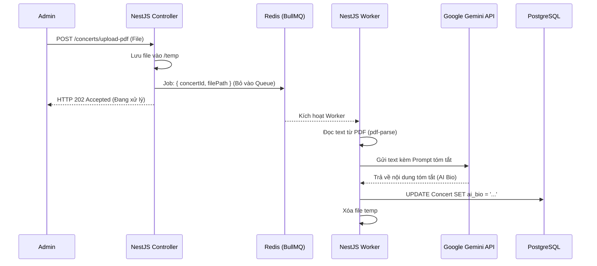
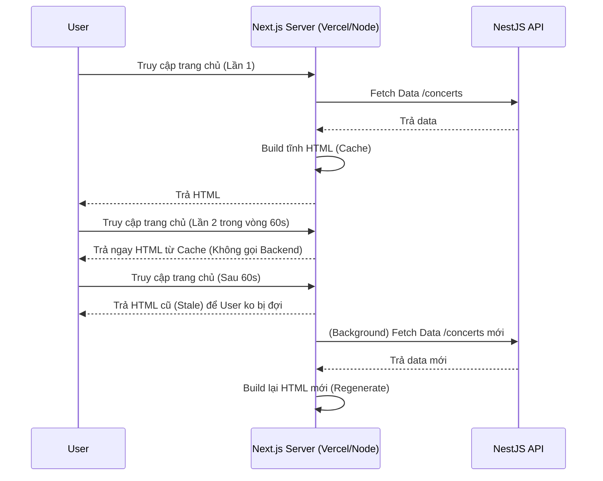

# Phase 2: Dữ Liệu Cốt Lõi, Quản Trị & Giao Diện Khám Phá

## 1. Bức Tranh Tổng Thể (The Big Picture)

Sau khi hoàn thiện Phase 1 (Base setup và Authentication), Phase 2 là bước chúng ta xây dựng phần **"Thịt"** của hệ thống. Ở giai đoạn này, TicketBox cần bắt đầu có dữ liệu thực tế: Các sự kiện âm nhạc (Concert), các hạng vé (TicketType) và khả năng hiển thị chúng tới người dùng cuối. 

Vấn đề đặc thù ở phase này là:
1. **Làm sao để admin không phải nhập tay tiểu sử nghệ sĩ dài ngoằng?** Thay vào đó, họ chỉ việc quăng 1 cái file PDF Press Kit (hồ sơ báo chí) của sự kiện vào hệ thống.
2. **Làm sao để trang chủ và trang chi tiết sự kiện không sập khi có hàng triệu người F5 liên tục để chờ mua vé?** Nếu mỗi lần F5 lại chọc xuống Database (Postgres) thì DB sẽ "chết" ngay lập tức.

## 2. Giải Quyết Vấn Đề Chuyên Sâu

### Vấn đề 1: Tự động hóa tóm tắt PDF bằng AI (Google Gemini)
- **Tư duy giải quyết:** Việc đọc file PDF và gọi API AI mất thời gian (từ 5 - 15 giây). Nếu ta gọi API này đồng bộ (Synchronous) trong request upload của Admin, trình duyệt sẽ bị treo (loading mãi), dễ dẫn đến Timeout.
- **Giải pháp:** Sử dụng **Message Queue (BullMQ)** kết hợp Background Worker. 
  - Admin upload PDF -> Backend lưu file tạm -> Đẩy 1 task vào Queue (ví dụ: `PROCESS_PDF_BIO`) -> Trả về HTTP 200 "File đang được xử lý".
  - Ở phía sau, Worker sẽ nhặt task này lên, dùng thư viện `pdf-parse` bóc tách chữ từ file PDF, sau đó đẩy đoạn text đó lên Google Gemini API với prompt: *"Hãy tóm tắt tiểu sử nghệ sĩ này trong 150 chữ..."*. Cuối cùng, update kết quả vào cột `ai_bio` trong Postgres.

### Vấn đề 2: Tối ưu tải cho giao diện Public bằng ISR
- **Tư duy giải quyết:** Dữ liệu trang chủ (danh sách concert) và thông tin cơ bản của concert ít khi thay đổi (chỉ có số lượng vé là đổi liên tục).
- **Giải pháp:** Sử dụng Next.js **ISR (Incremental Static Regeneration)**.
  - Next.js sẽ build trang chủ thành 1 file HTML tĩnh.
  - Bất kỳ ai truy cập cũng sẽ được trả về file HTML này cực nhanh mà không cần gọi xuống backend.
  - Ta set `revalidate: 60` (cứ 60 giây, Next.js ngầm hỏi lại backend xem có concert nào mới không, nếu có thì nó build lại HTML mới trong background).
  - Riêng **số lượng vé còn lại**, ta sẽ fetch bằng SWR ở phía client-side (chỉ gọi API nhẹ lấy đúng con số, và backend API này sẽ đọc từ Redis thay vì Postgres).

## 3. Sơ Đồ Hoạt Động (Flow Diagrams)

### Flow 1: Upload PDF & Trích xuất AI (Backend)


### Flow 2: Tối ưu trang chủ bằng ISR (Frontend)


## 4. Hướng Dẫn Coding & Xử Lý Chi Tiết

**Backend (NestJS):**
- Trong `ConcertModule`, đăng ký BullMQ: `BullModule.registerQueue({ name: 'ai-bio-queue' })`.
- Tạo một `AiBioProcessor` bằng `@Processor('ai-bio-queue')`.
- Sử dụng hàm `pdf(dataBuffer)` từ thư viện `pdf-parse` để lấy `text`.
- Dùng `@google/genai` (Google Generative AI SDK) để truyền text vào Model `gemini-1.5-flash` lấy nội dung.

**Frontend (Next.js):**
- Ở trang `app/page.tsx` (hoặc `pages/index.tsx`), dùng fetch với cấu hình `{ next: { revalidate: 60 } }` để lấy danh sách Concert.
- Ở trang chi tiết, chia component. Component hiển thị thông tin chung là SSR/ISR. Component hiển thị **Sơ đồ chỗ ngồi và số lượng vé trống** sẽ là Client Component (`"use client"`), dùng thư viện `swr` để gọi API `/tickets/available` (API này móc vào Redis lấy nhanh số vé).

## 5. Breakdown Task Siêu Nhỏ (Dành để thực thi)

### [Backend] Module Concert & TicketType
- [ ] B1: Tạo `ConcertController` và `ConcertService` (CRUD cơ bản: Create, FindAll, FindOne, Update).
- [ ] B2: Tạo `TicketTypeController` và `TicketTypeService` (CRUD, phải map với `concert_id`).
- [ ] B3: Viết logic khi tạo 1 TicketType, ngoài việc save vào Postgres, phải tự động `SET` một key vào Redis: `ticket_type:{id}:available = quantity` (Đây là bước đệm cực kỳ quan trọng cho Phase 3).

### [Backend] AI Processing Worker
- [ ] B1: Cài đặt thư viện: `npm i @nestjs/bullmq bullmq pdf-parse @google/genai`. Cài `@types/pdf-parse`.
- [ ] B2: Viết API POST `/concerts/:id/upload-bio`. Dùng `FileInterceptor` lưu file vào thư mục local `/uploads`.
- [ ] B3: Trong API trên, `await this.audioQueue.add('process-pdf', { concertId, filePath })` và trả về `202 Accepted`.
- [ ] B4: Viết class `AiProcessor` kế thừa `WorkerHost`. Trong hàm `process()`, đọc file PDF bằng `fs` và `pdf-parse`.
- [ ] B5: Tích hợp Gemini SDK. Truyền prompt: *"Bạn là một biên tập viên sự kiện. Hãy tóm tắt hồ sơ nghệ sĩ sau thành 1 đoạn văn ngắn gọn, hấp dẫn, độ dài tối đa 200 chữ: [TEXT_PDF]"*.
- [ ] B6: Update `ai_bio` vào record Concert tương ứng trong Postgres.

### [Frontend] Admin Dashboard
- [ ] B1: Dựng layout Admin Panel bằng Tailwind (Sidebar, Header).
- [ ] B2: Dựng màn hình Danh sách Sự kiện (Table dạng đơn giản hiển thị tên, ngày, trạng thái).
- [ ] B3: Dựng form Tạo sự kiện (Input text, date picker).
- [ ] B4: Dựng nút Upload PDF (Input type="file"). Dùng Axios POST file lên backend dưới dạng `multipart/form-data`.

### [Frontend] Web Public
- [ ] B1: Dựng trang chủ (Homepage). Sử dụng CSS Grid tạo các Card sự kiện.
- [ ] B2: Viết hàm fetch data gọi API backend. Cấu hình `revalidate` cho ISR Next.js.
- [ ] B3: Dựng trang Chi tiết sự kiện (`/concert/:id`). Layout chia 2 cột: Cột trái (Ảnh, Bio AI), cột phải (Mua vé).
- [ ] B4: Viết Client Component cho phần "Loại Vé". Dùng `swr` hook để liên tục polling API số vé trống (VD: 5 giây cập nhật 1 lần).

---

## 6. Giải Pháp Đã Triển Khai Thực Tế

> Phần này ghi lại cách 2 task trên được giải quyết cụ thể trong codebase, bao gồm các quyết định kiến trúc (ADR), file thay đổi và kết quả test đã xác nhận.

---

### Task 1: Tự Động Hóa AI Bio qua BullMQ

#### Kiến trúc triển khai

```
Admin mở ConcertModal (create/edit)
  └── Tab "Nhập tay": textarea → lưu trực tiếp vào field aiBio (PUT /concerts/:id)
  └── Tab "Upload PDF": drop zone → POST /concerts/:id/upload-bio (multipart)
         └── Backend: lưu buffer → enqueue BullMQ job → trả 202 ngay
                └── Worker AiBioProcessor (background):
                      1. pdf-parse trích xuất text
                      2. Groq/Gemini AI summarize ~150 chữ
                      3. UPDATE concerts SET ai_bio = '...', ai_bio_status = 'DONE'
         └── Frontend: poll GET /concerts/:id mỗi 3s cho đến khi status = DONE/FAILED
               └── Khi DONE: hiển thị preview aiBio ngay trong modal
```

#### Thiết kế UX — 2 chế độ nhập Bio

| Chế độ | Khi nào dùng | Flow |
|--------|-------------|------|
| **Nhập tay** | Đã có nội dung sẵn | Nhập textarea → Cập nhật → Lưu ngay |
| **Upload PDF** | Có Press Kit PDF | Kéo thả file → Backend xử lý → Tự cập nhật |

**Logic auto-switch tab:**
- Edit concert đã có `aiBio` → mở tab **Nhập tay** (thấy nội dung ngay)
- Edit concert chưa có `aiBio` → mở tab **Upload PDF** (gợi ý hành động tiếp theo)
- Create concert → mở tab **Nhập tay** (PDF chỉ upload được sau khi concert đã có ID)

#### Files đã thay đổi

| File | Nội dung thay đổi |
|------|------------------|
| `frontend/src/components/admin/ConcertModal.tsx` | Thêm section AI Bio với 2 tab (nhập tay / drop zone PDF), inline polling |
| `frontend/src/services/adminService.ts` | Thêm `aiBio` vào `UpdateConcertPayload` |
| `frontend/src/app/admin/page.tsx` | Xóa cột AI Bio + `UploadPdfButton` khỏi table row |
| `backend/src/concert/dto/concert.dto.ts` | Thêm `aiBio?: string` vào `UpdateConcertDto` |

#### Bug đã fix: aiBio bị strip khi nhập tay

**Root cause:** `ValidationPipe` với `whitelist: true` trong `main.ts` tự động loại bỏ mọi field không khai báo trong DTO. `aiBio` chưa có trong `UpdateConcertDto` nên bị xóa im lặng trước khi đến service — không có lỗi, dữ liệu đơn giản không được lưu.

**Fix:** Thêm `@IsString() @IsOptional() aiBio?: string` vào `UpdateConcertDto`.

---

### Task 2: Tối Ưu Tải với ISR + Redis

#### Kiến trúc triển khai

```
Homepage (app/page.tsx) — Server Component, ISR revalidate: 60s
  ├── fetch /concerts → Next.js cache HTML tĩnh tại server
  ├── <HeroCarousel concerts={concerts} />  ← nhận prop, không tự fetch
  ├── <TickerBanner concerts={concerts} />  ← Client Component, nhận prop
  └── <TrendingScroller concerts={concerts} /> ← Client Component (cần useRef scroll)

Concert Detail (app/concert/[id]/page.tsx) — Server Component, ISR revalidate: 60s
  ├── fetch /concerts/:id → cache per-route
  ├── Toàn bộ UI tĩnh render server-side
  ├── <BackButton />       ← micro Client Component (router.back())
  ├── <BookingButton />    ← micro Client Component (router.push())
  └── <TicketAvailability concertId fallbackTicketTypes />
        ├── "use client" + SWR poll mỗi 5 giây
        ├── GET /concerts/:id/availability → Redis O(1)
        ├── fallbackData từ Postgres (Server Component) → không flash loading
        └── onErrorRetry: tối đa 3 lần, interval 10s — không spam khi backend down

Backend GET /concerts/:id/availability
  ├── Đọc Redis key: ticket_type:{id}:available  (O(1), <1ms)
  ├── Cache miss → đọc Postgres → SET Redis → trả về
  └── Header: Cache-Control: public, s-maxage=5, stale-while-revalidate=10
```

#### Các quyết định kiến trúc (ADR)

| ADR | Quyết định | Lý do |
|-----|-----------|-------|
| ADR-001 | Dùng `ioredis` trực tiếp thay vì `@nestjs/cache-manager` | Hỗ trợ DECR/INCRBY atomic cho Phase 3 booking |
| ADR-002 | Redis warm-up qua `OnApplicationBootstrap` | Tránh cold miss lần đầu sau server restart |
| ADR-003 | `process.env.NEXT_PUBLIC_API_URL?.replace('/api', '')` | Nhất quán base URL giữa Server Component và apiClient |
| ADR-004 | `Cache-Control: public, s-maxage=5` trên availability endpoint | CDN/proxy hấp thụ thundering herd khi concert hot |

#### Redis key schema

```
ticket_type:{ticketTypeId}:available  →  số vé còn lại (integer)
```

Warm-up khi server khởi động: dùng `SET NX` (không ghi đè nếu key đã tồn tại) để bảo toàn giá trị đang live.

#### Files đã tạo mới

| File | Vai trò |
|------|---------|
| `backend/src/infrastructure/redis.provider.ts` | Custom ioredis provider với token `REDIS_CLIENT` |
| `frontend/src/components/concert/TicketAvailability.tsx` | Client Component SWR poll 5s |
| `frontend/src/components/concert/TickerBanner.tsx` | Tách khỏi page để page là Server Component |
| `frontend/src/components/concert/TrendingScroller.tsx` | Client Component vì cần `useRef` cho horizontal scroll |
| `frontend/src/components/concert/BackButton.tsx` | Micro Client Component cho `router.back()` |
| `frontend/src/components/concert/BookingButton.tsx` | Micro Client Component cho `router.push()` |

#### Kết quả test xác nhận (terminal)

```
# Test availability endpoint đọc từ Redis
GET /concerts/bce9064e.../availability
→ SKY LOUNGE available: 3  (từ Redis cache)

# Redis DECR thủ công
DECR ticket_type:e94c8233...:available → 2

# Gọi lại availability ngay sau DECR
GET /concerts/bce9064e.../availability
→ SKY LOUNGE available: 2  ✅ phản ánh ngay lập tức

# SWR trên browser (xác nhận qua DevTools)
→ Request GET /availability tự lặp mỗi 5 giây
→ Số vé thay đổi không cần F5 trang
```

#### So sánh trước / sau

| Chỉ số | Trước (CSR) | Sau (ISR + Redis) |
|--------|------------|-------------------|
| Homepage: 100 user F5 | 100 DB query | 0 DB query (HTML từ cache) |
| Concert detail: mỗi user | 1 DB query | 0 DB query (cache 60s/route) |
| Số vé: cập nhật | Stale (lúc load trang) | Real-time, lag tối đa 5s |
| Backend down | Trang trắng/crash | ISR cache vẫn phục vụ |
| HeroCarousel | Tự fetch (API call riêng) | Nhận prop từ parent, 0 extra request |
