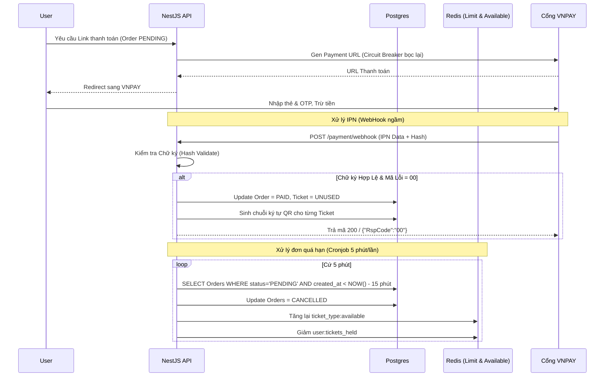

# Phase 4: Thanh Toán VNPAY, Đối Soát & Chống Lỗi Hệ Thống

## 1. Bức Tranh Tổng Thể (The Big Picture)

Sau khi người dùng đã vượt qua "cửa ải" giành vé thành công ở Phase 3, hệ thống sẽ tạo ra một đơn hàng (`Order`) với trạng thái `PENDING` (Chờ thanh toán) trong vòng 15 phút. Người dùng được chuyển hướng sang cổng thanh toán (ví dụ: VNPAY).

Ở phase này, bạn không quản lý "hàng hóa" nữa mà quản lý **"Tiền"**. Lỗi ở phase này cực kỳ nhạy cảm: 
- Trừ tiền khách mà không đổi trạng thái vé (Khách mất tiền oan).
- Khách không trả tiền hoặc thanh toán thất bại nhưng hệ thống lại báo thành công (Hệ thống lỗ).
- Cổng thanh toán (VNPAY) đang bảo trì, server backend của bạn chờ mòn mỏi tới sập server (Cascading Failure).

## 2. Giải Quyết Vấn Đề Chuyên Sâu

### Vấn đề 1: Trừ tiền thành công nhưng hệ thống không ghi nhận (Mất mạng lúc thanh toán)
- **Tư duy:** Không bao giờ phụ thuộc vào việc trình duyệt của người dùng sau khi thanh toán xong sẽ tự redirect về trang web của bạn (Return URL). Người dùng có thể tắt trình duyệt ngay khi VNPAY báo trừ tiền.
- **Giải pháp:** Sử dụng cơ chế **Webhook (IPN - Instant Payment Notification)**. 
  - VNPAY sẽ có 1 server riêng âm thầm gọi thẳng (Server-to-Server) vào API của bạn để báo "Đơn 123 đã thanh toán thành công".
  - Chữ ký số (Signature/Checksum): Để chống hacker giả danh server VNPAY gọi vào API của bạn, toàn bộ dữ liệu gọi về đều được băm (hash) bằng một Secret Key. Backend của bạn nhận được phải băm lại và so sánh chữ ký.

### Vấn đề 2: Cổng thanh toán gặp sự cố kéo sập toàn hệ thống
- **Tư duy:** Nếu hệ thống bạn gọi API tạo Link thanh toán tới VNPAY, nhưng VNPAY đang treo và 30s sau mới báo timeout. Nếu có 1000 người ấn Mua Vé, backend của bạn sẽ treo cứng 1000 kết nối đó trong 30s, dẫn đến cạn kiệt tài nguyên (CPU/RAM) và sập toàn bộ web, ngay cả người chỉ vào xem trang chủ cũng bị lỗi.
- **Giải pháp:** Sử dụng Design Pattern **Circuit Breaker** (Ngắt mạch).
  - Hoạt động y hệt cầu dao điện nhà bạn. Nếu gọi VNPAY thất bại (hoặc timeout) liên tục 5 lần, cầu dao sẽ "Tự Ngắt" (Trạng thái OPEN).
  - Khi OPEN, mọi request tiếp theo gọi VNPAY sẽ bị Backend chặn lại ngay lập tức (trả về lỗi 503 Service Unavailable) mà không cần phải cố kết nối ra ngoài internet nữa.
  - Sau 1 khoảng thời gian (Cooldown - vd: 60s), cầu dao tự đóng lại 1 nửa (Half-Open) để thử 1 request. Nếu OK, nó đóng mạch (CLOSED) hoạt động bình thường trở lại.

### Vấn đề 3: Đơn hàng bị treo "PENDING" vô thời hạn
- **Tư duy:** Người dùng vào tới VNPAY nhưng đổi ý không thanh toán, tắt máy đi ngủ. 200 vé SVIP bị treo cứng, người khác không mua được.
- **Giải pháp:** Xây dựng **Cronjob Quét Hủy Đơn & Hoàn Vé**. Cứ 5 phút chạy 1 lần, tìm các Order PENDING quá 15 phút để hủy. Quan trọng nhất: Hủy DB xong phải gọi lại **Redis** để cộng lại vé vào `available` và trừ số lượng `tickets_held` đi để xả vé cho người khác mua.

## 3. Sơ Đồ Hoạt Động (Flow Diagrams)

### Flow Thanh Toán Chuẩn (IPN) & Cronjob Hoàn Vé


## 4. Hướng Dẫn Coding & Xử Lý Chi Tiết

**Tích hợp VNPAY:**
- Sandbox VNPAY cung cấp tài liệu chi tiết. Bạn cần ghép các tham số như `vnp_TmnCode` (Mã Terminal), `vnp_Amount` (Số tiền * 100), `vnp_TxnRef` (Mã đơn hàng), sắp xếp theo bảng chữ cái alphabet và dùng thuật toán HMAC SHA512 với `vnp_HashSecret` để tạo chữ ký an toàn (`vnp_SecureHash`).

**Bọc Circuit Breaker bằng thư viện Opossum:**
```typescript
import CircuitBreaker from 'opossum';

const options = {
  timeout: 5000, // Nếu API VNPAY không trả lời sau 5s -> Báo Lỗi
  errorThresholdPercentage: 50, // Nếu 50% request lỗi -> Ngắt mạch (OPEN)
  resetTimeout: 30000 // Chờ 30s sau mới thử lại (Half-Open)
};

this.vnpayBreaker = new CircuitBreaker(this.callVnpayApiFunction, options);

// Khi dùng
try {
   const url = await this.vnpayBreaker.fire(orderData);
   return url;
} catch (e) {
   throw new ServiceUnavailableException('Cổng thanh toán đang bảo trì, xin thử lại sau');
}
```

## 5. Breakdown Task Siêu Nhỏ (Dành để thực thi)

### [Backend] VNPAY Service & Gen URL
- [ ] B1: Đăng ký tài khoản VNPAY Sandbox, lấy `vnp_TmnCode` và `vnp_HashSecret` bỏ vào `.env`.
- [ ] B2: Viết hàm tạo URL chuyển hướng VNPAY (Sorting các params theo quy tắc của VNPAY, hash SHA512).
- [ ] B3: Viết API GET `/orders/:id/payment-url`. Cài đặt thư viện `opossum`. Bọc hàm Gen URL trên vào Circuit Breaker để bảo vệ hệ thống.

### [Backend] Xử lý Webhook (IPN) & Tạo Mã QR
- [ ] B1: Viết API GET (hoặc POST tùy VNPAY quy định) `/payment/webhook`.
- [ ] B2: Viết hàm Validate Checksum/Signature. Sắp xếp lại params nhận được trừ đi `vnp_SecureHash`, hash lại bằng Secret Key xem có khớp không. Nếu sai ném lỗi.
- [ ] B3: Nếu hợp lệ và giao dịch thành công (Mã `00`), update `Order.status = PAID`.
- [ ] B4: Viết vòng lặp qua các `Ticket` của `Order` đó. Dùng thư viện sinh ngẫu nhiên 1 chuỗi string dài (VD: JWT hoặc UUID). Update vào cột `qr_code_payload`. (Lưu ý: Không lưu hình ảnh QR vào DB, chỉ lưu chuỗi text, frontend sẽ tự vẽ hình ảnh QR code dựa trên chuỗi này).
- [ ] B5: Trả về chuẩn format mà VNPAY yêu cầu: `{ "RspCode": "00", "Message": "Confirm Success" }`.

### [Backend] Cronjob Hủy Đơn Treo
- [ ] B1: Cài đặt `@nestjs/schedule`. Kích hoạt `ScheduleModule.forRoot()`.
- [ ] B2: Viết hàm chạy cronjob `@Cron(CronExpression.EVERY_5_MINUTES)`.
- [ ] B3: Dùng TypeORM query các Order có trạng thái `PENDING` và `created_at` cách đây quá 15 phút.
- [ ] B4: Dùng vòng lặp (hoặc transaction) đổi status thành `CANCELLED`.
- [ ] B5: Gọi `RedisService` để cộng lại số vé tương ứng vào `ticket_type:{id}:available` và trừ số lượng tại `user:{id}:tickets_held`.

### [Frontend] Màn Hình Trạng Thái Đơn Hàng & Vé Của Tôi
- [ ] B1: Ở trang chờ thanh toán, gọi API lấy Payment URL và chuyển hướng người dùng sang VNPAY.
- [ ] B2: Dựng trang `/payment/return` (Trang VNPAY redirect về sau khi thanh toán). Đọc param trên URL, báo "Thanh toán thành công" hoặc "Thất bại".
- [ ] B3: Dựng trang "Vé của tôi" (`/my-tickets`). Gọi API lấy danh sách Ticket đã mua.
- [ ] B4: Cài đặt thư viện `qrcode.react` (hoặc tương tự) để render QR Code trên màn hình dựa vào trường `qr_code_payload` lấy từ backend.
