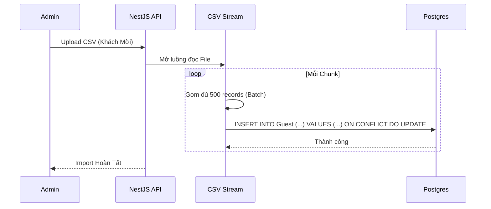
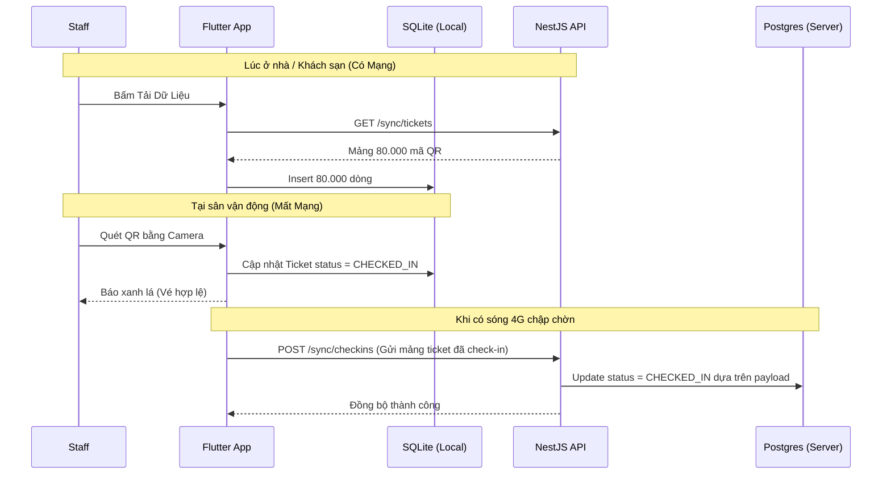

# Phase 5: Mobile Offline Soát Vé & Xử Lý Dữ Liệu Khách Mời (CSV)

## 1. Bức Tranh Tổng Thể (The Big Picture)

Sau khi người dùng đã mua vé và có QR Code (e-ticket), ngày diễn ra Concert cũng đến. Giai đoạn này thuộc về sự kiện thực địa (On-site operation) với sự tham gia của **Nhân sự soát vé (Staff)** sử dụng Mobile App.

Các vấn đề hóc búa nhất của thực địa là:
1. **Mất Mạng:** Tại sân vận động Mỹ Đình chứa 40.000 người, trạm phát sóng 4G/5G sẽ sập hoàn toàn. Staff dùng điện thoại quét mã QR không thể gọi API check-in lên máy chủ được.
2. **Khách mời nhãn hàng VIP (Sponsor):** Họ không mua vé qua hệ thống mà nhãn hàng sẽ gửi cho BTC 1 file Excel/CSV chứa 5.000 khách mời vào tối trước ngày diễn ra sự kiện. File này có thể có dữ liệu lỗi, trùng lặp và cực nặng. Cần đưa nó vào hệ thống.

## 2. Giải Quyết Vấn Đề Chuyên Sâu

### Vấn đề 1: Soát vé Offline khi mất kết nối mạng
- **Tư duy:** Nếu không thể dùng mạng, dữ liệu phải nằm sẵn trên thiết bị của Staff.
- **Giải pháp:** 
  - **Offline First App (Flutter):** Trước giờ diễn ra sự kiện (lúc còn mạng), Staff mở app, ấn nút "Đồng bộ vé". Backend trả về danh sách toàn bộ các mã QR hợp lệ của Concert. App lưu đống này vào **SQLite cục bộ (sqflite)**.
  - Khi soát vé, quét mã -> Query thẳng vào `sqflite`. Nếu đúng mã -> Đánh dấu vé đó là `CHECKED_IN` tại thiết bị, lưu lại timestamp.
  - Vấn đề nảy sinh: Nếu 1 vé quét Offline ở cổng A, sau đó tuồn vé ra cho người ở cổng B quét tiếp thì sao? Giới hạn của mô hình Offline là không thể ngăn chặn chéo theo thời gian thực. Tuy nhiên, bằng quy trình vật lý (đóng dấu tay, xé góc) kết hợp với **Background Sync** (Khi máy rà có mạng 3G, nó tự động gửi vé đã quét lên Server, Server broadcast xuống các máy khác) sẽ giảm thiểu tối đa gian lận. Logic Backend sử dụng **"Last Write Wins"** hoặc lấy thời gian Timestamp sớm nhất làm gốc (nếu 2 thiết bị cùng gửi lên 1 vé đã check-in).

### Vấn đề 2: Xử lý file CSV 5.000 - 100.000 dòng mà không tràn RAM (OOM)
- **Tư duy:** Nếu Admin upload file CSV 100K dòng, bạn dùng hàm `fs.readFileSync` đọc toàn bộ lên RAM rồi chọc vòng lặp `insert` vào Postgres thì RAM server NodeJS sẽ bung và App sẽ crash.
- **Giải pháp:** Sử dụng cơ chế **Stream** kết hợp **Bulk Upsert**.
  - Dùng thư viện `csv-parser` xử lý data theo luồng (Stream). Đọc từng chunk nhỏ, gom đủ 500 dòng (Batching) thì mới thực hiện 1 câu lệnh SQL Insert duy nhất vào DB.
  - Sử dụng cú pháp `ON CONFLICT` của Postgres để tự động update nếu data khách mời đã tồn tại, tránh lỗi báo trùng lặp dừng toàn bộ tiến trình.

## 3. Sơ Đồ Hoạt Động (Flow Diagrams)

### Flow 1: Import Khách Mời VIP (Streaming CSV)


### Flow 2: Soát Vé Offline & Đồng Bộ Lại (Flutter)


## 4. Hướng Dẫn Coding & Xử Lý Chi Tiết

**Logic Bulk Upsert Data (TypeORM/Postgres):**
Khi dùng QueryBuilder của TypeORM với Postgres, bạn có thể gọi hàm `orUpdate` để xử lý Conflict dễ dàng.
```typescript
await this.guestRepository.createQueryBuilder()
  .insert()
  .into(Guest)
  .values(batch500Data)
  .orUpdate(['name', 'phone'], ['email']) // Trùng Email thì update Name, Phone
  .execute();
```

**Flutter Offline Database (Sqflite):**
- Trong Flutter, tạo DB Schema cục bộ hệt như backend.
- Viết 1 class `DatabaseHelper`. Dùng package `dio` để gọi API lấy List object.
- Mẹo tối ưu ở thiết bị yếu: Dùng **Batch** của `sqflite` để insert 80k dòng nhanh:
```dart
var batch = db.batch();
for(var ticket in tickets) {
    batch.insert('tickets', ticket.toMap(), conflictAlgorithm: ConflictAlgorithm.replace);
}
await batch.commit(noResult: true); // Chạy cực nhanh
```

## 5. Breakdown Task Siêu Nhỏ (Dành để thực thi)

### [Backend] Module Sync & Khách Mời CSV
- [ ] B1: Cài đặt thư viện `csv-parser`.
- [ ] B2: Viết API POST `/guests/import-csv` nhận file qua `FileInterceptor`.
- [ ] B3: Dùng `fs.createReadStream().pipe(csv())` xử lý file theo stream. Khai báo 1 biến mảng `batchData`. Cứ push vào mảng, khi `batchData.length === 500` thì thực thi `insert...orUpdate` với TypeORM, sau đó reset mảng về rỗng. Đừng quên insert nốt phần dư còn lại ở sự kiện `.on('end')`.
- [ ] B4: Viết API GET `/sync/tickets/:concertId` trả về toàn bộ mã QRCode payload, status và ID của các vé thuộc Concert đó.
- [ ] B5: Viết API POST `/sync/checkins` nhận vào một Body Array chứa `{ qr_payload, timestamp }`. Dùng TypeORM update cột `status = 'CHECKED_IN'` cho các vé thỏa mãn payload trên.

### [Frontend - Mobile] Flutter App Cơ Bản & Scanner
- [ ] B1: Khởi tạo dự án Flutter. Thêm thư viện `dio`, `sqflite`, `mobile_scanner`, `connectivity_plus`.
- [ ] B2: Tạo các bảng `sqflite` tên là `tickets` (chứa qr_payload, status) và `guests` (chứa email, tên, status).
- [ ] B3: Dựng màn hình Login cho nhân viên Staff (chỉ nhập mã PIN hoặc user/pass cơ bản).
- [ ] B4: Dựng màn hình chọn Concert và có nút "Đồng Bộ Offline". Khi bấm, gọi `dio` tải API `/sync/tickets`, dùng db batch lưu hết vào local database.
- [ ] B5: Dựng màn hình Scanner dùng Camera (cấp quyền Camera). Khi quét ra string, query vào bảng local `tickets` hoặc `guests`.
  - Nếu query ko ra: Báo đỏ "Mã vé không tồn tại".
  - Nếu query ra status CHECKED_IN: Báo đỏ "Vé đã sử dụng".
  - Nếu query ra status UNUSED: Báo xanh "Hợp lệ", đổi status local thành CHECKED_IN.

### [Frontend - Mobile] Logic Auto Sync ngầm
- [ ] B1: Sử dụng thư viện `connectivity_plus` lắng nghe sự thay đổi trạng thái mạng (Stream listen network changes).
- [ ] B2: Viết 1 vòng lặp hẹn giờ ngầm (VD: mỗi phút 1 lần). Kiểm tra nếu thiết bị đang có mạng (Mobile/Wifi).
- [ ] B3: Query lấy toàn bộ các records trong local DB có status là `CHECKED_IN` nhưng cột cờ `synced = false`.
- [ ] B4: Dùng `dio` POST gửi mảng dữ liệu này lên `/sync/checkins`. Nếu backend trả về 200 OK, update lại cột `synced = true` trong db local để lần sau không gửi lại nữa.
