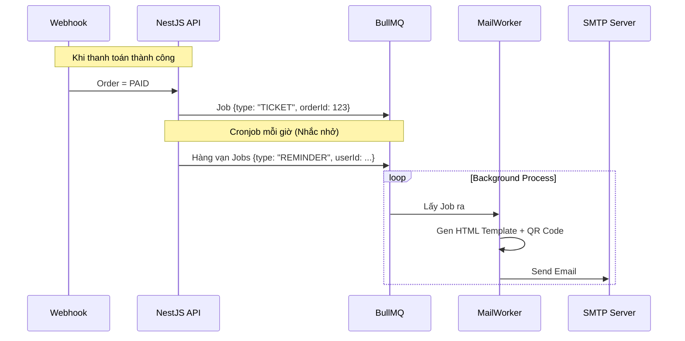
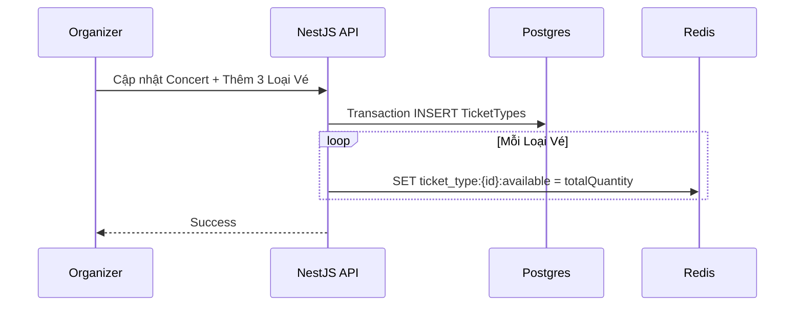

# Phase 6: Hệ Thống Thông Báo (Notification) & Admin Dashboard (Remaining Tasks)

## 1. Bức Tranh Tổng Thể (The Big Picture)

Sau khi hoàn thiện luồng mua vé cực kỳ mạnh mẽ (Phase 3), thanh toán (Phase 4), và soát vé offline (Phase 5), hệ thống TicketBox vẫn còn 2 mảnh ghép quan trọng cuối cùng trong `spec.md` để trở thành một sản phẩm hoàn thiện 100%:

1. **Hệ thống Thông báo (Notification):** Cấu thành trải nghiệm khách hàng. Gửi Email (chứa mã QR) ngay khi mua vé thành công và hệ thống tự động nhắc nhở khán giả 24 giờ trước khi Concert bắt đầu.
2. **Giao diện & Chức năng Quản Trị (Admin Dashboard):** Ban tổ chức (Organizer) cần một bộ công cụ hoàn chỉnh để tạo Loại Vé (TicketType), cấu hình giá, số lượng mở bán, cũng như xem biểu đồ thống kê doanh thu theo thời gian thực.

## 2. Giải Quyết Vấn Đề Chuyên Sâu

### Vấn đề 1: Gửi Email không làm chậm API (Asynchronous Notification)
- **Tư duy:** Việc gọi API của bên thứ 3 (như Gmail, SendGrid, AWS SES) tốn từ 1 đến 3 giây. Không được bắt luồng Webhook của VNPAY hoặc luồng Checkout phải chờ gửi email xong mới trả về kết quả. Nếu server mail bị lỗi, không được làm hỏng trạng thái vé.
- **Giải pháp:** Sử dụng **Message Queue (BullMQ)**. Ngay khi đơn hàng chuyển sang `PAID`, Backend đẩy 1 job `SEND_TICKET_EMAIL` vào Queue. Worker chạy ngầm sẽ lấy template email, gắn mã QR (dạng base64 image hoặc link) và gửi. Nếu lỗi, Queue tự động thử lại 3 lần.

### Vấn đề 2: Tự động nhắc nhở trước 24 giờ (Scheduled Cronjob)
- **Tư duy:** Không thể dùng `setTimeout` trong code Node.js vì nếu server restart thì sẽ mất hết lịch hẹn. 
- **Giải pháp:** Viết một **Cronjob quét mỗi giờ (`@Cron('0 * * * *')`)**. Query DB tìm các Concert sắp diễn ra trong 24h tới và chưa được đánh dấu là `is_reminded`. Lấy danh sách toàn bộ các User đã mua vé của Concert đó, đẩy hàng loạt Job gửi email vào Queue. Sau đó đánh dấu Concert đó là `is_reminded = true`.

### Vấn đề 3: Động hóa cấu trúc Loại Vé (TicketType CRUD)
- **Tư duy:** Hiện tại Phase 2 và 3 đang dùng Seed Data. Admin tạo được Concert nhưng không thể tự định nghĩa hạng vé "SVIP 5.000.000 VND - 200 vé".
- **Giải pháp:** Cung cấp API `POST /concerts/:id/ticket-types`. Tuy nhiên, phải có luồng đồng bộ: Mỗi khi Admin tạo mới hoặc sửa tổng số lượng vé (totalQuantity), Backend phải gọi Redis `SET` để cập nhật lại `available` theo công thức `available = totalQuantity - soldQuantity`.

## 3. Sơ Đồ Hoạt Động (Flow Diagrams)

### Flow 1: Gửi Email Vé & Nhắc Nhở (Notification Worker)


### Flow 2: Luồng Admin Khởi Tạo Sự Kiện (TicketType Sync)


## 4. Hướng Dẫn Coding & Xử Lý Chi Tiết

**Gửi Mail với NodeMailer + EJS Template:**
Sử dụng template engine `ejs` hoặc `handlebars` để render ra giao diện email đẹp mắt từ HTML. Truyền các biến như `concertName`, `seatNumber`, và `qrImage` vào template.
```typescript
import * as nodemailer from 'nodemailer';
import * as ejs from 'ejs';

// Render HTML
const html = await ejs.renderFile('template.ejs', { name: user.name, qrUrl });
// Gửi qua SMTP
await transporter.sendMail({ to: user.email, subject: 'Vé của bạn', html });
```

**Query lấy User cần Reminder (Postgres):**
```typescript
const concerts = await concertRepo.find({
  where: {
    date: Between(now, next24Hours),
    isReminded: false
  }
});
```

## 5. Breakdown Task Siêu Nhỏ (Dành để thực thi)

### [Backend] API Quản Trị TicketType (Loại vé)
- [ ] B1: Thêm `TicketTypeController`. Viết API `POST /concerts/:id/ticket-types` (Chỉ role ADMIN/ORGANIZER).
- [ ] B2: Logic Update TicketType: Update `totalQuantity` trong Postgres. Cực kỳ quan trọng: tính lại `available = totalQuantity - soldQuantity` và update luôn vào Redis để đồng bộ với luồng Booking Phase 3.
- [ ] B3: Viết API lấy doanh thu (`GET /admin/stats/revenue`): Dùng TypeORM query sum `totalAmount` từ bảng `Order` theo trạng thái `PAID`, Group By Concert.

### [Backend] Hệ Thống Notification Queue
- [ ] B1: Khởi tạo module Mail (`@nestjs-modules/mailer` hoặc tự setup Nodemailer).
- [ ] B2: Tạo Queue mới `@InjectQueue('ticketbox.notifications')`.
- [ ] B3: Viết `NotificationProcessor` lắng nghe Queue. Phân loại Job: `TICKET_CONFIRMATION` và `EVENT_REMINDER`.
- [ ] B4: Móc (Hook) vào hàm xử lý IPN Webhook ở Phase 4: Nếu Order thành công, `notificationQueue.add('TICKET_CONFIRMATION', { orderId })`.

### [Backend] Cronjob Nhắc Nhở 24h
- [ ] B1: Viết Cronjob `@Cron(CronExpression.EVERY_HOUR)`.
- [ ] B2: Tìm các Concert thỏa mãn: `date` nằm trong 24h tới và cột cờ `reminder_sent = false`.
- [ ] B3: Lấy danh sách toàn bộ User đã mua vé (JOIN Order -> Ticket -> User với status PAID). Đẩy tất cả vào `notificationQueue`.
- [ ] B4: Update `reminder_sent = true` để không bị nhắc lại vào giờ sau.

### [Frontend] Admin Dashboard UI
- [ ] B1: Dựng trang `/admin/concerts/:id/manage` (Bảo vệ bằng Auth Guard Role Organizer).
- [ ] B2: Giao diện Form thêm loại vé (Tên, Giá, Tổng Số Lượng, Max per user). Bấm lưu gọi API POST ở trên.
- [ ] B3: Dựng trang Thống Kê Doanh Thu sử dụng Recharts hoặc Chart.js. Gọi API thống kê để vẽ biểu đồ line (Doanh thu theo ngày) và Pie chart (Tỷ lệ bán từng loại vé).
