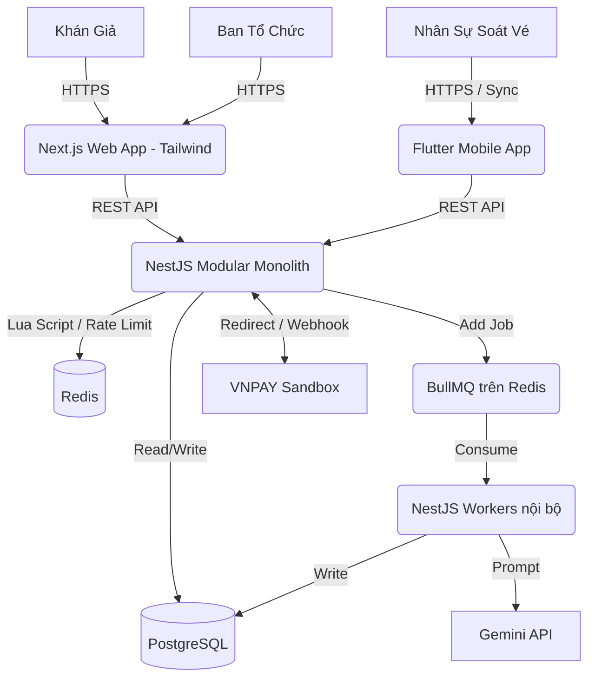

# Phân Tích & Đề Xuất Giải Pháp Hệ Thống TicketBox

Tài liệu này trình bày phân tích chi tiết, đề xuất kiến trúc, công nghệ và hướng giải quyết các bài toán kỹ thuật hóc búa của hệ thống TicketBox dựa trên yêu cầu từ spec.

## 1. Tổng quan Kiến trúc và Công nghệ (Tech Stack)

Hệ thống áp dụng kiến trúc **Modular Monolith**. 

Việc dùng Microservices ở giai đoạn này là over-engineering, tốn nhiều chi phí setup hạ tầng, khó debug và vận hành. Modular Monolith giúp code vẫn được chia tách thành các module nghiệp vụ độc lập (Auth, Order, Ticket, Payment...) nhưng chạy chung trong 1 tiến trình (process), dễ dàng deploy và quản lý.

- **Frontend (Web App):** Next.js (App Router) + Tailwind CSS thuần (không dùng thư viện UI phức tạp). Sử dụng SSR/SSG/ISR để tối ưu SEO và Caching cho trang chủ và chi tiết concert.
- **Frontend (Mobile App Soát Vé):** Flutter. Cung cấp hiệu năng cao, build đa nền tảng tốt và hỗ trợ tích hợp với SQLite (sqflite) cực tốt cho tính năng offline.
- **Backend (API Server):** NestJS (TypeScript) theo mô hình Modular Monolith. ORM sử dụng TypeORM hoặc Prisma.
- **Database (RDBMS):** PostgreSQL. Hỗ trợ ACID transactions cực tốt, phù hợp cho dữ liệu tài chính và vé.
- **Caching & In-memory DB:** Redis. Dùng để Caching, Rate Limiting, và đếm số lượng vé (Atomic Counters).
- **Message Broker / Queue:** BullMQ (chạy trực tiếp trên nền Redis). Việc này giúp tận dụng luôn instance Redis có sẵn, không phải setup thêm RabbitMQ hay Kafka, vừa đủ mạnh vừa đơn giản.
- **Payment Gateway:** Tích hợp Sandbox thật của VNPAY (hoặc MoMo) để luồng thanh toán và webhook sát với thực tế nhất.
- **AI Integration:** Google Gemini API hoặc OpenAI API để xử lý tính năng tóm tắt Artist Bio từ PDF.

---

## 2. Giải Quyết Các Bài Toán Kỹ Thuật (Nút Thắt)

### 2.1. Tranh chấp vé (Concurrency & Race Condition)
**Vấn đề:** Hàng chục ngàn người giành nhau 200 vé cuối cùng. Query DB để check số lượng sẽ gây ra độ trễ cao và race condition (bán lố vé - oversell).

**Giải pháp:** Sử dụng **Redis Lua Script** kết hợp BullMQ.
1. Số lượng vé khả dụng của mỗi hạng vé được nạp sẵn vào Redis (ví dụ: key `ticket:SVIP:available` = 200).
2. Khi user ấn mua, Backend gọi Redis Lua script. Script chạy nguyên tử (atomic) thực hiện:
   - Kiểm tra vé yêu cầu <= vé available.
   - Nếu đủ: Trừ vé available và trả về `SUCCESS`.
   - Nếu thiếu: Trả về `SOLD_OUT`.
3. Nhờ Lua script đơn luồng nguyên tử trên Redis, hệ thống chống được oversell 100%.
4. Ngay khi Redis trừ vé thành công, API phản hồi "giữ chỗ thành công", đồng thời Backend đẩy event `TICKET_RESERVED` vào **BullMQ**. Các worker chạy ngầm sẽ từ từ insert dữ liệu đơn hàng (Order) vào PostgreSQL, giảm tải ghi cho DB lúc cao điểm.

### 2.2. Kiểm soát tải đột biến (Spike Load)
**Vấn đề:** Khi mở bán, 80.000 người truy cập dồn vào 1 phút đầu tiên.

**Giải pháp:**
- **Rate Limiting:** Dùng thư viện `@nestjs/throttler` kết hợp Redis (thay vì memory mặc định) để giới hạn request từ mỗi IP hoặc User (ví dụ 10 request/giây). Request vượt ngưỡng bị chặn với status 429.
- **Caching tĩnh (Frontend):** Ứng dụng Next.js ISR (Incremental Static Regeneration). Trang chủ và chi tiết concert build sẵn HTML tĩnh. Request vào các trang này sẽ không gọi xuống database.
- **Dữ liệu realtime:** Số lượng vé còn lại trên FE sẽ được fetch qua Client-side (SWR hoặc fetch thường) và Backend lấy kết quả trực tiếp từ Redis chứ không query Postgres.

### 2.3. Giới hạn vé per-user dưới tải cao
**Giải pháp:** Tích hợp logic giới hạn vào chính **Redis Lua Script** (mục 2.1).
- Redis duy trì 1 Hash Key lưu số vé user đã mua/đang giữ của concert: `user:123:concert:456:tickets_held`.
- Lua script thực hiện 3 lệnh đồng thời:
  1. Kiểm tra `tickets_held + số_lượng_mua <= max_limit`.
  2. Kiểm tra `available >= số_lượng_mua`.
  3. Nếu đủ điều kiện: Trừ `available` và cộng dồn vào `tickets_held`.
- Ngăn chặn triệt để hành vi dùng script/bot mở nhiều tab gửi request cùng lúc.

### 2.4. Thanh toán không ổn định & Chống trừ tiền 2 lần
**Giải pháp:**
- **Idempotency Key:** Frontend sinh ra UUID cho mỗi phiên click thanh toán (`Idempotency-Key`). Backend kiểm tra key này trên Redis. Nếu mạng lag user ấn 2 lần sinh ra 2 request giống nhau, request thứ 2 sẽ bị từ chối ngay.
- **Circuit Breaker:** Khi API Sandbox VNPAY gặp lỗi hoặc timeout liên tục, Circuit Breaker (vd: package `opossum`) chuyển sang **OPEN**, chặn gọi API VNPAY và báo "Hệ thống thanh toán bảo trì", giữ cho app vẫn sống để xem thông tin.
- **Webhook IPN:** Dùng webhook (IPN) từ VNPAY để cập nhật trạng thái đơn hàng thay vì chờ user redirect về trang kết quả. Đồng thời có 1 Cronjob quét các đơn "PENDING" quá 15 phút để chủ động hỏi lại VNPAY hoặc đánh dấu HỦY và nhả lại vé vào Redis.

### 2.5. Soát vé offline tại cổng sự kiện
**Vấn đề:** Sân vận động sóng yếu hoặc mất mạng.

**Giải pháp:**
- **Flutter App** tải (sync) danh sách mã vé (QR payload) hợp lệ lưu vào `sqflite` (database local) trước giờ diễn.
- Khi staff quét mã, app kiểm tra trong `sqflite`. Hợp lệ -> Đánh dấu `CHECKED_IN`, lưu timestamp.
- Ngầm định, Flutter app dùng 1 Isolate hoặc background task (như `workmanager`) liên tục ping mạng. Khi có kết nối, đẩy vé đã quét lên NestJS.
- **Xử lý trùng lặp:** Dùng timestamp quét tại thiết bị làm gốc (Last Write Wins). Nếu vé đã quét offline, lần thứ 2 có ngưởi cầm cùng mã đến cổng khác sẽ bị từ chối vì app offline chỉ ghi nhận 1 lần, quét lần 2 app báo vé đã dùng. 

### 2.6. Tích hợp dữ liệu CSV một chiều & AI Artist Bio
- **CSV Import:** Admin upload file CSV. NestJS lưu file tạm và ném job vào **BullMQ**. Worker dùng stream xử lý từng dòng để chống tràn RAM, sử dụng **Bulk Upsert** (ON CONFLICT) của Postgres để ghi dữ liệu.
- **AI Artist Bio:** Admin upload PDF Press Kit. Worker lấy text từ PDF, gửi tới Google Gemini API tóm tắt lại, lưu đoạn text ngắn gọn vào bảng Concert.

---

## 3. Thiết Kế Cơ Sở Dữ Liệu (PostgreSQL)

- **`User`**: `id`, `email`, `password_hash`, `role` (ADMIN, AUDIENCE, STAFF)
- **`Concert`**: `id`, `name`, `description`, `ai_bio`, `location`, `event_date`, `status`
- **`TicketType`**: `id`, `concert_id`, `name` (SVIP, GA...), `price`, `total_quantity`, `max_per_user`
- **`Order`**: `id`, `user_id`, `concert_id`, `total_amount`, `status` (PENDING, PAID, CANCELLED), `payment_method`, `idempotency_key`, `created_at`
- **`Ticket`**: `id`, `order_id`, `ticket_type_id`, `qr_code_payload`, `status` (UNUSED, CHECKED_IN), `checked_in_at`
- **`Guest`**: `id`, `concert_id`, `name`, `email`, `phone`, `is_checked_in`

---

## 4. Mô hình Kiến trúc C4 - Container Level

