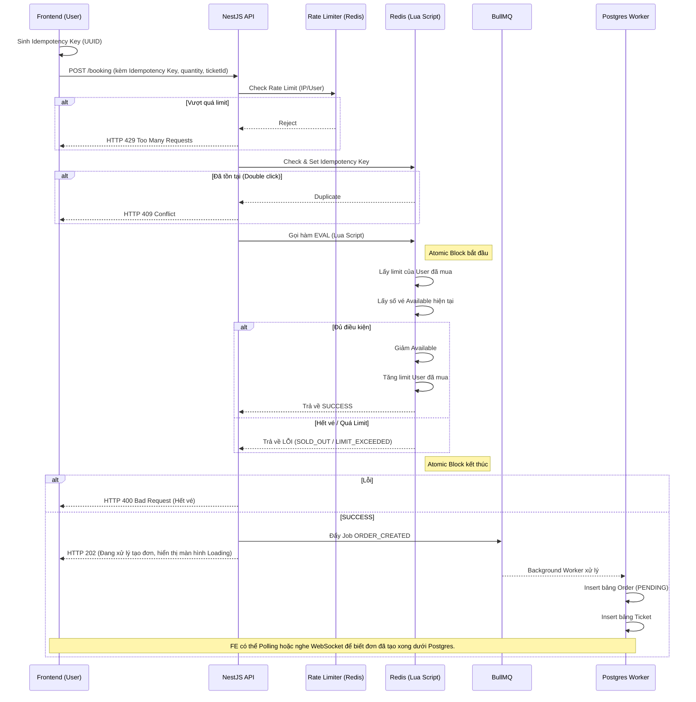

# Phase 3: Nút Thắt Đặt Vé - Xử Lý Tranh Chấp & Hàng Đợi

## 1. Bức Tranh Tổng Thể (The Big Picture)

Đây là "linh hồn" và cũng là điểm khó nhất của toàn bộ đồ án TicketBox. Khác với các web bán hàng thông thường, bán vé sự kiện có một đặc thù: **Nhu cầu thì khổng lồ, nhưng sản phẩm thì hữu hạn và mọi người đổ xô vào mua trong cùng 1 tích tắc**.
Ví dụ: Concert Anh Trai Say Hi có hạng vé SVIP chỉ 200 chỗ. Khi vừa mở bán, 80.000 người cùng ấn nút "Mua vé" vào lúc 12:00:00. 

Nếu ta xử lý theo cách thông thường:
`Lấy số vé từ DB -> Kiểm tra > 0 -> Trừ vé -> Lưu lại vào DB`
Thì ở giữa bước "Lấy số vé" và "Trừ vé", sẽ có hàng ngàn request cùng lọt qua điều kiện `> 0`, dẫn đến việc **bán lố (oversell)** 200 vé thành 2000 vé. Hậu quả là đền tiền cho khách hàng. Ngoài ra, DB Postgres sẽ bị sập vì phải chịu quá nhiều kết nối cùng lúc.

## 2. Giải Quyết Vấn Đề Chuyên Sâu

### Vấn đề 1: Tranh chấp dữ liệu (Race Condition)
- **Tư duy:** Không thể dùng CSDL quan hệ (Postgres) để xử lý logic trừ vé dưới tải cao vì khóa Lock (Pessimistic Locking) sẽ gây nghẽn cổ chai (Deadlock) toàn hệ thống. Ta cần một cái gì đó chạy trên RAM, tốc độ phản hồi cực cao và chạy theo cơ chế **đơn luồng (Single Thread)**.
- **Giải pháp:** Sử dụng **Redis Lua Script**.
  - Redis chạy đơn luồng, tức là nếu có 80.000 request tới cùng lúc, nó sẽ xếp hàng thực hiện từng cái một cực kỳ nhanh.
  - Lua Script giúp gộp nhiều câu lệnh Redis (Kiểm tra vé, Kiểm tra limit user, Trừ vé) thành một giao dịch nguyên tử (Atomic). Trong lúc Lua script đang chạy, không một request nào khác được chen ngang. Đảm bảo tính nhất quán 100%.

### Vấn đề 2: Bảo vệ hệ thống khỏi bão Request (Spike Load)
- **Tư duy:** Không phải ai ấn mua vé cũng là người. Sẽ có rất nhiều Bot của phe phe vé (Scalper) gửi 1000 requests/giây để càn quét vé. Ta cần chặt đứt các request này ngay từ cổng.
- **Giải pháp:** Dùng **Rate Limiting** kết hợp **Idempotency Key**.
  - Rate Limit: Giới hạn mỗi User/IP chỉ được gọi API Book vé tối đa 2 lần/giây.
  - Idempotency Key: Khi người dùng bấm nút mua vé ở Frontend, FE sinh ra 1 chuỗi UUID (ví dụ: `txn-12345`). Nếu mạng lag người dùng nhấp 10 lần, backend dùng Redis check key `txn-12345` này. Nhận ra request trùng lặp, backend lập tức từ chối 9 request sau.

### Vấn đề 3: Tránh sập Database Postgres (Asynchronous Processing)
- **Giải pháp:** Sau khi Lua Script trừ vé trong Redis thành công (tức là chắc chắn 100% có vé), Backend KHÔNG ghi thẳng xuống Postgres ngay. Thay vào đó, backend đẩy 1 thông báo vào **BullMQ (Queue)** và báo lại FE "Đặt vé thành công, đang tạo mã". 
- Background Worker sẽ từ từ lấy từng đơn hàng từ Queue ra để Insert vào Postgres. Dù có 80.000 đơn, Worker sẽ xử lý thong thả 1000 đơn/giây, Postgres vẫn sống khỏe.

## 3. Sơ Đồ Hoạt Động (Flow Diagrams)

### Flow Đặt Vé Tối Ưu Tải (High-Concurrency Booking Flow)


## 4. Hướng Dẫn Coding & Xử Lý Chi Tiết

**Mã nguồn Lua Script trên NestJS:**
Bạn cần nạp script này vào `ioredis` khi khởi động ứng dụng:
```lua
-- Lua script: book_ticket.lua
local ticket_key = KEYS[1]
local user_limit_key = KEYS[2]

local qty = tonumber(ARGV[1])
local max_per_user = tonumber(ARGV[2])

-- Kiểm tra xem user đã mua bao nhiêu vé
local user_bought = tonumber(redis.call('GET', user_limit_key) or '0')
if (user_bought + qty) > max_per_user then
    return 'LIMIT_EXCEEDED'
end

-- Kiểm tra số vé còn lại
local available = tonumber(redis.call('GET', ticket_key) or '0')
if available < qty then
    return 'SOLD_OUT'
end

-- Đủ điều kiện: Tiến hành trừ vé và tăng số vé user đã mua
redis.call('DECRBY', ticket_key, qty)
redis.call('INCRBY', user_limit_key, qty)

return 'SUCCESS'
```

**NestJS Code gọi Lua Script:**
```typescript
const result = await this.redis.eval(
  luaScript,
  2, // Số lượng keys
  `ticket_type:${ticketTypeId}:available`,
  `user:${userId}:tickets_held`,
  quantity,
  maxPerUser
);

if (result === 'SUCCESS') {
    await this.orderQueue.add('create-order', { userId, ticketTypeId, quantity });
    return { status: 'processing', message: 'Bạn đã giữ vé thành công, đang tạo đơn!' };
}
```

## 5. Breakdown Task Siêu Nhỏ (Dành để thực thi)

### [Backend] Redis Setup & Lua Script
- [ ] B1: Khởi tạo module Redis (dùng gói `ioredis`). Tạo service `RedisService`.
- [ ] B2: Chuẩn bị chuỗi string Lua Script (hoặc đọc từ file `.lua`).
- [ ] B3: Viết hàm trong `RedisService` để thực thi `eval` với Lua script trên, nhận tham số truyền vào là userId, ticketTypeId, quantity.

### [Backend] Booking API & Rate Limit
- [ ] B1: Cài đặt `@nestjs/throttler`. Cấu hình dùng `ThrottlerStorageRedisService` để Rate Limit hoạt động đồng bộ qua nhiều server. Set rule: 3 requests / 1 giây cho endpoint `/booking`.
- [ ] B2: Tạo Guard hoặc Interceptor xử lý Idempotency Key. Đọc header `Idempotency-Key`, dùng Redis `SET key value NX EX 3600`. Nếu trả về 0 -> Bắn lỗi Duplicate Request.
- [ ] B3: Viết controller POST `/booking`. Flow gọi qua Guard Idempotency -> Gọi Rate Limit -> Gọi `RedisService` chạy Lua Script.
- [ ] B4: Nếu Lua SUCCESS, đẩy data vào Queue `order-queue`.

### [Backend] Order Worker
- [ ] B1: Tạo `OrderProcessor` lắng nghe `order-queue`.
- [ ] B2: Trong hàm xử lý, thực hiện TypeORM/Prisma transaction: Tạo bản ghi vào bảng `Order` (Status: PENDING), sau đó tạo N bản ghi vào bảng `Ticket` tương ứng với số lượng vé.
- [ ] B3: Viết thêm API GET `/orders/:id` để frontend kiểm tra xem đơn hàng đã được worker tạo xong chưa.

### [Frontend] Giao diện Mua Vé (Booking UI)
- [ ] B1: Ở trang chi tiết sự kiện, tạo Form nhập số lượng vé, max = giới hạn BTC quy định.
- [ ] B2: Khi ấn "Thanh toán", dùng thư viện `uuid` (v4) sinh ra 1 mã nhét vào Header `Idempotency-Key` của Axios.
- [ ] B3: Gửi request lên `/booking`.
  - Nếu gặp 429: Báo lỗi "Bạn thao tác quá nhanh".
  - Nếu báo Hết vé: Load lại data.
  - Nếu báo Thành công (202): Chuyển màn hình sang trạng thái "Đang tạo đơn, vui lòng không tắt trình duyệt".
- [ ] B4: Viết hàm `setInterval` gọi API GET `/orders/:id` (Polling) mỗi 2 giây. Khi nào API trả về trạng thái PENDING thì chuyển hướng sang trang Thanh toán VNPAY (Phase 4).
